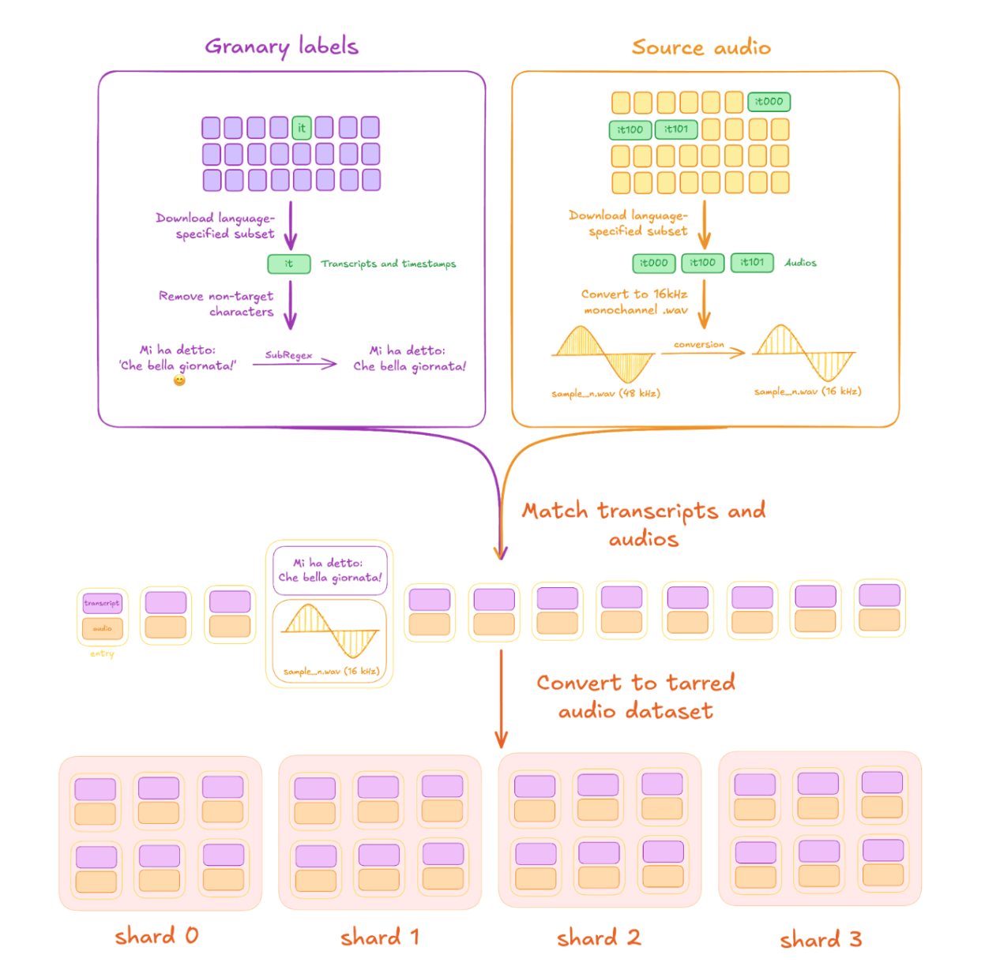

---
date:
    created: 2025-08-13
slug: granary-data-for-fine-tune
authors:
    - sofia_kostandian
    - nithin_rao_koluguri
categories:
    - NeMo-ASR
    - NeMo-AST
    - Automatic Speech Recognition
    - Automatic Speech Translation
    - Dataset

tags:
    - NeMo-ASR
    - NeMo-AST
    - Automatic Speech Recognition
    - Automatic Speech Translation
    - Dataset
    - Granary
---

<!--
nemo_blog: {
  "repo": "https://github.com/NVIDIA-NeMo/NeMo",
  "authors": ["Ssofja", "nithinraok"]
}
-->

# Guide to Fine-tune Nvidia NeMo models with Granary Data

## Introduction
The Granary dataset stands out as one of the largest and most diverse open-source collections of European speech data available today. Designed to advance research and development in automatic speech recognition (ASR) and automatic speech translation (AST), Granary provides approximately 643,000 hours of audio paired with transcripts for ASR, and around 351,000 hours of aligned translation pairs. Its recordings are sourced from a variety of Creative Commons corpora—such as YODAS2, YouTube-Commons, VoxPopuli, and Libri-Light—and each sample is carefully reviewed to ensure that only clear, high-quality audio and accurate transcripts are included. Because the dataset includes consistent segment boundaries and normalized text across more than twenty-five languages (including Italian), it eliminates much of the preprocessing burden and allows you to focus on model development or evaluation.

<!-- more -->

In this tutorial, Granary serves as the central resource: we walk through a step-by-step workflow that begins with selecting the appropriate Italian and English subsets (for both ASR and AST), preparing and validating those files, and then integrating them into a model training pipeline. To make these steps concrete, we demonstrate how to apply them to the pre-trained [Canary 1B-Flash](https://huggingface.co/nvidia/canary-1b-flash) checkpoint using NVIDIA NeMo Framework Speech toolkit. These same steps can also be followed with the newly released [Canary-1b-v2](https://huggingface.co/nvidia/canary-1b-v2), a multitask multilingual model supporting 25 languages for both ASR and AST, offering broader language coverage and improved capabilities for multilingual training. While this tutorial focuses on Canary models, the overall workflow - including data selection, formatting, tokenizer adaptation, configuration, fine-tuning, and evaluation - is equally applicable to other ASR and AST systems. By following the detailed instructions below, you’ll see exactly how Granary’s standardized, high-quality audio and text pairs plug into a training script, regardless of which speech model you choose. The outcome of our example is a single checkpoint that can:


- Transcribe Italian speech into written text (Italian ASR)

- Translate spoken Italian into English (Italian→English AST)

- Translate spoken English into Italian (English→Italian AST)

Although the pre-trained Canary 1B-Flashn checkpoint does not natively support Italian, we demonstrate how feeding it high-quality Italian audio and transcript pairs from Granary alongside the English subsets enables the model to learn Italian pronunciation, vocabulary, and phrasing without altering its core design. This highlights how Granary’s consistency and scale make it straightforward to adapt a multilingual model to a new language.

The overall workflow in this tutorial is as follows:

1. **Download** the relevant Granary subsets for Italian and English ASR, plus Italian↔English AST.

2. **Prepare** the data by verifying that audio segments and corresponding transcripts or translation pairs are correctly formatted and aligned.

3. **Obtain** the pre-trained Canary 1B-Flash model checkpoint from NVIDIA’s model [collection](https://huggingface.co/collections/nvidia/canary-65c3b83ff19b126a3ca62926) on  🤗Hugging Face.

4. **Create** or adapt tokenizers for Italian and English so that the model can handle each language’s vocabulary and symbols.

5. **Configure** a NeMo training script with appropriate hyper-parameters (learning rate, batch size, etc.).

6. **Fine-tune** the model on Granary’s Italian and English data
7. **Evaluate** performance

At the conclusion of this process, you'll observe how Granary data independently enhances Canary’s capabilities for Italian, yielding robust transcription and translation outcomes. In a broader context, this tutorial provides a template: you can replicate these exact steps to refine or assess any NeMo speech model like [parakeet](https://huggingface.co/nvidia/parakeet-tdt-0.6b-v2) (not limited to Canary) for any other language available in Granary, positioning it as a versatile, high-quality asset for multilingual speech research.

## Data downloading and processing

This section focuses on data - specifically, how to download, process, and convert it into the "canary" format.

To facilitate these steps, we have developed a [pipeline](https://github.com/NVIDIA/NeMo-speech-data-processor/tree/main/dataset_configs/multilingual/granary) for use with the NeMo Speech Data Processor (SDP). By using a single configuration file, we can efficiently reproduce all necessary tasks. SDP is a toolkit designed to streamline the processing of speech datasets by minimizing boilerplate code and enabling easy sharing of processing steps.




Figure 1 - Speech data processing workflow

Figure 1 outlines the main steps involved in data processing: downloading the relevant language subsets, aligning transcripts with audio files, and converting the data into the WebDataset format - all carried out within the SDP pipeline, which can be executed using the command below:


```
# Run Yodas2 Processing
cd NeMo-speech-data-processor && \
python main.py \
--config-path=dataset_configs/multilingual/granary/ \
--config-name=yodas.yaml \
params.source_lang="it" \ # Language to process
params.en_translation=True
```
The same steps were done for processing MOSEL data, which’s config is located [here](https://github.com/NVIDIA/NeMo-speech-data-processor/tree/main/dataset_configs/multilingual/granary).

By processing the Granary data, we generate the manifests needed for the next steps in training the Canary model. We can also include [Mozilla common voice](https://commonvoice.mozilla.org/it/datasets) and a [COVOST](https://github.com/facebookresearch/covost) (the speech-translation version of Common Voice). Using the [SDP Italian configuration file](https://github.com/NVIDIA/NeMo-speech-data-processor/blob/yodas2/dataset_configs/italian/mcv/config.yaml), we process each dataset and, at the end, [retain only](https://github.com/NVIDIA/NeMo-speech-data-processor/blob/3dc4971cf942edfa7193dcd029845743dcc15e42/dataset_configs/multilingual/granary/yodas2.yaml#L90-94) the Italian and English characters [mentioned here](https://github.com/NVIDIA/NeMo-speech-data-processor/blob/main/dataset_configs/multilingual/granary/partials/subregex_params/it.yaml), [adding fields](https://github.com/NVIDIA/NeMo-speech-data-processor/blob/3dc4971cf942edfa7193dcd029845743dcc15e42/dataset_configs/multilingual/granary/yodas2.yaml#L207) required by Canary. The same steps can be applied to [Google Fleurs](https://huggingface.co/datasets/google/fleurs/tree/main/data).


## Training the models

After processing and preparing our datasets, the next step is to create **input configuration files** (input_cfg) . These files feed directly into our [final NeMo training config](https://github.com/NVIDIA/NeMo/blob/main/examples/asr/speech_multitask/speech_to_text_aed.py) and tell the training script:

- **Which datasets** to use (for ASR or AST)

- **The language** and **task type** (e.g., speech recognition vs. translation)

- **Where** the audio files and manifest files live on disk

- **How much** data each source contributes (via weights, typically proportional to its number of hours)

Defining these settings lets us mix and match multiple corpora—boosting under-represented languages or balancing recognition and translation examples.

Below is an example excerpt from an input_cfg.yaml that includes MOSEL and YODAS data. Notice how we assign each dataset a weight based on its size:


```
- input_cfg:
 - corpus: mosel
   language: it
   manifest_filepath: <path_to_the_mosel_it_manifest>
   tarred_audio_filepaths: <path_to_the_mosel_it_audio>
   type: nemo_tarred
   weight: <number_of_hours>
 - corpus: mosel
   language: it-en
   manifest_filepath: <path_to_the_mosel_it_to_en_manifest>
   tarred_audio_filepaths: <path_to_the_mosel_it_to_en_audio>
   type: nemo_tarred
   weight: <number_of_hours>
 - corpus: yodas
   language: it
   manifest_filepath: <path_to_the_yodas_it_manifest>
   tarred_audio_filepaths: <path_to_the_yodas_it_audio>
   type: nemo_tarred
   weight: <number_of_hours>
```
With this input_cfg.yaml, the NeMo trainer knows exactly which files to load, which task each dataset supports, and how to balance them during training.

The next step for our model training is to train tokenizers. For this step we have two different types of them

### **Aggregated SentencePiece BPE Tokenizer**

The aggregated tokenizer stitches together separate per-language vocabularies by ID-offsetting. Each monolingual tokenizer keeps its own subword list (e.g. English 0–1023, Italian 0–1023) but in the aggregated model you shift the second language’s IDs by the first vocab size—in our example Italian tokens become 1024–2047. This guarantees no ID clashes while preserving each language’s original segmentation.

- For italian tokenizer we will use IT-ASR and En-IT data
- For the english tokenizer we will use all English Granary data

```
  tokenizer:
    dir: null  # Null for aggregate tokenizers
    type: agg  # Can be either bpe (SentencePiece tokenizer) or wpe (WordPiece tokenizer) or `agg` for aggregate tokenizers
    langs:
      spl_tokens: # special tokens model
        dir: '<path_to_the_special_tokens>/canary/special_tokens_multitask/' # Passed in training script
        type: bpe
      en: # English tokenizer
        dir: '/<path_to_the_tokenizers_folder/en/tokenizers/tokenizer_spe_unigram_v1024/'
        type: bpe
      it:
        dir: '<path_to_the_tokenizers_folder>/it/tokenizers/tokenizer_spe_unigram_v1024'
        type: bpe
    custom_tokenizer:
      _target_: nemo.collections.common.tokenizers.canary_tokenizer.CanaryTokenizer  # Can be replaced with other tokenizer for different prompt formats
      tokenizers: null  # Filled at runtime by all the tokenizers inside the aggregate tokenizer
```
### **Unified tokenizer**

The unified tokenizer trains one SentencePiece BPE model on the merged English + Italian corpus, producing a single fixed-size vocabulary (e.g. 2048 tokens) that naturally intermixes both languages. No manual offsetting is needed, and frequent subwords shared across languages are learned only once.

- For this tokenizer we will use all Italian and English Granary data
```
tokenizer:
    dir: <path to the unified tokenizer>/tokenizers/tokenizer_spe_bpe_v1024  # Null for aggregate tokenizers
    type: bpe
    custom_tokenizer:
      _target_: nemo.collections.common.tokenizers.canary_tokenizer.CanaryBPETokenizer
```
| **Tokenizer type** | **Vocabulary Structure** | **Example** |
| --- | --- | --- |
| Aggregated | Two separate 1 024-token vocabularies concatenated by adding an offset of 1 024 to the second language’s IDs. | • English IDs: 0 – 1023<br><br>• Italian IDs: 1024 – 2047 |
| Unified | One joint 2048-token vocabulary trained on the merged corpus. Shared subwords span both languages. | • IDs: 0 – 2047<br><br>• Sample tokens: \['▁the', '▁and', '▁ciao', '▁buongiorno', '▁ing', '▁ion', …\] |

By having this information, we can create these two tokenizers for future experiments.
Let’s continue working with our training configuration file
### **Configuration file creation**

The next step is to load our base model—Canary 1B-Flash—so we can fine-tune it. At the top of your NeMo config file, add:
```
init_from_pretrained_model:
  model0:
    name: "nvidia/canary-1b-flash"
    include: ["encoder"]
    exclude: ["encoder.pre_encode.out"]
```
This tells NeMo to start from the pretrained weights in canary-1b-flash but to reinitialize the decoder, joiner, and the pre-encode output layer—so they can learn our new Italian data.

Because the Canary family includes models of different sizes, we need to set a few key parameters to match the **1B-Flash** architecture. Below is a comparison of three Canary variants:

For **Canary-1B-Flash**, set:

| **Model** | **Num params** | **encoder.n_layers** | **trans_decoder.cofig_dict.num_layer** | **trans_decoder.config_dict.max_sequence_length** | **model_defaults.asr_enc_hidden** | **model_defaults.lm_dec_hidden** |
| --- | --- | --- | --- | --- | --- | --- |
| Canary-1b | 1B  | 24  | 24  | 512 | 1024 | 1024 |
| **canary-1b-flash** | **883** | **32** | **4** | **1024** | **1024** | **1024** |
| canary-180m-flash | 182 | 17  | 4   | 1024 | 512 | 1024 |

```
model:
  encoder:
    ...
    n_layers: 32
    ...
  trans_decoder:
    ...
    config_dict:
      num_layers: 4
      max_sequence_length: 1024
      ...
  model_defaults:
    ...
    asr_enc_hidden: 1024
    lm_dec_hidden: 1024
    ...
```
After setting the needed parameters we are moving to our **model.train_ds** parameters.
```
train_ds:
    use_lhotse: true
    tarred_audio_filepaths: null
    input_cfg: <Path_to_the_created_input_cfg>/input_cfgs/input_cfg.yaml
    manifest_filepath: null
    sample_rate: ${model.sample_rate}
    shuffle: true
    ...
     # ... additional Lhotse data-loading parameters ...
    ...
```
- **use_lhotse**: Enables the Lhotse integration in NeMo.

- **input_cfg**: Points to the combined dataset definitions you created earlier.

For detailed options on Lhotse data loading—bucketing, bucketing strategy, padding, multi-worker settings—see [the Lhotse documentation](https://github.com/NVIDIA/NeMo/blob/main/docs/source/asr/datasets.rst#lhotse-dataloading).

Below we show the parameters which we used for our training sets after reading the documentation:

```
     max_duration: 40.0
    min_duration: 0.01
    text_field: answer
    lang_field: target_lang
    max_tps: [24.32,24.32,7.61,7.61,7.61,7.61,7.77,7.77]
    use_bucketing: true
    bucket_duration_bins: [[26.55,75],[26.55,369],[30.0,89],[30.0,108],[30.0,121],[30.0,220],[39.98,150],[39.98,305]]
    bucket_batch_size: [35,32,30,30,30,29,21,21]
    num_buckets: 8
    bucket_buffer_size: 20000
    shuffle_buffer_size: 10000
```

The bucket duration bins and all other parameters were generated and optimized by the NeMo framework.

After training the set upped models we are getting the results presented below

<table>
  <tr>
    <th rowspan="2">Dataset</th>
    <th colspan="2">MLS</th>
    <th colspan="4">Fleurs</th>
    <th colspan="3">Covost</th>
  </tr>
  <tr>
    <th>WER</th>
    <th>BLEU (IT-EN)</th>
    <th>WER</th>
    <th>BLEU (EN-IT)</th>
    <th>COMET (EN-IT)</th>
    <th>COMET (IT-EN)</th>
    <th>BLEU (IT-EN)</th>
    <th>WER</th>
    <th>COMET (IT-EN)</th>
  </tr>
  <tr>
    <td>Canary-1b-flash-unified2048</td>
    <td>7.16</td>
    <td>19.14</td>
    <td>7.89</td>
    <td>24.83</td>
    <td>81.84</td>
    <td>77.61</td>
    <td>31.85</td>
    <td>4.17</td>
    <td>77.65</td>
  </tr>
  <tr>
    <td>Canary-1b-flash-agg1024</td>
    <td>7.33</td>
    <td>23.97</td>
    <td>3.46</td>
    <td>24.02</td>
    <td>80.54</td>
    <td>81.41</td>
    <td>40.55</td>
    <td>3.94</td>
    <td>89.27</td>
  </tr>
</table>


The metric for automatic speech recognition is Word Error Rate (WER), which measures the percentage of words that differ between the model’s output and the reference transcript. For speech translation, we report BLEU and COMET scores, which evaluate how closely the model’s translations match human references in terms of accuracy and overall quality. As shown in the table, our fine-tuned bilingual Canary model achieves low WER values for Italian speech recognition tasks, while also delivering high BLEU and COMET scores on translation tasks between Italian and English. These results demonstrate that the model can reliably transcribe and translate between Italian and English with strong performance.

## Conclusion

In this tutorial, we have discussed how to leverage the Granary dataset - paired audio and transcripts in 25  languages - to train and evaluate the Canary model for Italian and English speech recognition and translation using NeMo. We specifically highlighted Granary’s consistent, validated data: clear segments, speaker metadata, and normalized text. By following the steps outlined in the tutorial, you can quickly apply the same workflow to any other language in Granary without collecting new data. In short, Granary simplifies multilingual ASR and translation experiments, offering a reliable foundation for future research.

