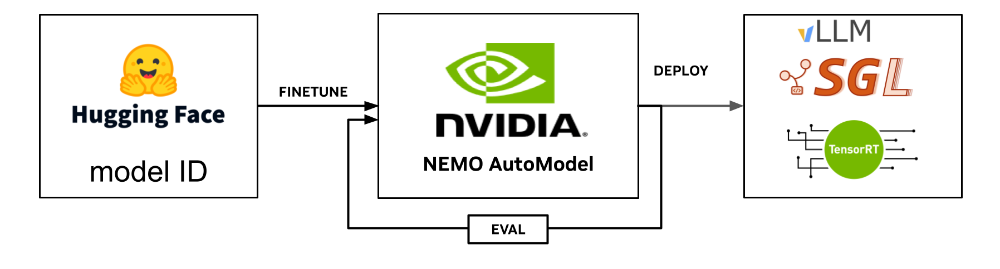
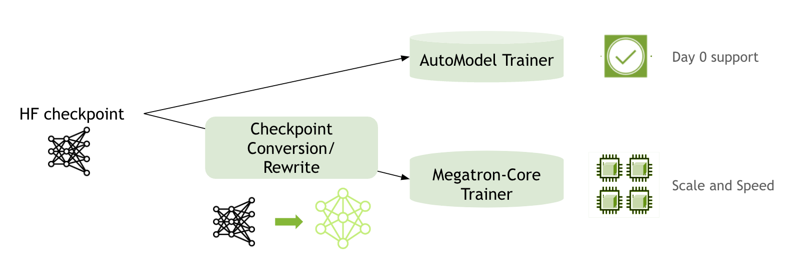

---
date:
  created: 2025-07-29
categories:
    - automodel
authors:
    - alexandros_koumparoulis
    - shashank_verma
    - wenwen_gao
    - bernard_nguyen
---

<!--
nemo_blog: {
  "repo": "https://github.com/NVIDIA-NeMo/Automodel",
  "authors": ["akoumpa", "shashank3959", "snowmanwwg", "bernardwin"]
}
-->

# Fine-tune Hugging Face Models Instantly with Day-0 Support with NVIDIA NeMo AutoModel

---


As organizations strive to maximize the value of their [generative AI](https://developer.nvidia.com/blog/category/generative-ai/) investments, access to the latest model developments is crucial for continued success. By using state-of-the-art models on Day-0, teams can harness these innovations efficiently, maintain relevance, and be competitive.

The past year has seen a flurry of exciting model series releases in the open-source community, including Meta Llama, Google Gemma, Mistral Codestral, Codestral Mamba, Large 2, Mixtral, Qwen 3, 2, and 2.5, Deepseek R1, NVIDIA Nemotron, and NVIDIA Llama Nemotron. These models are often made available on the Hugging Face Hub, providing the broader community with easy access.

Shortly after release, many users focus on evaluating model capabilities and exploring potential applications. Fine-tuning for specific use cases often becomes a key priority to gain an understanding of the models' potential and to identify opportunities for innovation.

The [NVIDIA NeMo Framework](https://docs.nvidia.com/nemo-framework/index.html) uses [NVIDIA Megatron-Core](https://developer.nvidia.com/megatron-core) and [Transformer-Engine (TE)](https://github.com/NVIDIA/TransformerEngine) backends to achieve high throughput and Model Flops Utilization (MFU) on thousands of NVIDIA GPUs, driving [exceptional performance](https://docs.nvidia.com/nemo-framework/user-guide/latest/performance/performance_summary.html). However, integrating new model architectures into the NeMo framework requires multi-stage model conversion using Megatron-Core primitives, followed by validation of different phases, including supervised and parameter-efficient finetuning, model evaluation, and Hugging Face to NeMo conversion. This introduces a time delay between model release and optimal training/post-training recipe development.

To ensure Day-0 support for the latest models, NeMo framework introduces the Automatic Model (AutoModel) feature.


<!-- more -->
---
## Introducing AutoModel in NVIDIA NeMo Framework


*Figure 1: AutoModel provides seamless integration with Hugging Face Models and ecosystem, models can be fine-tuned, deployed and evaluated right away.*

AutoModel is a library within NeMo Framework (i.e. **NeMo AutoModel**) that offers GPU-accelerated, Hugging Face-native and PyTorch-native training to provide **Day-0** fine-tuning for every LLM and most VLMs available on the Hugging Face Hub.
In addition, the Hugging Face-native integration bypasses the need for checkpoint conversion, allowing users to leverage any Hugging Face-compatible software such as vLLM, SGLang, etc.
With a lightweight dependency footprint, AutoModel is available on GitHub and PyPI, ready to install with a single command or integrate effortlessly into your existing Hugging Face workflows:

- GitHub  : https://github.com/nvidia-nemo/automodel
- PyPI   : `pip3 install git+https://github.com/NVIDIA-NeMo/Automodel.git` (package available on PyPI soon).


### Installation Matrix
| Environment | Command | Notes |
|-------------|---------|-------|
| Single-GPU workstation | `pip install git+https://github.com/NVIDIA-NeMo/Automodel.git` | Installs latest NeMo Automodel. |
| DGX / multi-node | `docker run nvcr.io/nvidia/nemo:25.07` | Includes all NeMo software. |


### AutoModel core principles
AutoModel is built around four core principles, that guide our decision-making process:

- **Day-0 Hugging Face support**: Works out-of-the-box with every LLM and most VLMs on the Hugging Face Hub. Models scale transparently from a single GPU to multi-node clusters with FSDP-2 and TP/CP.

- **Flexibility & Modularity**: Every component, data module, optimizer, scheduler, checkpoint I/O, distributed back end, is swappable. Keep the pieces you like, replace the ones you don't.

- **Trainer-Free**: No rigid "trainer" god-class à la Lightning/HF Trainer style. Your training script remains linear Python, so all logic is visible, debuggable, and hackable.

- **Lightweight & Torch-Native**: Built entirely on PyTorch 2 primitives (DDP, FSDP, TorchCompile, torch.distributed), delivering maximum compatibility and performance with minimal extra dependencies.

### Key Features of AutoModel
AutoModel currently offers the following key capabilities:

- **Model Parallelism**: Supports Fully-Sharded Data Parallelism 2 (FSDP2) and Distributed Data Parallel (DDP). In addition, it supports Tensor Parallelism (TP) and Context Parallelism (CP) (eng. preview).
- **PyTorch JIT Compilation**: Enhanced performance via Just-In-Time compilation.
- **Custom Triton Kernels**: To support key operations (e.g., LoRA) and enhance performance.
- **Training Recipes**: Use optimized recipes to fine-tune your model or modify one to use your data.
- **Export Support**: Export to vLLM; TensorRT-LLM and SGLang export coming soon.
- **Checkpoint Interoperability (Hugging Face-native)**: AutoModel keeps checkpoints in the standard Hugging Face format, so fine-tuned weights can be loaded directly by any library, service, or runtime that understands the HF format—no conversion required.

By using the Hugging Face ecosystem, AutoModel enables effortless integration of a vast array of LLMs, without requiring explicit checkpoint rewrites. All models are natively supported, with a subset of the most popular also receiving optimized Megatron-Core support for speed of light throughput. Figure 2 shows the two options a user have while Table 1 gives a detailed comparison on the two options. Users can start from the AutoModel path and seamlessly transition to Megatron-core path as their experiments scale.

---



*Figure 2. NeMo framework training workflow with the new AutoModel path that offers Day 0 support*

| Feature | Megatron-Core Backend | AutoModel Backend |
|---|---|---|
| **Coverage** | Most popular LLMs with recipes tuned by experts | All models supported in Hugging Face on Day-0 |
| **Training Throughput Performance** | Optimal Throughput with Megatron-Core | Good Performance with liger kernels, cut cross entropy and PyTorch JIT |
| **Scalability** | thousands of GPUs with full 4-D parallelism (TP, PP, CP, EP) | Comparable scalability using PyTorch native TP, CP, and FSDP2 at slightly reduced training throughput |
| **Inference Path** | Export to TensorRT-LLM, vLLM, or directly to NVIDIA NIM | Export to vLLM |

*Table 1. Comparison of the two backends in the NeMo framework: Megatron-Core and AutoModel*

---


## How to Use AutoModel

NeMo AutoModel provides a range of recipe configs for supervised fine-tuning (SFT) and parameter-efficient fine-tuning (PEFT).

### Ready-to-Use Recipes
The following recipes demonstate how to fine-tune an LLM and a VLM model with various setups (single-GPU to multi-node).
A recipes defines an end-to-end workflow (data → training → eval) for a variety of tasks, such as, training, fine-tuning, knowledge distillation, and can be configured with YAML files.
The (introductory guide)[https://docs.nvidia.com/nemo/automodel/latest/repository-structure.html] provides more information about recipes and the repository/code structure.

| Domain | Model ID | Single-GPU | Single-Node | Multi-Node |
|--------|----------|------------|-------------|------------|
| [**LLM**](https://github.com/NVIDIA-NeMo/Automodel/blob/main/examples/llm/finetune.py) | [`meta-llama/Llama-3.2-1B`](https://huggingface.co/meta-llama/Llama-3.2-1B) | [HellaSwag + LoRA](https://github.com/NVIDIA-NeMo/Automodel/blob/main/examples/llm/llama_3_2_1b_hellaswag_peft.yaml) |•[HellaSwag](https://github.com/NVIDIA-NeMo/Automodel/blob/main/examples/llm/llama_3_2_1b_hellaswag.yaml)<br>•[SQuAD](https://github.com/NVIDIA-NeMo/Automodel/blob/main/examples/llm/llama_3_2_1b_squad.yaml) |  [HellaSwag + nvFSDP](https://github.com/NVIDIA-NeMo/Automodel/blob/main/examples/llm/llama_3_2_1b_hellaswag_nvfsdp.yaml) |
| [**VLM**](https://github.com/NVIDIA-NeMo/Automodel/blob/main/examples/vlm/finetune.py) | [`google/gemma-3-4b-it`](https://huggingface.co/google/gemma-3-4b-it) | [CORD-v2 + LoRA](https://github.com/NVIDIA-NeMo/Automodel/blob/main/examples/vlm/gemma_3_vl_3b_cord_v2_peft.yaml) | [CORD-v2](https://github.com/NVIDIA-NeMo/Automodel/blob/main/examples/vlm/gemma_3_vl_3b_cord_v2.yaml) | Coming Soon |


### Example Recipe Configuration
Below is a minimal YAML configuration that showcases the key fields understood by the [LLM finetune recipe](https://github.com/NVIDIA-NeMo/Automodel/blob/main/nemo_automodel/recipes/llm/finetune.py). Feel free to [copy it](https://github.com/NVIDIA-NeMo/Automodel/blob/main/examples/llm/llama_3_2_1b_hellaswag_peft.yaml) as a starting point and tweak any value.

```YAML
model:
  _target_: nemo_automodel.NeMoAutoModelForCausalLM.from_pretrained
  pretrained_model_name_or_path: meta-llama/Llama-3.2-1B  # The Hugging Face Hub model ID, can be adjusted as needed.

distributed:
  _target_: nemo_automodel.components.distributed.fsdp2.FSDP2Manager
  dp_size: none  # will use all GPUs available.
  tp_size: 1  # Set this to greater than one to enable tensor parallelism.
  cp_size: 1
  sequence_parallel: false

loss_fn:
  _target_: nemo_automodel.components.loss.linear_ce.FusedLinearCrossEntropy

dataset:
  _target_: nemo_automodel.components.datasets.llm.squad.make_squad_dataset
  dataset_name: rajpurkar/squad  # we will use the SQuAD datasets.
  split: train

# We will PEFT for finetuning
peft:
  _target_: nemo_automodel.components._peft.lora.PeftConfig
  match_all_linear: True
  dim: 8
  alpha: 32
  use_triton: True  # The custom Triton kernel offers improved performance.
```

The snippet above is broken down as follows:

* **model**: selects the causal-language-model autoclass and points to the pretrained checkpoint (`pretrained_model_name_or_path`). The pretrained checkpoint can be a model id from the Hugging Face Hub or a local path.
* **distributed**: sets up parallelism using the `FSDP2Manager`. `dp_size: none` automatically uses all visible GPUs, while `tp_size` controls tensor parallelism, and `sequence_parallel` toggles sequence-level sharding.
* **loss_fn**: chooses the training criterion; here we use `FusedLinearCrossEntropy`, for reduced memory usage.
* **dataset**: tells AutoModel how to fetch and preprocess data. This example downloads the SQuAD corpus from the Hugging Face Hub and preprocesses it with the `make_squad_dataset` function.
* **peft**: enables parameter-efficient fine-tuning with LoRA, applying adapters to every linear layer and leveraging the Triton kernel for additional speed-ups.

You can extend this configuration with evaluation blocks, schedulers, loggers, or override any hyper-parameter directly on the command line using `--my_section.my_param=value` syntax, which will overwrite/append the `my_param` parameter to the `my_section` in the config.

### Run a Recipe
To run a NeMo AutoModel recipe, you need a recipe script (e.g., [LLM](https://github.com/NVIDIA-NeMo/Automodel/blob/main/examples/llm/finetune.py), [VLM](https://github.com/NVIDIA-NeMo/Automodel/blob/main/examples/vlm/finetune.py)) and a YAML config file (e.g., [LLM](https://github.com/NVIDIA-NeMo/Automodel/blob/main/examples/llm/llama_3_2_1b_squad.yaml), [VLM](https://github.com/NVIDIA-NeMo/Automodel/blob/main/examples/vlm/gemma_3_vl_3b_cord_v2_peft.yaml)):

```bash
# Single-GPU quick-start (AutoModel CLI)
automodel finetune llm -c examples/llm/llama_3_2_1b_hellaswag_peft.yaml --nproc-per-node=1

# Multi-GPU quick-start (AutoModel CLI)
automodel finetune llm -c examples/llm/llama_3_2_1b_hellaswag_peft.yaml

# VLM Multi-GPU
automodel finetune vlm -c examples/vlm/gemma_3_vl_3b_cord_v2_peft.yaml

# Multi-GPU with Torchrun
torchrun --nproc-per-node=8 examples/llm/finetune.py -c examples/llm/llama_3_2_1b_hellaswag.yaml
```

### Using NeMo Automodel as a library
NeMo Automodel introduces two autoclasses: `NeMoAutoModelForCausalLM` and `NeMoAutoModelForImageTextToText` with more autoclasses upcoming.
You can leverage these optimized implementations, as they become available, directly in your own codebase. For example:

```python
from nemo_automodel import NeMoAutoModelForCausalLM

# Load a pretrained model and move it to GPU (remove `.to("cuda")` if using CPU only)
model = NeMoAutoModelForCausalLM.from_pretrained("meta-llama/Llama-3.2-1B").to("cuda")

# Generate text
output = model.generate(["Hello, my name is"])
print(output[0])
```

This allows you to use NeMo Automodel's optimizations in your own software.

### Use AutoModel checkpoints with vLLM
If you prefer serving your model with [vLLM](https://github.com/vllm-project/vllm), simply point vLLM to the fine-tuned checkpoint directory that AutoModel produced (or any Hugging Face model ID).

First fine-tune a model with automodel:
```bash
automodel finetune llm -c examples/llm/llama_3_2_1b_squad.yaml
```

After fine-tuning completes you can use the checkpoint right away with vLLM:
```python
from vllm import LLM, SamplingParams

# Path to your AutoModel fine-tuned checkpoint (HF format)
ckpt_path = "checkpoints/epoch_0_step_10/model/"

# Initialise vLLM with the HF-format weights
llm = LLM(model=ckpt_path, dtype="float16")

# Generate text
outputs = llm.generate([
    "Tell me a short story about AI assistants."
], SamplingParams(max_tokens=64))

print(outputs[0].outputs[0].text)
```

Because AutoModel preserves the standard Hugging Face format, no conversion step is required—vLLM (or any other HF-compatible runtime) can load the weights directly.

## From Automodel to Megatron Path

Sometimes you out-grow the small-scale experiments or light-weight training loop that AutoModel provides. When you need **massive scale** (thousands of GPUs), pipeline-, tensor-, expert- and sequence-parallelism, or bleeding-edge features, you can hand the very same weights over to the Megatron path within Nemo Framework.

Megatron Bridge is a thin compatibility layer on top of NVIDIA [Megatron-Core](https://github.com/NVIDIA/Megatron-LM/tree/main/megatron/core).  It converts a standard Hugging Face (or AutoModel) checkpoint into Megatron's internal representation and exposes helper utilities to run Megatron's highly-optimized pre-training / fine-tuning loops. Megatron Bridge is available in the [NeMo 25.07](https://catalog.ngc.nvidia.com/orgs/nvidia/containers/nemo/tags) docker container.

The migration path is intentionally friction-less:

1. Fine-tune or run quick experiments with AutoModel.
2. Point Megatron Bridge to the resulting HF-format checkpoint directory.
3. Launch Megatron-Core training with your preferred parallelism scheme.

```python
from megatron.bridge import AutoBridge

# Example: continue training the checkpoint we produced earlier
# ckpt_path can also be any Hugging Face model id such as "meta-llama/Llama-3.2-1B"
ckpt_path = "checkpoints/epoch_0_step_10/model/"  # HF-format directory from AutoModel

# Wrap the weights with a Bridge instance
bridge = AutoBridge.from_hf_pretrained(ckpt_path)

# Export a Megatron-Core provider that plugs into existing recipes
model_provider = bridge.to_megatron_provider()

# Import a ready-made Megatron recipe (or craft your own)
import megatron.bridge.recipes.llama.llama32_1b as llama32_1b
from megatron.bridge.training.pretrain import pretrain
from megatron.bridge.training.gpt_step import forward_step

cfg = llama32_1b.pretrain_config()
cfg.model = model_provider
cfg.train.train_iters = 10  # quick sanity run

# Align sequence length & vocab size with the provider
cfg.dataset.sequence_length = cfg.model.seq_length
cfg.tokenizer.vocab_size = cfg.model.vocab_size

pretrain(cfg, forward_step)
```

## Conclusion

NeMo AutoModel enables rapid experimentation with a performant implementation, natively supporting Hugging Face models without requiring model conversions. Additionally, it provides a seamless “opt-in” to the high-performance Megatron-core path, allowing users to easily switch to optimized training with minimal code changes.

To get started, refer to the AutoModel recipes for [PEFT LoRA](https://github.com/NVIDIA-NeMo/Automodel/blob/main/examples/llm/llama_3_2_1b_hellaswag_peft.yaml) and [SFT](https://github.com/NVIDIA-NeMo/Automodel/blob/main/examples/llm/llama_3_2_1b_hellaswag.yaml). We also invite the developer community to [share feedback](https://github.com/NVIDIA-NeMo/Automodel/issues), [contribute code](https://github.com/NVIDIA-NeMo/Automodel/blob/main/CONTRIBUTING.md), to help shape the future development of AutoModel.
