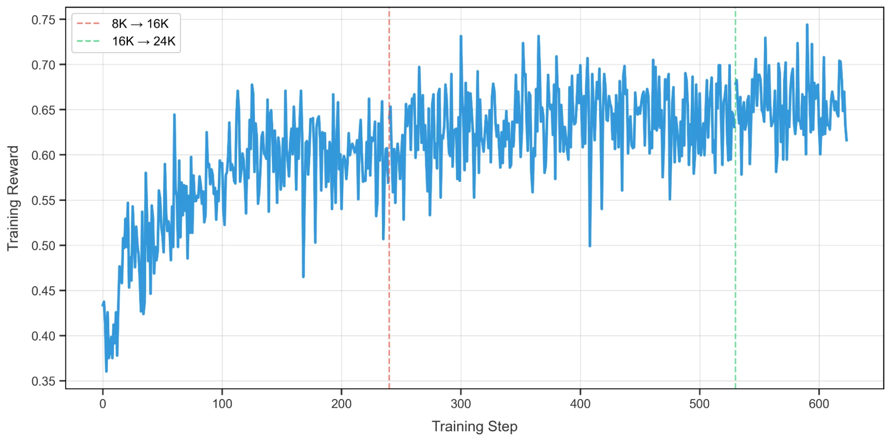
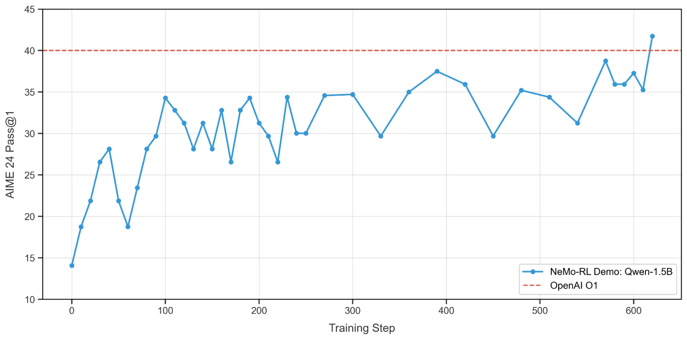

---
date:
  created: 2025-07-08
slug: nemo-rl-deepscaler-grpo
authors:
  - alexander_bukharin
  - terry_kong
  - wenwen_gao
  - sylendran_arunagiri
categories:
    - NeMo-RL
    - Reinforcement Learning
    - DeepScaleR
    - GRPO
    - Qwen
tags:
    - NeMo-RL
    - Reinforcement Learning
    - DeepScaleR
    - GRPO
    - Qwen
---

<!--
nemo_blog: {
  "repo": "https://github.com/NVIDIA-NeMo/blog-poc",
  "authors": ["chtruong814"]
}
-->

# Reinforcement Learning with NVIDIA NeMo-RL: Reproducing a DeepScaleR Recipe Using GRPO

[Reinforcement learning (RL)](https://www.nvidia.com/en-us/glossary/reinforcement-learning/) is the backbone of interactive AI. It is fundamental for teaching agents to reason and learn from human preferences, enabling multiturn tool use, and much more. This post introduces [NVIDIA NeMo-RL](https://docs.nvidia.com/nemo/rl/latest/index.html), a new open source post-training library that is built to support everything from single-GPU prototypes to thousand-GPU large models and to orchestrate multicomponent RL pipelines with ease.

<!-- more -->

Part of [NVIDIA NeMo Framework](https://docs.nvidia.com/nemo-framework/index.html), NeMo-RL includes native integration with models on [Hugging Face](https://huggingface.co/), optimized training and inference, popular algorithms like DPO and GRPO, and [Ray](https://github.com/ray-project/ray)-based orchestration. While the current [v0.2.1](https://github.com/NVIDIA-NeMo/RL/releases/tag/v0.2.1) release supports models up to 32 billion parameters in size, ongoing development aims to extend support to even larger models.

A key design principle of NeMo-RL is its flexible backend architecture that supports multiple training and rollout backends. For training backends, the library currently supports Hugging Face models with PyTorch native parallelisms, with a Megatron-Core backend coming soon to enable larger models with advanced parallelism strategies.

NeMo-RL uses a vLLM backend for generation, with easy extensibility to additional generation backends including [NVIDIA TensorRT-LLM](https://github.com/NVIDIA/TensorRT-LLM) and SGLang. The overall design ensures that high-level algorithm implementations remain agnostic to backend implementation details, with each backend operating in its own isolated environment while adhering to standardized training or generation interfaces. This architecture enables seamless scaling from single-GPU prototypes to thousand-GPU deployments without modifying algorithm code.

In this post, we'll specifically explore how to use NeMo-RL to seamlessly reproduce a DeepScaleR-1.5B recipe using the Group Relative Policy Optimization (GRPO) reinforcement learning algorithm.

## Training high-performing reasoning models with NeMo-RL

Recently, long chain-of-thought (CoT) reasoning models such as DeepSeek-R1 and OpenAI O1 have gained widespread attention. These models have greatly advanced language model capabilities across a variety of challenging domains. The following sections show how NeMo-RL can be used to train these high-performing reasoning models.

We follow the [DeepScaleR](https://pretty-radio-b75.notion.site/DeepScaleR-Surpassing-O1-Preview-with-a-1-5B-Model-by-Scaling-RL-19681902c1468005bed8ca303013a4e2) recipe, which provides a dataset and methodology to train reasoning models on difficult math problems. In particular, we train Qwen-1.5B using GRPO to the level of OpenAI O1 on the competitive academic math benchmark AIME 2024.

## Step-by-step training process

As training long CoT reasoning models can be quite slow due to long generation times, DeepScaleR first trains with shorter maximum sequence lengths, and gradually increases the maximum sequence length used. Concretely, DeepScaleR has three training stages: 8K context length, 16K context length, and 24K context length. This approach also helps control the long-tail distribution of rollout sequence lengths.

Running this training with NeMo-RL is very straightforward, requiring only three steps.

### Step 1: Setup

Clone the repo, and install the uv Python package. With uv, you can quickly create isolated virtual environments despite potentially conflicting dependencies while also natively integrating with Ray.

```bash
git clone  git@github.com:NVIDIA-NeMo/RL.git nemo-rl

cd nemo-rl
pip install uv
```

### Step 2: Training

Run training with DeepSeek-R1-Distill-Qwen-1.5B first on 8K maximum context length, then on 16K maximum context length, and then on 24K maximum context length. NeMo-RL natively integrates with Hugging Face models for users to directly specify their choice of models. The config files specify the DeepScaleR dataset and the correct GRPO hyperparameters.

```bash
uv run examples/run_grpo_math.py --config=examples/configs/grpo-deepscaler-1.5b-8K.yaml

uv run examples/run_grpo_math.py --config=examples/configs/grpo-deepscaler-1.5b-16K.yaml policy.model_name=/path/to/8K/checkpoint/hf

uv run examples/run_grpo_math.py --config=examples/configs/grpo-deepscaler-1.5b-24K.yaml policy.model_name=/path/to/16K/checkpoint/hf
```

The configuration files contain essential parameters for training:

```yaml
policy:
  # Qwen/Qwen2.5-1.5B has tied weights which are only supported with dtensor policy with tp size 1
  # (https://github.com/NVIDIA-NeMo/RL/issues/227)
  model_name: "Qwen/Qwen2.5-1.5B"
  tokenizer:
    name: ${policy.model_name} ## specify if you'd like to use a tokenizer different from the model's default
  train_global_batch_size: 512
  train_micro_batch_size: 4
  generation_batch_size: 32 # Only used when generating using HF backend
  logprob_batch_size: 4
  max_total_sequence_length: 512
  precision: "bfloat16"
  fsdp_offload_enabled: false
  activation_checkpointing_enabled: false
```

<div id="figure-1"></div>

<p style="text-align: center; font-style: italic;">Figure 1. Example <a href="https://github.com/NVIDIA-NeMo/RL/blob/be05b1325383b81cea44f2e847a722168985544b/examples/configs/grpo_math_1B.yaml#L33">config file</a> where model name, sequence length, and other hyperparameters are specified</p>

### Step 3: Evaluation

Convert the checkpoints to Hugging Face format and evaluate the model. Note that the model is constantly evaluated throughout training. The model config, the model location, and desired location of the Hugging Face checkpoint should be specified as shown below.

```bash
uv run examples/convert_dcp_to_hf.py --config=results/grpo-deepscaler-1.5b-8K/step_xx/config.yaml --dcp-ckpt-path=results/grpo-deepscaler-1.5b-8K/step_xx/policy/weights --hf-ckpt-path=results/grpo-deepscaler-1.5b-8K/step_xx/hf

uv run examples/run_eval.py \
    generation.model_name=results/grpo-deepscaler-1.5b-8K/step_xx/hf
```

## Results

[Figure 2](#figure-2) shows the training curve with NeMo-RL. A training reward of 0.65 is achieved in only 400 steps.

<div id="figure-2"></div>



<p style="text-align: center; font-style: italic;">Figure 2. Training curve with NeMo-RL on the DeepScaleR Qwen1.5B recipe</p>

[Figure 3](#figure-3) shows the evaluation results on AIME 2024 throughout training, which eventually surpass OpenAI O1.

<div id="figure-3"></div>



<p style="text-align: center; font-style: italic;">Figure 3. AIME 2024 evaluation scores for the Qwen1.5B recipe trained using NeMo-RL</p>

For a head start on what to expect from the DeepScaleR recipe and to visualize the Tensorboard logs, check out the [NeMo-RL DeepScaleR Tensorboard Viewer Google Colab](https://colab.research.google.com/drive/1TXmKQCB4dpBhbXOQ1-o51iIdvIg7tgdm?usp=sharing).

## Get started with NeMo-RL

NeMo-RL is a scalable post-training library designed for models ranging from a single GPU to thousands. It includes seamless integration with Hugging Face, a modular design for flexibility, and efficient resource management with Ray.

To kick-start your own reinforcement learning experiments with NeMo-RL, explore the open source [NVIDIA NeMo-RL GitHub repo](https://github.com/NVIDIA-NeMo/RL), where you'll find [detailed documentation](https://docs.nvidia.com/nemo/rl/latest/index.html), example scripts, and configuration files. You can also try the [DeepScaleR](https://docs.nvidia.com/nemo/rl/latest/guides/grpo-deepscaler.html) and [OpenMathInstruct-2](https://docs.nvidia.com/nemo/rl/latest/guides/sft-openmathinstruct2.html) examples to learn more.
