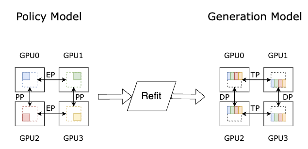
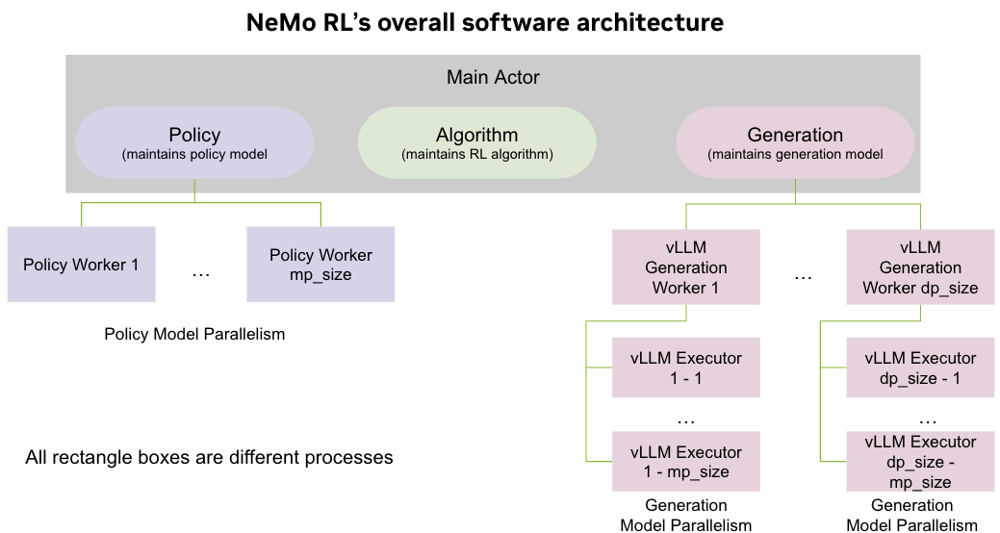
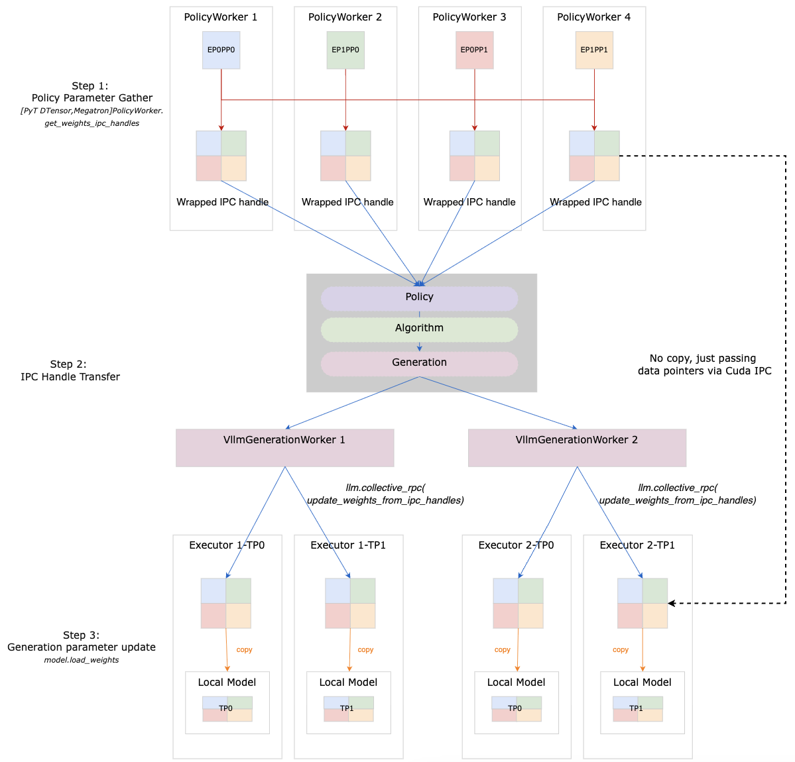
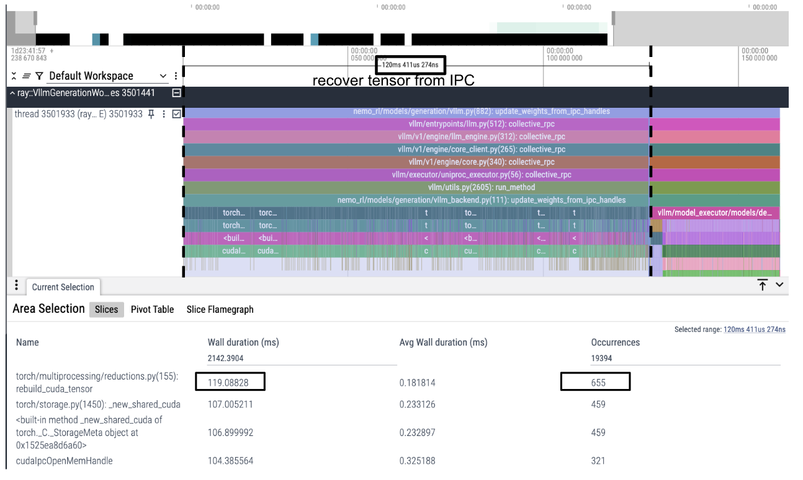
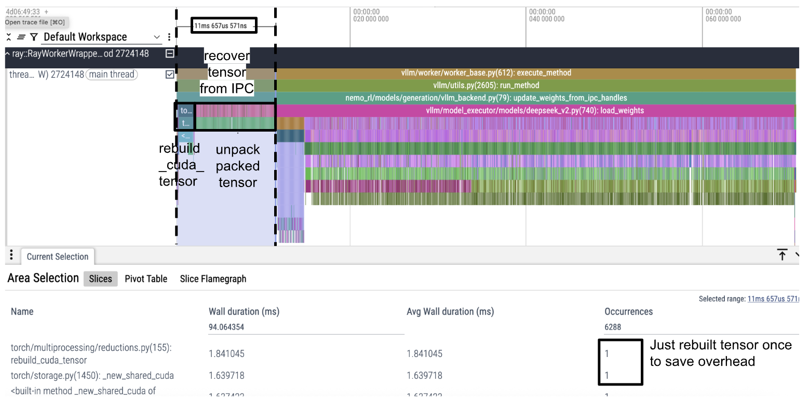
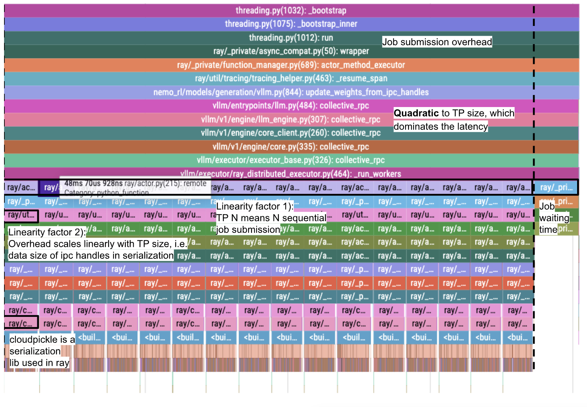

---
date:
    created: 2025-08-12
slug: nemo-rl-refit-performance
authors:
    - guyue_huang
    - parth_chadha
    - terry_kong
    - wenwen_gao
    - zhiyu_li
categories:
    - NeMo-RL
    - Reinforcement Learning
    - DeepSeekV3
tags:
    - NeMo-RL
    - Reinforcement Learning
    - Megatron-Core
    - GRPO
    - DeepSeekV3
---

# NeMo-RL: Journey of Optimizing Weight Transfer in Large MoE Models by 10x

## Introduction
A typical Reinforcement Learning (RL) step involves updating the policy model using the data generated, and transferring the updated weights to the generation model. In addition, training and generation have different memory requirements and hence necessitates different parallelism schemes. The process of transferring weights and updating the sharding is called “refit”, sometimes also referred to as “resharding” in other RL frameworks. Figure 1 shows an example of the refit process for an MoE model, where the policy model and generation model have different parallelism schemes.

  Figure 1. An example refit process with different parallelism schemes in policy and generation.

<!-- more -->
## How Refit is Done in NeMo-RL
The implementation and performance for refit largely depends on the software architecture of the RL framework. As shown in Figure 2, in Nemo RL, there is a main actor that maintains the training loop (for example, [GRPO in NeMo RL](https://github.com/NVIDIA-NeMo/RL/blob/main/nemo_rl/algorithms/grpo.py)). The main actor contains a policy module and a generation module. The policy module is connected to multiple policy workers, which collectively perform the training of the policy model in some model-parallelism scheme. The generation actor is connected to multiple vLLM generation workers, each of which is connected to multiple vLLM executors located in different GPUs that collectively perform the generation with model-parallelism (refer to [vLLM RayDistributedExecutor](https://github.com/vllm-project/vllm/blob/v0.10.0/vllm/executor/ray_distributed_executor.py) for more information). In this architecture, all boxes in Figure 2 belong to different processes, and sharing GPU tensors among them will require cuda Inter-Process Communication (i.e. "cuda IPC") or similar mechanisms (refer to [pytorch multiprocessing documentation](https://docs.pytorch.org/docs/stable/notes/multiprocessing.html) for more information).

  Figure 2. NeMo-RL’s overall software architecture

Refit in NeMo-RL takes three steps, as illustrated in Figure 3:

1. **Policy parameter gather**: The policy workers gather parameters from each device in its model-parallelism. After this step each policy worker gets full model parameters.
2. **IPC handle transfer**:
    * The policy worker wraps the full model parameters on each device into cuda IPC handles and returns the handles to the main actor.
    * The main actor passes the cuda IPC handles to vLLM generation workers. 
    * Each vLLM generation worker invokes a [collective_rpc](https://docs.vllm.ai/en/latest/api/vllm/entrypoints/llm.html#vllm.entrypoints.llm.LLM.collective_rpc) to make all vLLM executors run function `update_weights_from_ipc_handles` using IPC handles as the argument. 
    * The vLLM executors unwrap the IPC handles and recover the parameter tensors from them. **If policy worker and vLLM executors are co-located in the same GPU, no data copy happens during this transfer**.
3. **Generation parameter update**: The vLLM executors update the parameters of its local model shard with the parameter tensors obtained in the last step via the `model.load_weights` API. Only weights belonging to the generation model-parallel shard are used for update. For example, in Figure 3, vLLM executor 1-TP0 only uses half of the parameters and discards the other half.

  Figure 3. NeMo-RL refit workflow

## Optimizing Refit Performance

Table 1 compares the refit speed for a DeepSeek V3 use case without and with optimizations discussed in this blog, and speed-of-light (SOL) scenario as reference. SOL scenario is calculated based on full utilization of GPU network and HBM bandwidth, and zero cpu runtime overhead. From the table we can tell that the biggest performance challenge lies in the step 2 IPC handle transfer. While step 1 and step 3 are not close to SOL either, their ratio in the whole refit time is low. Reducing the IPC handle transfer time becomes critical in refit speed optimization. Specifically, we have identified the following three optimizations, and Table 2 shows the speedup breakdown by each of them, applied in this order.

1. Reducing cuda IPC overhead via tensor packing
2. Mitigating vLLM’s `collective_rpc` API overhead
3. Ahead-of-time medata preparation. 

||Step 1: Policy parameter gather(s)|Step 2: IPC handle transfer(s)|Step 3: Generation parameter update(s)|Total Refit Time(s)|
|-|-|-|-|-|
|NeMo-RL w/o optimization|132.9|558.1|1.5|692.5|
|NeMo-RL v0.3|12.2|33.5|1.5|47.2|
|**Speed-up**||||**14.7x**|
|Speed-of-light|3.3|0|0.01|

  Table 1: Refit Performance Breakdown and Optimization for DeepSeek V3 - Training sharding EP64PP8 and Generation sharding TP64.

 

||DSV3 Refitting Time (s)|Marginal Improvement|Cumulative Improvement|
|-|-|-|-|
|Baseline|693|1.0x|1.0x|
|Part 1 - Reducing Cuda IPC Overhead via Tensor Packing|450|1.5x|1.5x|
|Part 2 - Mitigating the overhead of vLLM’s collective_rpc API|120|3.8x|5.8x|
|Part 3 - Further reducing refit overhead via Ahead-of-time metadata preparation|47|2.5x|14.7x|

  Table 2: Refit optimization breakdown and their contribution to performance improvements.

### Part 1 - Reducing Cuda IPC Overhead via Tensor Packing

The first thing to notice is a large number of parameters that multiplies the overhead of Cuda IPC tensor wrapping and recovering. We utilize the torch multiprocessing module to perform cuda IPC: 

* the [reduce_tensor](https://github.com/pytorch/pytorch/blob/255c0545e7eac2ec6d00a41a3fc9d6d8201f8f39/torch/multiprocessing/reductions.py#L223) function wraps a torch tensor into an IPC handle at the policy worker
* the [rebuild_cuda_tensor](https://github.com/pytorch/pytorch/blob/255c0545e7eac2ec6d00a41a3fc9d6d8201f8f39/torch/multiprocessing/reductions.py#L155) function unwraps the IPC handle back to the torch tensor in the vLLM generation worker. 

In the experiments we find that each invocation of `rebuild_cuda_tensor` takes about 0.18 milliseconds, and when the number of parameters in the model increases, this overhead increases linearly. Take DeepSeek V3 as an example which has over 90 thousand parameters, the overhead of calling `rebuild_cuda_tensor` for each vLLM executor is about 16 seconds. Figure 4 shows a trace for the `update_weights_from_ipc_handles` function of the vLLM executor, where the majority of time is spent on a series of `rebuild_cuda_tensor` calls.

  Figure 4. Overhead of executing rebuild_cuda_tensor in vLLM executors

To reduce this overhead, we propose to pack all parameters in the policy worker into one big torch tensor – the cuda IPC buffer. In addition, the policy worker prepares the metadata with everything needed to unpack parameters from the Cuda IPC buffer, including the names of parameters, their sizes and their offset in the buffer. The policy worker only wraps the Cuda IPC buffer to an IPC handle, thus the vLLM executor only needs to invoke `rebuild_cuda_tensor` once, and unpack the Cuda IPC buffer to obtain all parameters via the metadata. As introduced above, when the full model size is larger than the GPU memory, we split the full model into buckets. In this scenario, instead of calling `rebuild_cuda_tensor` once for the entire model, the vLLM executor needs to call `rebuild_cuda_tensor` once for each bucket. This optimization reduces the time required to recover a tensor from IPC handles from 120ms to 12ms, as illustrated in Figure 5, and is more notable for the large bucket size. The implementation can be found in [NeMo-RL PR 589](https://github.com/NVIDIA-NeMo/RL/pull/589).

  Figure 5. Overhead for rebuild_cuda_tensor and unpacking after optimization.

### Part 2 - Mitigating the overhead of VLLM’s collective_rpc API

The second performance challenge with refit comes from VLLM’s collective_rpc API. To support model-parallelism in vLLM we use the Ray distributed backend. There are two levels of serialization here:

1. Each vLLMGenerationWorker for the model-parallel group invokes the [collective_rpc](https://docs.vllm.ai/en/latest/api/vllm/entrypoints/llm.html#vllm.entrypoints.llm.LLM.collective_rpc) API, which iterates over all the executors and invokes their `update_weights_from_ipc_handles` function with the [remote](https://docs.ray.io/en/latest/ray-core/api/doc/ray.remote.html#ray.remote) method, as shown in Figure 6, label 1). The number of executor is the *tp_size*
2. For each execution of the `update_weights_from_ipc_handles` function, the `remote` method passes the arguments for all executors to each executor. The data size is hence proportional to *tp_size*. 

The cumulative overhead from above two points implies that it is quadratic in relation to *tp_size*: When the tp_size increases, the number of executors to be iterated over increases linearly, and the meta datasize to be serialized **per executor** call also increases linearly, compounding to quadratic increase in total overhead. 

To mitigate this overhead, an insight is that each executor only needs the metadata and IPC handle on its own device, while the `collective_rpc` API is defined as single-data-formultiple-workers, leading to dramatic overhead in `remote` function calls. We therefore propose to abandon the `collective_rpc` and directly invoke `update_weights_from_ipc_handles` of each executor with the argument for that particular executor. With this change, the metadata size is now constant with respect to *tp_size* and the cumulative overhead is reduced to being linear with *tp_size*. The implementation can be found in [NeMo-RL PR 634](https://github.com/NVIDIA-NeMo/RL/pull/634).

  Figure 6. The overhead of argument serialization in collective_rpc API call. 1) and 2) indicates the two places where overhead scales linearly with *tp_size*, compouding to quadratic increase.

### Part 3 - Further reducing refit overhead via Ahead-of-time metadata preparation

Since data size plays an important factor in the `update_weights_from_ipc_handles` call, we can further reduce the metadata size to achieve additional gains. Originally, the metadata for tensor packing included:

* A boolean flag indicating tensor packing.
* An IPC handle, encompassing the `rebuild_cuda_tensor` function and its arguments.
* Parameter information (a dictionary mapping parameter names to their `dtype`, `shape`, `size`, and `offload` values).
The substantial size of metadata was primarily due to parameter information, particularly with large tensors. Notably, serializing non-native Python types like `tensor.Size` or `tensor.dtype` in `cloudpickle` incurs a heavier cost, as additional information is required to preserve their type.

To address this, we implemented the following optimizations:

* Caching of Parameter Information: We now cache the `dtype`, `shape`, and `size` of parameters, as these remain constant between steps.
* Removal of `offset` from Metadata: `Offset` is the starting position of the packed tensor during recovery. The `offset` value can be recalculated locally based on `dtype`, `shape`, and `size`, and this calculation is relatively lightweight. 
* Removal of `rebuild_cuda_tensor` function: We found serializing the `rebuild_cuda_tensor` function to be expensive, so it has been removed from the metadata.

With these optimizations, the metadata size has been significantly reduced and now comprises:

* A boolean flag indicating tensor packing.
* An IPC handle, containing only the IPC handle arguments.
* A list of parameter names.

The implementation details can be found in the following NeMo-RL PRs: [PR 638](https://github.com/NVIDIA-NeMo/RL/pull/638), [PR 686](https://github.com/NVIDIA-NeMo/RL/pull/686), [PR 698](https://github.com/NVIDIA-NeMo/RL/pull/698).

## Conclusion and Future Work
In this blog, we introduced the implementation of weight transfer in NeMo RL and analyzed its performance bottlenecks such as overhead of cuda IPC, vLLM’s `collective_rpc` mechanism, and Ray job submission. We also introduce recent features in NeMo RL to resolve these challenges. In the future, we will integrate NeMo Framework’s [Megatron-Bridge](https://github.com/NVIDIA-NeMo/Megatron-Bridge) to optimize the policy parameter gather phase. 

## Core Contributors

Thank you to everyone who has contributed to NeMo-RL refit performance! Special thanks to the core contributors below:

- [Zhiyu Li](https://github.com/ZhiyuLi-Nvidia)
- [Yuki Huang](https://github.com/yuki-666)
- [Yifu Wu](https://github.com/yfw)
- [Guyue Huang](https://github.com/guyueh1)

Also want to acknowledge [Guan Luo](https://github.com/GuanLuo) for sharing .md editing expertise and being a tireless voice transmitter to chatgpt. 
