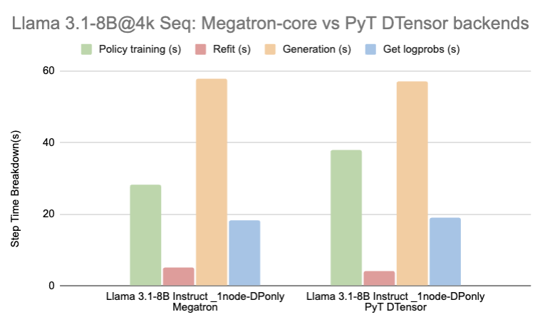
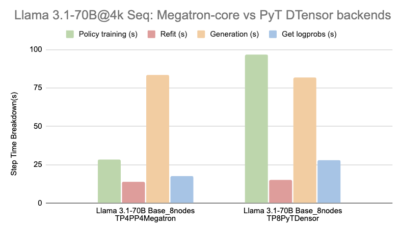
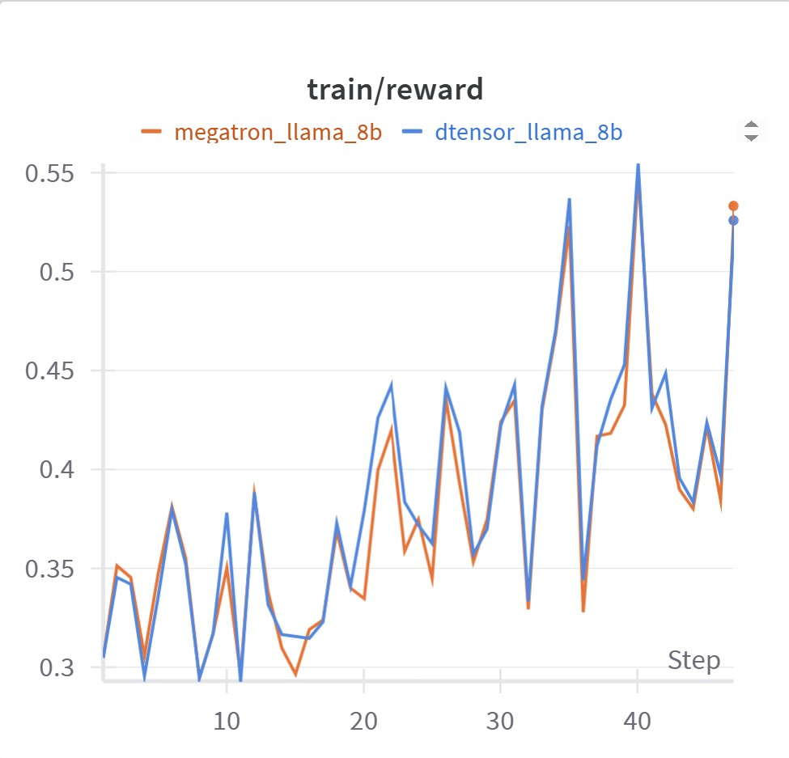
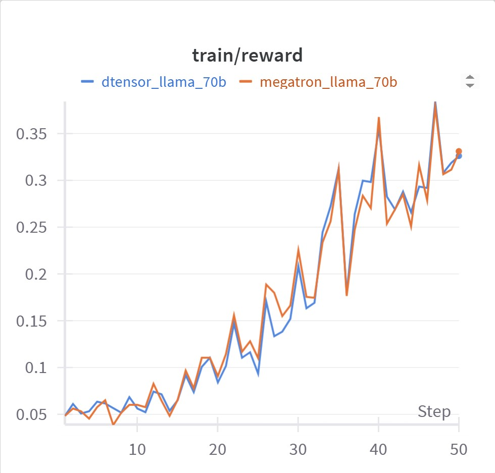

---
date:
  created: 2025-07-21
slug: nemo-rl-v0.3
authors:
  - anna_shors
  - parth_chadha
  - terry_kong
  - wenwen_gao
  - sylendran_arunagiri
categories:
  - NeMo-RL
  - Reinforcement Learning
  - Megatron-Core
  - GRPO
  - DeepSeekV3
  - Qwen3
tags:
  - NeMo-RL
  - Reinforcement Learning
  - Megatron-Core
  - GRPO
  - DeepSeekV3
  - Qwen3
---


<!--
nemo_blog: {
  "repo": "https://github.com/NVIDIA-NeMo/RL",
  "authors": ["ashors1", "parthchadha", "terrykong", "snowmanwwg", "Sylendran95"]
}
-->

# NeMo-RL V0.3: Scalable and Performant Post-training with Nemo-RL via Megatron-Core

The initial release of NeMo-RL included training support via PyTorch DTensor (otherwise known as FSDP2). This backend allows for native integration with the HuggingFace ecosystem, quick experimentation, and scaling via PyTorch native parallelisms (FSDP2, tensor parallel, sequence parallel and context parallel). However, when model sizes approach hundreds of billions of parameters, the DTensor path becomes insufficient. Activation memory from large models introduces significant recompute overhead, resulting in infeasibly slow step times. Furthermore, the DTensor path lacks optimized CUDA kernels and other performance enhancements necessary for optimal throughput. These challenges highlight the need for a more efficient solution, which is precisely what NVIDIA's [Megatron-Core](https://github.com/NVIDIA/Megatron-LM/tree/main/megatron/core) library is designed to provide.

<!-- more -->

## Megatron Backend in Nemo-RL

Built with GPU-optimized techniques and high-throughput performance enhancements, [Megatron-Core](https://github.com/NVIDIA/Megatron-LM/tree/main/megatron/core) enables seamless training of massive language models. The library's 6D parallelism strategy optimizes both communication and computation patterns and supports a diverse range of model architectures.

NeMo-RL has added support for Megatron-Core, allowing users to take advantage of these optimizations during post-training. While Megatron-Core offers many low-level settings for optimizing performance, configuring them can be overwhelming for those new to the library. NeMo-RL streamlines this process by automatically handling much of the complex tuning behind the scenes and instead presenting users with a simpler, more intuitive set of configuration options.

## Getting Started with Megatron Training

Enabling Megatron-based training is straightforward. Simply add the `policy.megatron_cfg` section to your YAML configuration:

```yaml
policy:

  ...

  megatron_cfg:
    enabled: true
    activation_checkpointing: false
    tensor_model_parallel_size: 1
    pipeline_model_parallel_size: 1

    ...

    optimizer:
      ...

    scheduler:
      ...

    distributed_data_parallel_config:
      grad_reduce_in_fp32: false
      overlap_grad_reduce: true
      overlap_param_gather: true
      average_in_collective: true
      use_custom_fsdp: false
      data_parallel_sharding_strategy: "optim_grads_params"
```

See [examples/configs/grpo_math_1B_megatron.yaml](https://github.com/NVIDIA-NeMo/RL/blob/v0.3.0/examples/configs/grpo_math_1B_megatron.yaml) for a complete working example.

All arguments within the megatron config will be forwarded to Megatron during training. After adding the megatron section to your config and setting `enabled=True`, you are ready to train a model using Megatron-Core! Launching training can be done in the exact same way as with DTensor, as described in the [README](https://github.com/NVIDIA-NeMo/RL/blob/v0.3.0/README.md#grpo) or our guide on [reproducing DeepScaleR](https://nvidia-nemo.github.io/blog/2025/07/08/nemo-rl-deepscaler-grpo/).

## Results

Megatron-based training supports both dense and Mixture of Experts (MoE) models. The following shows a step time breakdown for GRPO on a few commonly used models. The timing reported in the table is an average over steps 22-29 of each training run.

<table>
<thead>
<tr>
<th>Model</th>
<th>Backend</th>
<th>Nodes</th>
<th>GPUs per node</th>
<th>Total step time (s)</th>
<th>Policy training (s)</th>
<th>Refit (s)</th>
<th>Generation (s)</th>
<th>Get logprobs (s)</th>
<th>Avg. generated tokens per sample</th>
</tr>
</thead>
<tbody>
<tr>
<td rowspan="2" style="text-align: center; vertical-align: middle;">Llama 3.1-8B Instruct</td>
<td style="background-color: #f5f5f5;">Megatron</td>
<td style="background-color: #f5f5f5;">1</td>
<td style="background-color: #f5f5f5;">8</td>
<td style="background-color: #f5f5f5;">112</td>
<td style="background-color: #f5f5f5;">28</td>
<td style="background-color: #f5f5f5;">5</td>
<td style="background-color: #f5f5f5;">58</td>
<td style="background-color: #f5f5f5;">18</td>
<td style="background-color: #f5f5f5;">795</td>
</tr>
<tr>
<td>PyT DTensor</td>
<td>1</td>
<td>8</td>
<td>122</td>
<td>38</td>
<td>4</td>
<td>57</td>
<td>19</td>
<td>777</td>
</tr>
<tr>
<td rowspan="2" style="text-align: center; vertical-align: middle;">Llama 3.1-70B Base</td>
<td style="background-color: #f5f5f5;">Megatron</td>
<td style="background-color: #f5f5f5;">8</td>
<td style="background-color: #f5f5f5;">8</td>
<td style="background-color: #f5f5f5;">147</td>
<td style="background-color: #f5f5f5;">28</td>
<td style="background-color: #f5f5f5;">14</td>
<td style="background-color: #f5f5f5;">84</td>
<td style="background-color: #f5f5f5;">18</td>
<td style="background-color: #f5f5f5;">398</td>
</tr>
<tr>
<td>PyT DTensor*</td>
<td>8</td>
<td>8</td>
<td>230</td>
<td>97</td>
<td>15</td>
<td>82</td>
<td>28</td>
<td>395</td>
</tr>
<tr>
<td rowspan="1" style="text-align: center; vertical-align: middle;">Qwen3 32B**</td>
<td style="background-color: #f5f5f5;">Megatron</td>
<td style="background-color: #f5f5f5;">8</td>
<td style="background-color: #f5f5f5;">8</td>
<td style="background-color: #f5f5f5;">213</td>
<td style="background-color: #f5f5f5;">68</td>
<td style="background-color: #f5f5f5;">7</td>
<td style="background-color: #f5f5f5;">96</td>
<td style="background-color: #f5f5f5;">40</td>
<td style="background-color: #f5f5f5;">3283</td>
</tr>
<tr>
<td rowspan="1" style="text-align: center; vertical-align: middle;">Qwen3 30B-A3B**</td>
<td style="background-color: #f5f5f5;">Megatron</td>
<td style="background-color: #f5f5f5;">8</td>
<td style="background-color: #f5f5f5;">8</td>
<td style="background-color: #f5f5f5;">167</td>
<td style="background-color: #f5f5f5;">50</td>
<td style="background-color: #f5f5f5;">12</td>
<td style="background-color: #f5f5f5;">78</td>
<td style="background-color: #f5f5f5;">23</td>
<td style="background-color: #f5f5f5;">3251</td>
</tr>
</tbody>
</table>

*All runs were conducted with the following settings: max sequence length 4096, rollout batch size 2048, global batch size 512, and sequence packing enabled (see the subsequent section for details on sequence packing). For the Megatron-Core runs, Llama 3.1-8B was run with only data parallel, Llama 3.1-70B was run with 4-way tensor and 4-way pipeline parallel, Qwen3 32B was run with 4-way tensor and 2-way pipeline parallel, and Qwen3 30B-A3B was run with 8-way expert and 2-way tensor parallel.*

*\*Llama 70B DTensor results were gathered using dynamic batching rather than sequence packing because of a known [out of memory issue with sequence packing](https://github.com/NVIDIA-NeMo/RL/issues/769).*

*\*\*Qwen3 32B and 30B-A3B DTensor fail due to a known assertion error. See [the issue](https://github.com/NVIDIA-NeMo/RL/issues/758).*




<p style="text-align: center; font-style: italic;">Figure 1. Megatron vs DTensor: Total step time comparison</p>

By leveraging performance optimizations provided by Megatron-Core, we achieve superior training performance relative to DTensor with the same convergence properties, as demonstrated below.

<div id="figure-2"></div>
<div id="figure-3"></div>

{: style="max-width: 50%; display: block; margin: 0 auto;"}

<p style="text-align: center; font-style: italic;">Figure 2. 8B GRPO Megatron-Core vs DTensor reward curves</p>

{: style="max-width: 50%; display: block; margin: 0 auto;"}

<p style="text-align: center; font-style: italic;">Figure 3. 70B GRPO Megatron-Core vs DTensor reward curves</p>

The following commands were used to generate these reward curves:

```bash
## 8B -- requires a single node

## dtensor
uv run ./examples/run_grpo_math.py --config examples/configs/grpo_math_8B.yaml \
    loss_fn.use_importance_sampling_correction=True

## megatron
uv run ./examples/run_grpo_math.py --config examples/configs/grpo_math_8B_megatron.yaml \
    policy.sequence_packing.enabled=True loss_fn.use_importance_sampling_correction=True

## 70B -- requires 8 nodes

## dtensor
uv run ./examples/run_grpo_math.py --config examples/configs/grpo_math_8B.yaml \
    policy.model_name=meta-llama/Llama-3.1-70B policy.tokenizer.name=meta-llama/Llama-3.1-70B-Instruct \
    policy.generation.vllm_cfg.tensor_parallel_size=4 policy.max_total_sequence_length=4096 \
    cluster.num_nodes=8 policy.dtensor_cfg.enabled=True policy.dtensor_cfg.tensor_parallel_size=8 \
    policy.dtensor_cfg.sequence_parallel=True policy.dtensor_cfg.activation_checkpointing=False \
    loss_fn.use_importance_sampling_correction=True

## megatron
uv run ./examples/run_grpo_math.py --config examples/configs/grpo_math_70B_megatron.yaml \
    policy.model_name=meta-llama/Llama-3.1-70B policy.tokenizer.name=meta-llama/Llama-3.3-70B-Instruct \
    policy.sequence_packing.enabled=True loss_fn.use_importance_sampling_correction=True
```

These runs leverage a few performance and convergence enhancements to ensure that we achieve both optimal throughput and convergence.

1. **Sequence packing**: Multiple sequences are packed to the `max_total_sequence_length`. Sequence packing reduces the number of padding tokens and is particularly useful when there are large variations in sequence length. For Llama 70B, enabling sequence packing yields an approximate 1x reduction in overall step time with no impact on convergence. This enhancement is supported for both the Megatron-Core and DTensor backends. For more details on sequence packing in NeMo-RL, refer to our [documentation](https://github.com/NVIDIA-NeMo/RL/blob/v0.3.0/docs/design-docs/sequence-packing-and-dynamic-batching.md).
2. **Importance sampling**: Since NeMo-RL uses different frameworks for inference and training to achieve the best performance, there may be small differences in token probabilities between training and inference. One way to mitigate this issue is to use importance sampling, which assigns a weight to each sample that is a function of the inference and training probabilities. Enabling importance sampling reduces the variance between runs and allows us to better match convergence between Megatron-Core and DTensor policies. For more information on importance sampling in NeMo-RL, refer to our [documentation](https://github.com/NVIDIA-NeMo/RL/blob/v0.3.0/docs/guides/grpo.md#importance-sampling-correction-use_importance_sampling_correction).

### Long Sequence Support

We can also leverage context parallelism with both Megatron-Core and DTensor to support long context training.
For example, the following shows current performance results for Llama 3.3-70B at 16k sequence length using the Megatron backend. Even longer sequence lengths are supported and performance optimizations for long context training are ongoing.

| Model | Max sequence length | Nodes | GPUs per node | Context parallel size | Total step time (s) | Policy training (s) | Refit (s) | Generation (s) | Get logprobs (s) | Avg. generated tokens per sample |
|-------|-------------------|-------|---------------|------------|-------------------|-------------------|-----------|----------------|------------------|---------------------|
| Llama 3.3-70B Instruct | 16384 | 16 | 8 | 4 | 445 | 64 | 17 | 287 | 75 | 749 |

## Other Notable Features

In addition to the Megatron training backend, NeMo-RL V0.3 introduces a number of exciting features that help democratize efficient post-training on a wide range of models:

- **Async rollouts**: Users can now switch on VLLM async engine by setting `policy.generation.async_engine=True`, which speeds up multi-turn RL by 2-3x.
- **Non-colocated generation (DTensor backend)**: Users now have the option to place the training and generation backends on different sets of GPUs. This can be useful if training and generation have incompatible parallelisms/world sizes, or if the memory after offloading for training or generation is not low enough with colocation. See the 0.3.0 [release notes](https://github.com/NVIDIA-NeMo/RL/releases/tag/v0.3.0) for more details.

## Coming Soon

Stay on the lookout for the following features coming very soon:

- **Efficient Larger model support**: Using the Megatron backend to run models on the order of hundreds of billions of parameters, including DeepSeek-V3 and Qwen3-235B-A22B.
- **Highly optimized refit**
- **FP8 generation support**
- **Megatron and DTensor VLM support**
- **Non-colocated generation with the Megatron-Core backend**

## Core Contributors

Thank you to everyone who has contributed to NeMo-RL so far! Special thanks to the core contributors of V0.3:

- [Sahil Jain](https://github.com/SahilJain314)
- [Parth Chadha](https://github.com/parthchadha)
- [Terry Kong](https://github.com/terrykong)
- [Yi-Fu Wu](https://github.com/yfw)
- [Anna Shors](https://github.com/ashors1)
- [Zhiyu Li](https://github.com/ZhiyuLi-Nvidia)
- [Guyue Huang](https://github.com/guyueh1)
- [Ahmad Kiswani](https://github.com/ahmadki)
- [Yuki Huang](https://github.com/yuki-666)
- [Jonas Yang](https://github.com/joyang-nv)
- [Jimmy Zhang](https://github.com/jiemingz)
