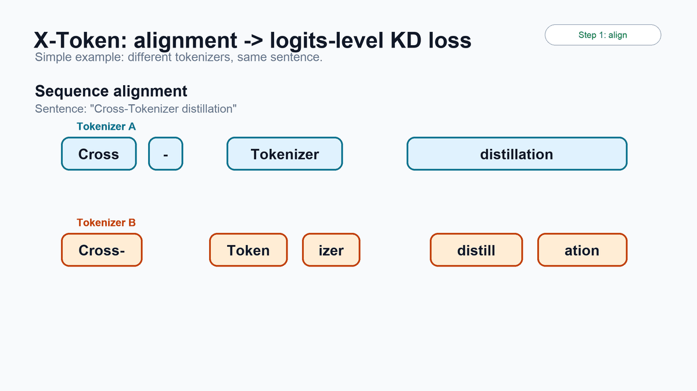
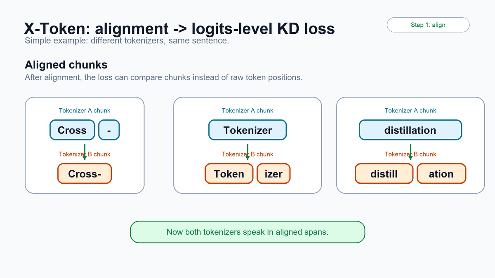
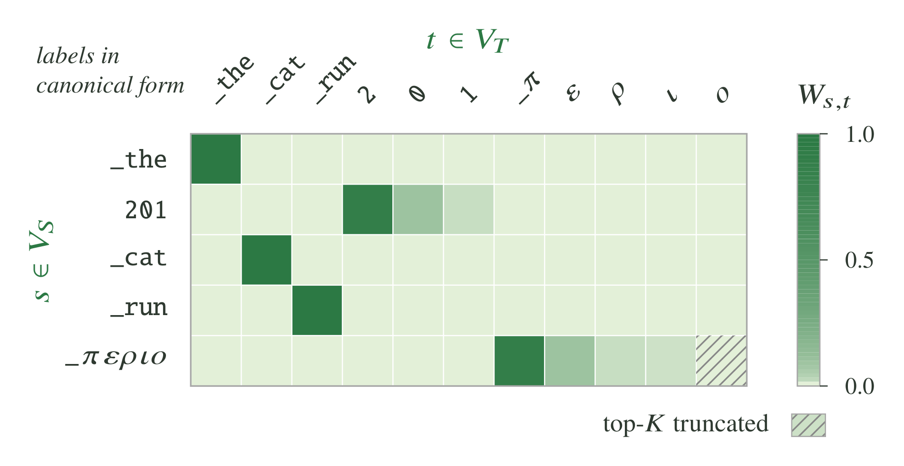
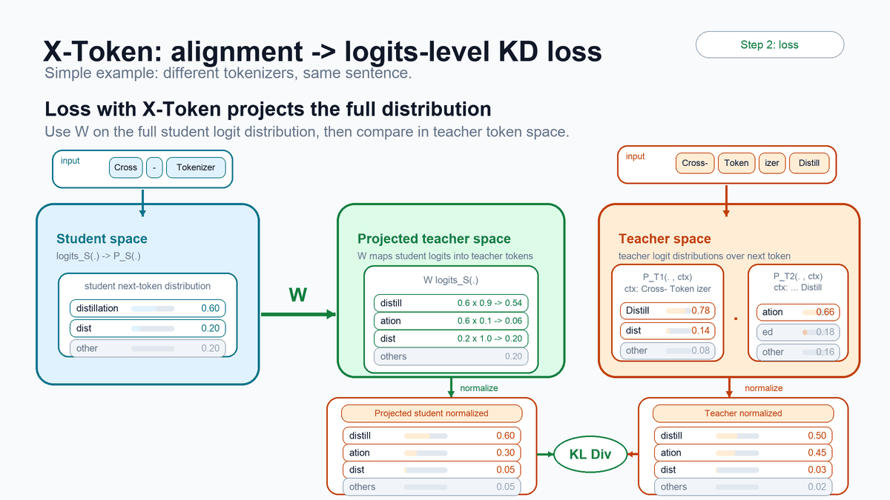

---
date:
  created: 2026-07-14
slug: cross-tokenizer-mopd-knowledge-distillation
authors:
  - sharath_turuvekere_sreenivas
  - adithya_hanasoge
  - mingyu_yang
  - yifu_wu
  - wenwen_gao
  - pavlo_molchanov
categories:
  - NeMo-RL
  - On-Policy Distillation
tags:
  - NeMo-RL
  - Knowledge Distillation
  - X-Token
  - MOPD
---

# Cross-Tokenizer and MOPD: Latest Advancements in Knowledge Distillation in NVIDIA NeMo-RL

<!--
nemo_discussion: {
  "repo": "https://github.com/NVIDIA-NeMo/RL",
  "authors": ["sharathts", "avenkateshha", "mingyyang", "yfw", "snowmanwwg", "pamolchanov"]
}
-->

*From off-policy knowledge distillation as a stronger form of supervised fine-tuning to on-policy distillation after SFT—and, for the first time in NeMo-RL, distillation from multiple teachers with mismatched tokenizers.*

Knowledge distillation (KD) transfers behavior from a stronger **teacher** model into a **student** model. The goal is to retain much of the teacher's quality while reducing inference cost, latency, and memory footprint. Recent techniques also transfer knowledge from multiple domain-specific teachers into one student model. This post introduces X-Token, which expands the choice of teacher models for distillation, and then explains the algorithm and execution choices supported by NVIDIA NeMo-RL.

<!-- more -->

https://github.com/user-attachments/assets/949529b4-23d2-4b87-af8d-52b248032ac5

## X-Token knowledge distillation

Traditional KD is tokenizer-bound. Because the teacher and student distributions must be compared over the same vocabulary, distillation is usually limited to models within the same family.

**X-Token removes this limitation.** It enables distillation across different tokenizers, so a student can learn from stronger teachers even when they use different vocabularies and segment text differently. Multi-teacher distillation also becomes more flexible: teachers can be chosen for their capabilities instead of tokenizer compatibility.

When teacher and student use different tokenizers, standard KL distillation breaks down. The same text can be split into different token spans, and the teacher and student distributions exist over different vocabularies.

X-Token addresses the mismatch in two steps:

1. Align token spans between the teacher and student.
2. Project the student distribution into the teacher vocabulary space before computing KL divergence. The projection uses a sparse vocabulary-level matrix initialized through bidirectional cross-tokenization and optionally learned during KD.

The following sequence shows how differently tokenized text is aligned into comparable spans.

<strong>Figure 1.</strong> Two tokenizers segment the same sentence into different tokens.

<strong>Figure 2.</strong> Span alignment creates comparable chunks for cross-tokenizer distillation.

After alignment, a sparse vocabulary-level projection realigns student probability mass with the teacher's vocabulary.

<strong>Figure 3.</strong> A sparse projection matrix maps student-token probability mass into the teacher vocabulary.

The projected student distribution can then be compared with the teacher distribution using KL divergence.

<strong>Figure 4.</strong> X-Token projects the full student distribution into teacher space before computing KL divergence.

For more details, see the [X-Token technical report](https://arxiv.org/abs/2605.21699) and the [NeMo-RL X-Token guide](https://github.com/NVIDIA-NeMo/RL/blob/main/docs/guides/xtoken-off-policy-distillation.md).

## Off-policy versus on-policy KD

The key difference between off-policy and on-policy KD is where the training sequences come from.

**Off-policy KD** trains on a fixed dataset. The dataset can contain human-written, curated, or teacher-generated responses. Both student and teacher score the same fixed sequences, and the student learns to match the teacher's next-token distribution. This makes off-policy KD a stronger form of SFT because the teacher distribution provides richer supervision than a one-hot label.

**On-policy KD** uses student-generated trajectories. The student samples responses from prompts, the teacher scores those responses, and the student learns from teacher feedback on its own behavior rather than only from dataset or teacher-generated trajectories. This reduces the mismatch between training and inference and further refines the student's policy.

This suggests a natural post-training order:

1. **Bootstrap with off-policy SFT-KD.** Give the student enough basic capability to generate useful responses.
2. **Refine with on-policy KD.** Once the student has a reasonable policy, refine it further with teacher supervision.

The AIME 2025 evaluation in the NeMo-RL [on-policy distillation technical discussion](https://github.com/NVIDIA-NeMo/RL/discussions/1445) shows this staged pattern for a Qwen3-4B-Base student:

| Student model | Original | Off-policy distillation | On-policy distillation | Off-policy + On-policy distillation |
| --- | ---: | ---: | ---: | ---: |
| Qwen3-4B-Base | 2.71 | 30.42 | 28.96 | **47.71** |

**Takeaway:** Off-policy KD is most useful as a bootstrap SFT stage, while on-policy KD works best after the student already has a usable policy.

## Off-policy X-Token KD

Off-policy X-Token KD supports distillation from teachers with different tokenizers, including multiple teachers at once.

### Pretraining-based X-Token KD

In the results below, X-Token improves over the Llama-3.2-1B continued-pretraining baseline and outperforms other cross-tokenizer KD methods, including ULD and GOLD, for both the Phi-4 and Qwen3 single-teacher setups. Extending the X-Token approach to multiple teachers produces the highest overall average score: the Phi-4 and Llama-3.2-3B combination achieves 40.48. Together, these results support the central X-Token motivation—choose teachers by capability, not tokenizer compatibility.

| Student model | Teacher model | MMLU | GSM8K | Math Hendrycks | Winogrande | HellaSwag | Avg. |
| --- | --- | ---: | ---: | ---: | ---: | ---: | ---: |
| Llama-3.2-1B | None (baseline) | 32.05 | 5.69 | 5.48 | 61.48 | 65.08 | 33.96 |
|  | None (continued pretraining) | 40.50 | 10.25 | 6.90 | 61.60 | 63.90 | 36.63 |
|  | Llama-3.2-3B | 43.83 | 12.89 | 8.16 | 62.70 | 64.42 | 38.40 |
|  | Phi-4-mini-Instruct (ULD) | 41.43 | 17.97 | 6.24 | 62.59 | 63.32 | 38.31 |
|  | Phi-4-mini-Instruct (GOLD) | 43.50 | 16.50 | 7.80 | 62.60 | 62.92 | 38.66 |
|  | Phi-4-mini-Instruct (X-Token) | 43.93 | 19.11 | 8.32 | 61.87 | 62.67 | **39.18** |
|  | Qwen3-4B (ULD) | 40.34 | 14.56 | 4.04 | 61.96 | 62.93 | 36.77 |
|  | Qwen3-4B (GOLD) | 42.56 | 2.56 | 4.50 | 62.95 | 62.59 | 35.03 |
|  | Qwen3-4B (X-Token) | 44.67 | 15.54 | 7.96 | 63.46 | 62.63 | 38.85 |
|  | Multi-teacher: Phi-4 + Llama-3.2-3B | 46.32 | 20.39 | 9.02 | 63.30 | 63.38 | **40.48** |
|  | Multi-teacher: Qwen3 + Phi-4 | 43.98 | 14.63 | 8.10 | 62.74 | 63.00 | 38.49 |
|  | Multi-teacher: Phi-4 + Qwen3 + Llama-3.2-3B | 45.86 | 19.18 | 8.56 | 63.61 | 63.55 | 40.15 |

### SFT-based X-Token KD

X-Token also improves supervised fine-tuning. In the Llama-3-8B setup, cross-tokenizer SFT-KD from a Qwen3-14B teacher improves the average score over vanilla SFT, with particularly strong gains on MATH and IFEval.

| Student model | Teacher model | MMLU | GPQA | GSM8K | MATH | IFEval | Avg. |
| --- | --- | ---: | ---: | ---: | ---: | ---: | ---: |
| Llama-3-8B | None | 68.68 | 23.74 | 75.36 | 46.18 | 74.49 | 57.69 |
|  | None (SFT) | 67.08 | 31.82 | 78.17 | 47.76 | 77.45 | 60.46 |
|  | Qwen3-14B (X-Token SFT-KD) | 67.78 | 28.79 | 78.32 | 53.84 | 80.22 | **61.79** |

**Takeaway:** X-Token benefits both pretraining and alignment. It enables stronger teacher selection across model families and supports multi-teacher distillation when teachers have complementary strengths.

## Multi-Teacher On-Policy Distillation versus full-distribution KL

NeMo-RL supports two distillation styles today:

1. MOPD-style RL-based distillation
2. Full-distribution KL distillation

### MOPD: teacher-guided RL

[Multi-Teacher On-Policy Distillation (MOPD)](https://github.com/NVIDIA-NeMo/RL/blob/main/docs/about/algorithms/mopd.md) uses an RL-style objective. Instead of matching the full teacher distribution, it focuses on the token that the student actually sampled.

At each position, the teacher-student log-probability gap on the sampled token becomes an advantage-like signal in a policy-gradient update. In effect, MOPD is teacher-guided RL.

This has two practical benefits:

- It fits naturally into NeMo-RL's GRPO path (`run_grpo.py`), including rollouts, advantages, and asynchronous generation.
- It can be combined with a real RL reward, so the model can learn from both teacher guidance and task-specific reward signals.

MOPD is a good fit when the student can already generate meaningful trajectories and teacher guidance inside an RL training loop is preferred. This top-1 sampled style is used with models such as MiMo-V2 and GLM-5.

### Full-distribution KL

KL-based KD matches the teacher's full next-token distribution, or a top-k approximation of it. This transfers the teacher's *dark knowledge*: not just the most likely token, but also the relative probabilities of plausible alternatives.

This is the traditional KD path used by systems such as Qwen and DeepSeek. In NeMo-RL, X-Token extends this path to teachers with different tokenizers through alignment and projection.

| Objective | What it learns from | Use case |
| --- | --- | --- |
| MOPD | The token sampled by the student | Teacher-guided RL |
| KL KD | Full or top-k distribution | Rich imitation of the teacher |

## Synchronous versus asynchronous execution

**Synchronous training** runs each stage in lockstep: generate, score with the teacher, optimize, and repeat. It is simple and stable, but each stage waits on the others, which creates pipeline bubbles.

**Asynchronous training** overlaps stages. For example, the system can generate the next rollout while optimizing the current one. This keeps hardware busier and improves throughput.

The tradeoff is staleness: some samples can come from a slightly older student policy. NeMo-RL's asynchronous GRPO path bounds this staleness with mechanisms such as replay buffers and trajectory-age limits. A conservative one-step asynchronous setup can recover much of the throughput benefit while keeping policy drift small. For a broader treatment of asynchronous on-policy distillation, see the [verl documentation](https://verl.readthedocs.io/en/latest/advance/async-on-policy-distill.html).

## Choosing a KD recipe

The recommended workflow is to treat KD recipes as stages in a post-training pipeline rather than mutually exclusive options.

| Goal | Recommended recipe |
| --- | --- |
| Bootstrap a base model | Off-policy SFT-KD with multi-teacher X-Token |
| Refine a model that already generates reasonable responses | On-policy distillation or MOPD |
| Add teacher guidance to RL training | MOPD with an RL reward |
| Improve training throughput | Asynchronous execution |

### Why MOPD and SFT-KD are separate paths today

MOPD and SFT-KD optimize different objectives. MOPD uses an RL-style sampled-token objective, while SFT-KD uses a KL-based full-distribution objective. Because these losses make different assumptions and use different training machinery, NeMo-RL keeps them as separate paths today.

The support matrix summarizes what each path supports:

| Recipe | Multi-teacher | X-Token | Async | Policy | Loss | Tokenizer | Backend |
| --- | --- | --- | --- | --- | --- | --- | --- |
| **MOPD** | Yes | No | Yes | On-policy | Top-1 sampled, RL-style | Same tokenizer | Megatron |
| **SFT-KD** | Yes | Yes | No, synchronous | Off-policy | Full or top-k logit, KL | Same or different tokenizers | DTensor V2 |
| **Future unified distillation stack** | Yes | Yes | Synchronous and asynchronous | On-policy and off-policy data | Sampled-token RL and full-distribution KD | Same or different tokenizers | Both backends |

## References

1. [X-Token technical report](https://arxiv.org/abs/2605.21699)
2. [Multi-Teacher On-Policy Distillation](https://arxiv.org/html/2601.02780v1)
3. [On-policy distillation in NVIDIA NeMo-RL](https://github.com/NVIDIA-NeMo/RL/discussions/1445)
4. [Data-efficient knowledge distillation for supervised fine-tuning with NVIDIA NeMo Aligner](https://developer.nvidia.com/blog/data-efficient-knowledge-distillation-for-supervised-fine-tuning-with-nvidia-nemo-aligner/)
