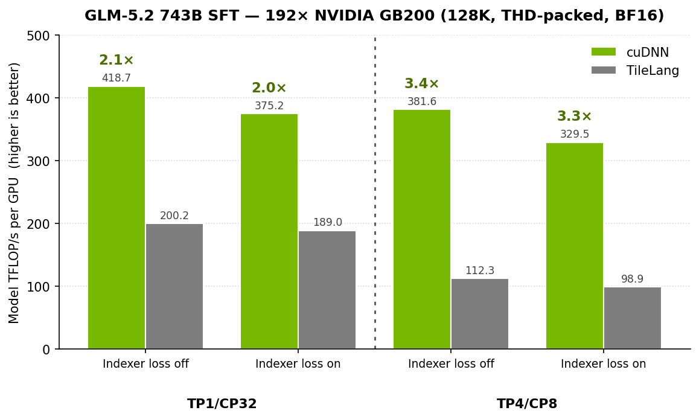
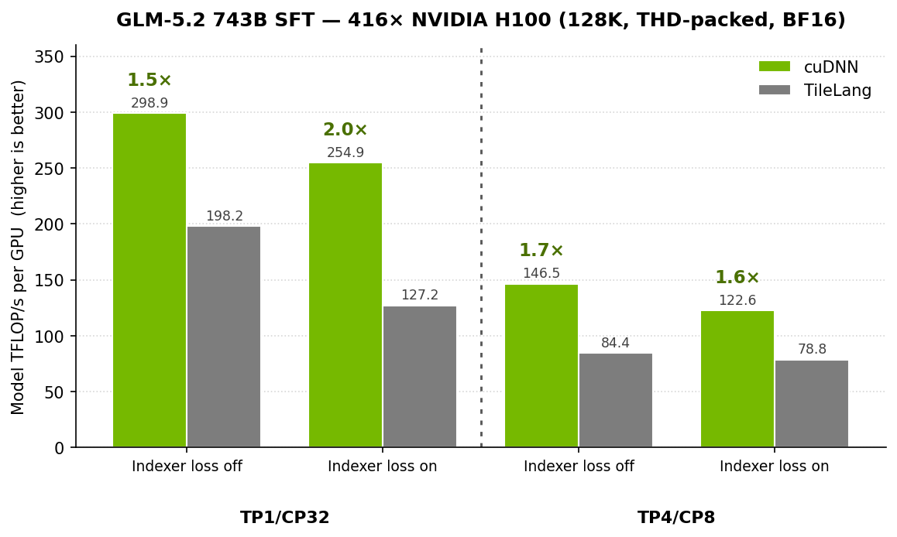
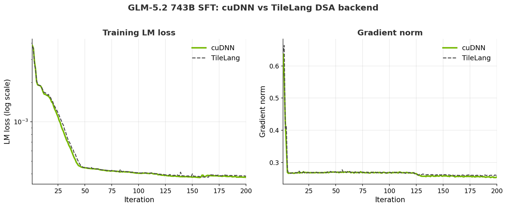

---
date:
  created: 2026-07-20
slug: cudnn-fused-dsa-glm5.2
authors:
  - songlin_jiang
  - yu_yao
  - wenwen_gao
categories:
  - Megatron-Bridge
  - Megatron-Core
tags:
  - Megatron-Bridge
  - Megatron-Core
  - DeepSeek Sparse Attention
  - cuDNN
  - GLM-5.2
---

# Accelerating GLM-5.2 Long-Context Training with cuDNN Fused DSA Kernels and THD-Packed Context Parallelism using Megatron Bridge

<!--
nemo_discussion: {
  "repo": "https://github.com/NVIDIA-NeMo/Megatron-Bridge",
  "authors": ["HollowMan6", "yaoyu-33", "snowmanwwg"]
}
-->

Long-context training hits a wall: standard attention costs *O(S²)*, so doubling the sequence length quadruples the attention work. DeepSeek Sparse Attention (DSA), used by [GLM-5.2](https://huggingface.co/zai-org/GLM-5.2), breaks that curve by using a lightweight *indexer* that selects the top-k most relevant key/value tokens per query, and the main attention runs only over that top-k set, turning the dominant term near-linear. But a sparse-attention layer is only as good as its kernels: a naive implementation materializes several *S × S* intermediates that are memory-prohibitive past 32K tokens. NVIDIA closes that gap with **fused DSA kernels in [NVIDIA cuDNN](https://developer.nvidia.com/cudnn)**, wired through [cuDNN frontend](https://github.com/NVIDIA/cudnn-frontend), [Megatron Core](https://github.com/NVIDIA/Megatron-LM), and [NeMo Megatron Bridge](https://github.com/NVIDIA-NeMo/Megatron-Bridge) with support for context parallelism (CP), packed sequences (THD), and GLM-5.2's new **IndexShare**. On GLM-5.2 743B training, the cuDNN backend delivers **~3.4× higher throughput than the TileLang reference** on NVIDIA GB200 (~2× on NVIDIA H100), at an equivalent memory footprint.

<!-- more -->

## How DSA works

A DSA layer runs in two stages. The **indexer** scores the query–key relevance and emits the top-k token indices per query, reusing Multi-head Latent Attention (MLA)'s query LoRA output (no separate down-projection). It also emits an auxiliary KL loss that aligns its score distribution with the main attention's, so it learns to pick the tokens the model would have attended to. **Sparse MLA** then runs causal attention restricted to that top-k set. The top-k indices are shared across all heads of a query, and the indexer's KL-loss graph is independent of the main model's, so it can be trained without perturbing the primary path. In Megatron Core, DSA is enabled with a few flags in addition to existing MLA arguments:

```bash
--experimental-attention-variant   dsa
--dsa-indexer-n-heads               64
--dsa-indexer-head-dim              128
--dsa-indexer-topk                  2048
--dsa-indexer-loss-coeff            0.001
--dsa-indexer-use-sparse-loss
```

GLM-5.2 adds one genuinely new model-side piece on top of standard DSA: **IndexShare**. Because the indexer forward is itself *O(S²)*, recomputing it at every layer is redundant, so IndexShare computes the lightning indexer once every four layers and reuses that top-k selection for the next three, cutting indexer FLOPs with savings that grow with context length. Everything else that distinguishes GLM-5.2 from DeepSeek-V3.2-style DSA (such as indexer RoPE handling) was made configurable in Megatron Core and set from the Megatron Bridge provider, so enabling GLM-5.2 is configuration and weight mapping rather than new module logic.

## Why DSA needs fused kernels

Several DSA intermediates, which include the indexer score matrix and the attention-score tensor the KL loss consumes, are *S × S*, and at 32K tokens and beyond they cannot be materialized in HBM. They must stay resident in registers and shared memory, which is only possible if the indexer, sparse-attention, and KL-score computations are each fused into single kernels. Throughput adds a second requirement: for sparse attention the tensor-core *M* axis is tiled from heads, not the query sequence, so DSA's per-head-KV MLA must be folded into the query, which is referred to as an **Absorbed MLA** transform, to reach an efficient Multi-Query Attention (MQA)-style tensor-core layout on the top-k set.

## cuDNN fused DSA kernels

The cuDNN DSA backend supplies fused forward and backward kernels for the indexer and sparse MLA plus the fused KL-score path. Landing it as a production backend required enabling it under real training conditions:

- **CP and packed THD.** Backend-neutral fused-kernel hooks let DSA run under context parallelism and packed variable-length sequences (Megatron-LM [#5246](https://github.com/NVIDIA/Megatron-LM/pull/5246)), with correct packed-THD RoPE under CP ([#5243](https://github.com/NVIDIA/Megatron-LM/pull/5243)) and correct indexer-loss scaling through the pipeline schedule ([#5244](https://github.com/NVIDIA/Megatron-LM/pull/5244)).
- **Absorbed-MLA refactor.** The KV up-projection layout and CP metadata are consolidated so the sparse-MQA tensor-core layout holds under CP (Megatron-LM [#5245](https://github.com/NVIDIA/Megatron-LM/pull/5245)).
- **Blackwell (SM100) score-recompute fix.** The DSA indexer-loss path calls cuDNN's sparse-attention score-recompute kernel; a compact top-k code-generation failure on SM100 was fixed by making the on-chip (TMEM) staging unconditional, keeping the path fully on cuDNN (cuDNN frontend [#317](https://github.com/NVIDIA/cudnn-frontend/pull/317)).
- **IndexShare.** The fused kernels support GLM-5.2's IndexShare, which needs the lightning indexer to compute once and its selection reused across a block of layers, together with packed THD and CP (Megatron-LM [#5099](https://github.com/NVIDIA/Megatron-LM/pull/5099)).

The result: GLM-5.2's entire DSA path, including IndexShare, runs on fused cuDNN kernels under context parallelism and packed THD.

## GLM-5.2 training results

These runs are GLM-5.2 (743B-parameter MoE) in supervised fine-tuning (SFT) at 128K sequence length with THD packing and full recompute, in BF16, on 192 NVIDIA GB200 GPUs and 416 NVIDIA H100 GPUs. TP/CP is the parallelism layout, with tensor-parallel over context-parallel size (1/32 is TP=1, CP=32; 4/8 is TP=4, CP=8). Indexer loss is whether the indexer's auxiliary KL loss (sparse formulation, coefficient 0.001) is computed during the step; with it off, the step still runs top-k selection and sparse attention but skips that loss and its score-recompute and backward. Throughput is model TFLOP/s per GPU; higher is better.

<a name="figure1"></a>

<div style="display: flex; justify-content: space-around; align-items: center;">
  
</div>

<p style="text-align: center;"><strong>Figure 1:</strong> GLM-5.2 743B SFT on 192× NVIDIA GB200 (128K context, THD-packed, BF16, full recompute): cuDNN vs. TileLang DSA-backend throughput in model TFLOP/s per GPU, indexer loss on and off. Green labels above the cuDNN bars show its speedup over TileLang in each configuration. Peak memory is equivalent between backends (~123.8 GB at TP1/CP32; ~107–109 GB at TP4/CP8).</p>

<a name="figure2"></a>

<div style="display: flex; justify-content: space-around; align-items: center;">
  
</div>

<p style="text-align: center;"><strong>Figure 2:</strong> The same GLM-5.2 743B SFT workload on 416× NVIDIA H100, throughput in model TFLOP/s per GPU, indexer loss on and off. Green labels above the cuDNN bars show its speedup over TileLang in each configuration. Peak memory is equivalent between backends (~69–75 GB at TP1/CP32; ~79 GB at TP4/CP8).</p>

Across both systems, cuDNN outperforms TileLang by roughly 2.0–3.4× on GB200 and 1.5–2.0× on H100. The advantage is widest on GB200 under heavier tensor-parallel sharding, where cuDNN holds its throughput while TileLang drops off.

Enabling the indexer loss costs cuDNN 10–14% of throughput on GB200 and 15–16% on H100, at effectively unchanged peak memory, so it is a drop-in kernel replacement, not a different memory regime. Extrapolated to 7T training tokens, that efficiency roughly halves projected GPU-hours at TP1/CP32.

With further investigation, we found that DSA itself only pays off at long context, once the quadratic term it removes outweighs the indexer overhead it adds; in per-layer measurements the crossover against full attention lands near 64K, and IndexShare pushes it earlier by shrinking the indexer's own *O(S²)* cost.

The speedup does not come at the cost of training convergence. Running the same GLM-5.2 SFT workload with the cuDNN and TileLang backends produces effectively identical LM-loss and gradient-norm trajectories over the first 200 steps ([Figure 3](#figure3)), so the fused cuDNN kernels are a numerically faithful drop-in for the reference, and they preserve convergence, not just throughput.

<a name="figure3"></a>

<div style="display: flex; justify-content: space-around; align-items: center;">
  
</div>

<p style="text-align: center;"><strong>Figure 3:</strong> Training parity over the first 200 steps of GLM-5.2 743B SFT: LM loss (log scale, left) and gradient norm (right) for the cuDNN and TileLang DSA backends. The overlapping curves confirm the fused cuDNN kernels reproduce the reference training dynamics.</p>

## Get started

DSA training with the cuDNN backend is available in [Megatron Core](https://github.com/NVIDIA/Megatron-LM) and [Megatron Bridge](https://github.com/NVIDIA-NeMo/Megatron-Bridge). Enable DSA with `--experimental-attention-variant dsa` and the `--dsa-indexer-*` flags shown above, and select the cuDNN DSA backend. To run GLM-5.2, load checkpoints with the GLM-5 provider and HF format conversion bridge in Megatron Bridge, then start from the GLM-5.2 SFT recipes for NVIDIA GB200 and NVIDIA H100 (THD packing at 128K, DeepEP, cuDNN DSA backend). The [GLM-5 model guide](https://github.com/NVIDIA-NeMo/Megatron-Bridge/blob/main/docs/models/glm/glm5.md), examples, and [performance recipes](https://github.com/NVIDIA-NeMo/Megatron-Bridge/tree/main/src/megatron/bridge/perf_recipes/glm_moe_dsa) live in Megatron Bridge under `docs/models/glm/glm5.md` and `src/megatron/bridge/perf_recipes/glm_moe_dsa`.

Reference PRs: Megatron-LM [#5243](https://github.com/NVIDIA/Megatron-LM/pull/5243), [#5244](https://github.com/NVIDIA/Megatron-LM/pull/5244), [#5245](https://github.com/NVIDIA/Megatron-LM/pull/5245), [#5246](https://github.com/NVIDIA/Megatron-LM/pull/5246), [#5099](https://github.com/NVIDIA/Megatron-LM/pull/5099), [#5049](https://github.com/NVIDIA/Megatron-LM/pull/5049); cuDNN frontend [#317](https://github.com/NVIDIA/cudnn-frontend/pull/317); Megatron Bridge [#4197](https://github.com/NVIDIA-NeMo/Megatron-Bridge/pull/4197), [#4198](https://github.com/NVIDIA-NeMo/Megatron-Bridge/pull/4198), [#4520](https://github.com/NVIDIA-NeMo/Megatron-Bridge/pull/4520). Tracking: [Megatron Bridge #4490](https://github.com/NVIDIA-NeMo/Megatron-Bridge/issues/4490).

## Conclusion

DSA makes long-context training tractable, but its payoff depends on fused, memory-resident kernels. NVIDIA's cuDNN fused DSA kernels deliver up to ~3.4× the throughput of the TileLang reference on GLM-5.2 743B (up to ~2× on H100) at an equivalent memory footprint, under the context parallelism and packed-THD strategies long-context training needs, and GLM-5.2's IndexShare spreads out the indexer's own quadratic cost across layers. Now you can clone [Megatron Bridge](https://github.com/NVIDIA-NeMo/Megatron-Bridge), enable the cuDNN DSA backend, and start a GLM-5.2 run from the GB200 or H100 recipe.

## Acknowledgments

This work builds on the original **TileLang fused DSA kernels developed at Mind Lab**, which delivered the first open, fused DSA forward and backward path implementation directly on top of Megatron and served as the correctness reference and performance baseline for the cuDNN kernels and the results in this post (Megatron-LM [#5049](https://github.com/NVIDIA/Megatron-LM/pull/5049)).
