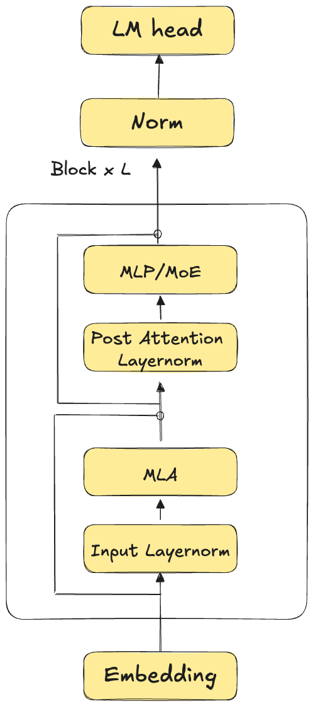
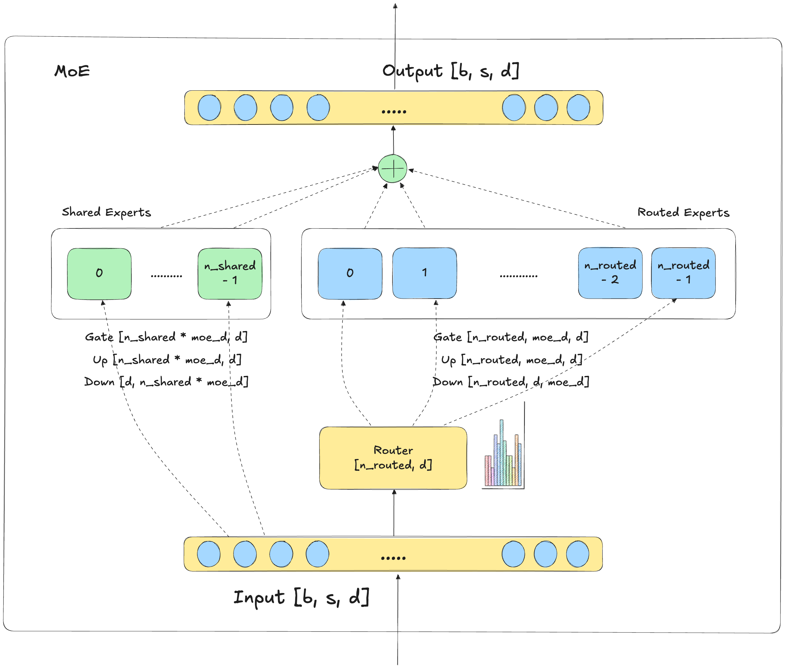
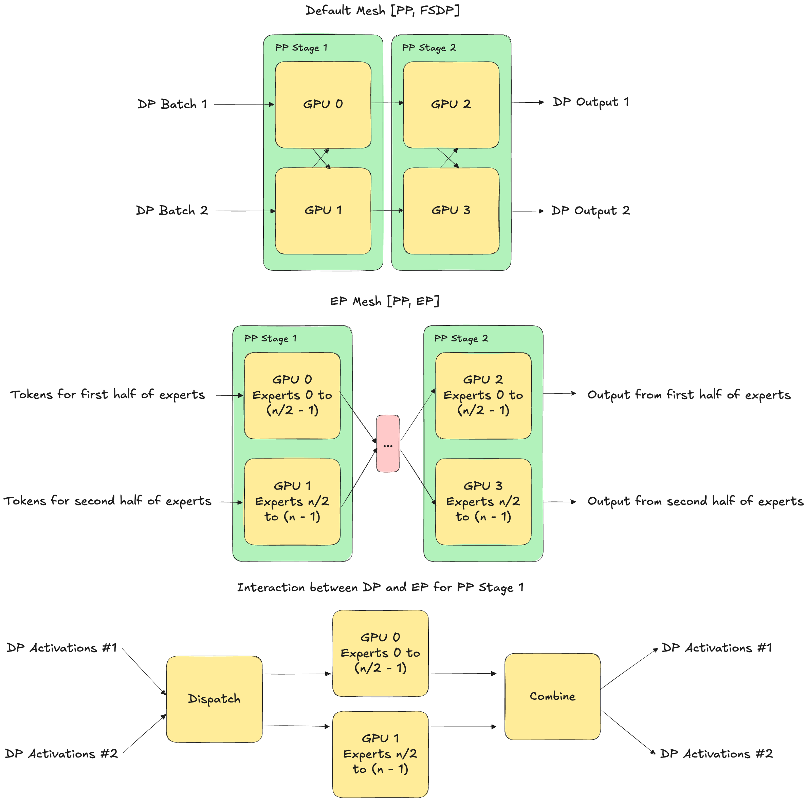
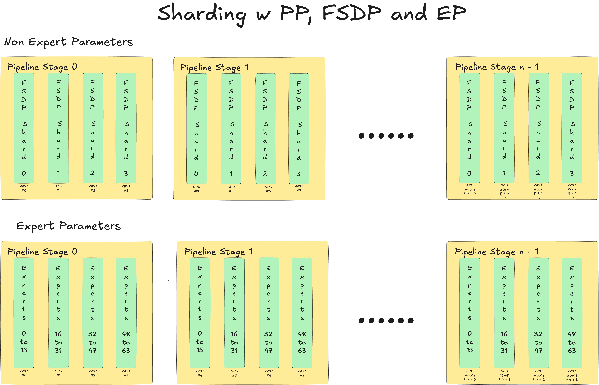
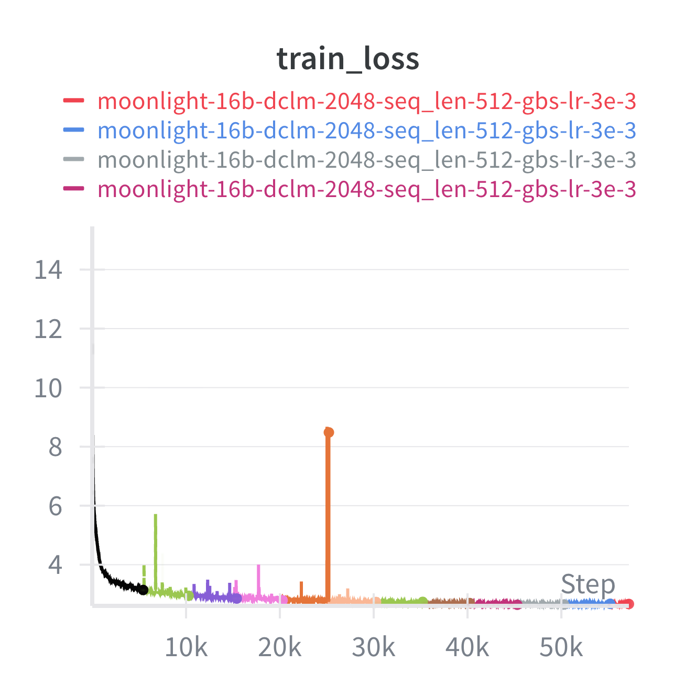
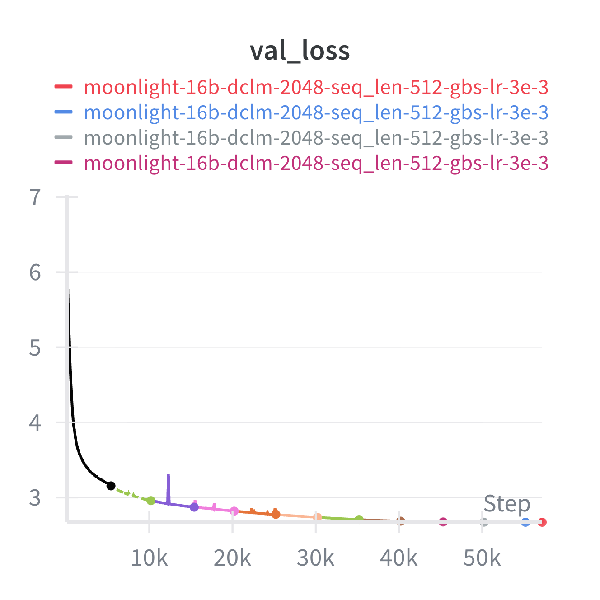
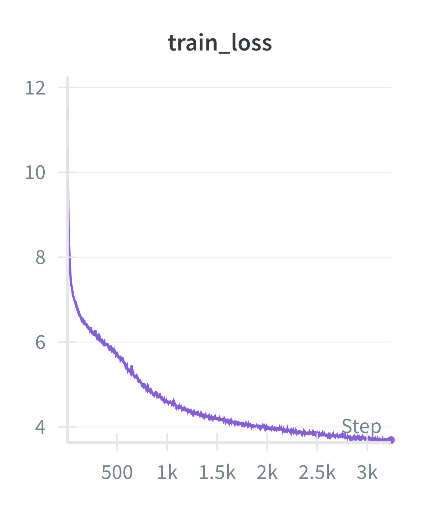

---
date:
  created: 2025-10-21
slug: deepseek-v3-automodel
categories:
  - automodel
---

# Implementing large scale MoE training with native Pytorch in Nemo Automodel

<!--
nemo_discussion: {
  "repo": "https://github.com/NVIDIA-NeMo/Automodel",
  "authors": ["aazzolini", "gekurian", "vinjn", "snowmanwwg", "adil-a", "hemildesai"]
}
-->

## 1\. Introduction

Mixture-of-Experts (MoE) models are fundamentally transforming the scalability of language models, surpassing the limitations of conventional "dense" architectures. This innovative paradigm has proven its value through the success of numerous state-of-the-art large language models, including open-weight systems like Deepseek v3 671b, Qwen 3 235b, Qwen 3 Coder 30b and 480b, GPT OSS 20b and 120b, Kimi K2, GLM 4.5/4.6 and more.

However, training these models at scale presents unique challenges: **routing complexity** across hundreds of experts and thousands of GPUs, **memory management** of distributed expert weights, **communication overhead** from all-to-all token routing patterns, **numerical stability** with dynamic routing, and **checkpoint management** with heterogeneous parallelism strategies. These technical hurdles have made large-scale MoE training an intricate engineering problem requiring innovative solutions.

We are proud to announce that [NeMo Automodel](https://github.com/NVIDIA-NeMo/Automodel) has taken a significant step forward in addressing these challenges. Our solution combines nD parallelism using PyTorch Distributed with highly optimized kernels engineered for peak performance. Putting it all together, we are able to achieve an impressive Model FLOPs Utilization (MFU) of approximately 25% on H100 GPUs for the full DeepSeek-V3 model—a testament to the efficiency of our integrated approach.

Before diving into the details, let's briefly introduce the key technologies that power this solution.

* **PyTorch Distributed** is a collective of parallelism modules ([DDP](https://docs.pytorch.org/docs/stable/generated/torch.nn.parallel.DistributedDataParallel.html), [FSDP2](https://docs.pytorch.org/docs/stable/distributed.fsdp.fully_shard.html), [TP](https://docs.pytorch.org/docs/stable/distributed.tensor.parallel.html#torch.distributed.tensor.parallel.parallelize_module), [PP](https://docs.pytorch.org/docs/stable/distributed.pipelining.html)), communications layer (C10D), and infrastructure for launching and debugging large training jobs. It provides sharding primitives like DTensor and DeviceMesh that transparently handle distributed logic, including sharded storage, operator computation, and collective communications across devices/hosts.
* **[NeMo Automodel](https://github.com/NVIDIA-NeMo/Automodel)**, a library under [NeMo Framework](https://github.com/NVIDIA-NeMo), is a framework that builds on top of PyTorch Distributed to scale training for LLMs and VLMs. It provides end to end recipes for pretraining and finetuning models on up to 1,000 H100s.

In this comprehensive technical deep dive, we explore how Automodel added support for MoEs through modular layer implementations, flexible kernel optimizations, n-dimensional parallelization, and optimized checkpointing systems. Note that while we focus on Deepseek v3 for this post, the components and optimizations should be applicable for all MoE architectures we support including Qwen3 MoE, GPTOSS, etc (more architectures coming soon).

## 2\. Model Implementation

The Deepseek V3 model roughly looks like this:

Specifically, the Deepseek V3 model contains 61 blocks with the first 3 blocks containing pure MLP layers, and the rest containing MoE layers. We provide optimized implementations for each of the layers depicted in the image above. The code for the model can be found [here](https://github.com/NVIDIA-NeMo/Automodel/tree/main/nemo_automodel/components/models/deepseek_v3). Let's dive into the implementation.

### 2.1 MoE Components

Zooming into the MoE layer of the model gives the following picture:

Automodel provides implementations for all four components: MLP for shared experts, specialized Expert layers for routed experts, Gates for routing, and the top-level MoE wrapper. Each component is modular and independently usable, and this design enables flexible composition and backend switching, thus allowing us to add support for other MoE models with relative ease.

#### [MLP](https://github.com/NVIDIA-NeMo/Automodel/blob/main/nemo_automodel/components/moe/layers.py#L73)

The MLP class implements a standard 2-layer feedforward network with SwiGLU activation, serving as both shared experts and the building block for non-MoE layers. It supports PyTorch native linear layers and Transformer Engine's linear implementation.

#### Router

We provide two gate implementations for token routing:

**[Top-k Gate](https://github.com/NVIDIA-NeMo/Automodel/blob/main/nemo_automodel/components/moe/layers.py#L563)**: The primary routing mechanism implementing DeepSeek-V3's routing strategy with dynamic load balancing, hierarchical group-based routing, and learnable correction bias to prevent routing collapse.

**[FakeBalancedGate](https://github.com/NVIDIA-NeMo/Automodel/blob/main/nemo_automodel/components/moe/layers.py#L511)**: A debugging tool that provides perfectly balanced routing for performance testing and analysis, helping isolate the impact of routing imbalance on overall system performance.

#### Expert Implementations

The core innovation lies in two fundamentally different but easily switchable expert implementations:

**[GroupedExperts](https://github.com/NVIDIA-NeMo/Automodel/blob/main/nemo_automodel/components/moe/layers.py#L169)**: Implements sequential expert processing where each expert is handled individually in a gather-compute-scatter pattern. This approach provides maximum compatibility, straightforward debugging, and predictable performance scaling. Communication is handled by all-gathering the input activations and router weights plus indices using DTensor’s `full_tensor` on each expert rank before computation, and reduce-scattering the weighted output using DTensor’s `redistribute`.

**[GroupedExpertsDeepEP](https://github.com/NVIDIA-NeMo/Automodel/blob/main/nemo_automodel/components/moe/layers.py#L343)**: Based on [Megatron's TokenDispatcher with DeepEP](https://github.com/NVIDIA/Megatron-LM/tree/main/megatron/core/transformer/moe) and [GroupedGEMM](https://github.com/fanshiqing/grouped_gemm) kernels, this implementation is focused on computational efficiency and performance through batched operations. It uses fused memory layouts (combined gate\_and\_up\_projs) and a sophisticated token dispatcher that permutes tokens to enable grouped GEMM operations across all experts simultaneously. This approach delivers significantly higher performance as long as you meet the environment requirements for DeepEP and GroupedGEMM.

The key differences between these implementations are summarized below:

| Aspect | GroupedExperts | GroupedExpertsDeepEP |
|--------|----------------|----------------------|
| **Computation** | Sequential expert processing | Batched operations across all local experts |
| **Communication** | All-gather input activations and router weights/indices using DTensor's `full_tensor`; reduce-scatter weighted output using `redistribute` | DeepEP's high-throughput all-to-all kernels |
| **GEMM Operations** | Standard linear layers | GroupedGEMM kernels |
| **Compatibility** | Maximum compatibility, works everywhere | Requires DeepEP and GroupedGEMM environment |
| **Debugging** | Straightforward and predictable | More complex due to DeepEP, GroupedGEMM, etc |

**Easily switchable**: Both implementations have the same weights with identical shapes, so they can be used interchangeably with any existing checkpoint. Additionally, we have plans to evolve **GroupedExperts** with PyTorch native optimizations like PyTorch GroupedGEMM and PyTorch Dispatch/Combine (once available in a released version).

#### MoE Wrapper

The top-level MoE module coordinates shared and routed experts with a critical optimization: stream-based parallel execution. While routed experts perform their computation (potentially involving cross-GPU communication), shared experts run concurrently in a separate CUDA stream, effectively hiding communication latency behind useful computation.

### 2.2 DeepSeek-V3 Specific Layers

#### Multi-Latent Attention (MLA)

Automodel provides a custom implementation for the DeepSeek-V3 Multi-Latent Attention layer, which dramatically reduces KV cache memory requirements through low-rank decomposition. The implementation supports both [Transformer Engine's DotProductAttention](https://docs.nvidia.com/deeplearning/transformer-engine/user-guide/api/pytorch.html#transformer_engine.pytorch.DotProductAttention) and PyTorch's SDPA (Scaled Dot-Product Attention) backends for computing the actual attention operations. Users are free to switch between these two attention backends.

### 2.3 Embedding and Norm layers

To complete the rest of the model architecture, Automodel supports PyTorch and Transformer Engine's RMSNorm for the norm layers and `nn.Embedding` for the embedding layer.

## 3\. nD Parallelization

Since Deepseek v3 is a 671B parameter model, it calls for combining various different forms of parallelisms for efficient training. In this initial implementation, we support mixing pipeline parallelism, expert parallelism, fully sharded data parallelism and context parallelism (via Transformer Engine’s DotProductAttention). Let's see how we do this.

We use PyTorch's native parallelism APIs for each parallelism type and the DeviceMesh API for orchestrating and combining them. At a high level, we have the following meshes:

1. Default mesh w PP \+ FSDP/HSDP \+ CP (either `("pp", "dp_shard", “cp”)` or `("pp", "dp_replicate", "dp_shard", “cp”)`). HSDP/FSDP is applied across `("dp_replicate", "dp_shard_cp")`where `dp_shard_cp` is obtained by flattening the `dp_shard` and `cp` axes.
2. MoE mesh w PP \+ EP/EP+EP shard (either `("pp", "ep")` or `("pp", "ep_shard", "ep")`)

Note that we can also use a single mesh and flatten dimensions to achieve a similar setting in the newest pytorch versions, but older Pytorch versions require applying  `ParallelStyle (used by ep)` to the innermost dimension of the mesh so we use two for now.

Below is a figure illustrating the device meshes at play and the flow of data for a toy run with 4 GPUs (pp 2, fsdp 2, ep 2).

We combine these parallelisms in the following order:

1. Split the model into stages based on the pipeline parallel size. This is done through the recently introduced Autopipeline component. You can read more about it in this [guide](https://github.com/NVIDIA-NeMo/Automodel/blob/main/docs/guides/pipelining.md) and this [post](https://github.com/NVIDIA-NeMo/Automodel/discussions/589)
2. Apply context parallelism, generally needed when sequence lengths is beyond 4k~8k. Context parallelism is only functional when using Transformer Engine’s `DotProductAttention`. Transformer Engine abstracts the communication and computation for long sequences with context parallelism, and exposes [a simple interface](https://docs.nvidia.com/deeplearning/transformer-engine/user-guide/api/pytorch.html#transformer_engine.pytorch.DotProductAttention.set_context_parallel_group) to specify the CP communication group and configuration. On the Automodel side, we update our data loading pipeline to shard the input correctly for CP.
3. Apply expert parallelism. The experts are sharded across the EP dim along the first dimension of the `GroupedExperts` parameter which has a shape of `[num_experts, dim1, dim2]`.
4. Apply activation checkpointing. We optionally use full activation checkpointing for the whole transformer Block. This is necessary to save activation memory across a pipeline parallel step for large models (recall that we use PP instead of TP). There’s also an option to avoid checkpointing the router activations to avoid activation recomputation errors in the backward pass in some cases where there’s non-determinism in the experts selected by the router.
5. Apply FSDP as follows:
   1. Use the `default` mesh for sharding all parameters except the `experts`
   2. Use the `moe` mesh for sharding the `experts` if needed. Note: We only support applying FSDP on the second dimension of the `GroupedExperts` parameter as of now, but we have plans on supporting the new `replicate` function introduced by PyTorch to enable pure data parallelism across the experts as well.

Once applied, the sharded parameters (considering  n \* 4 GPUs  with  `pp = n, fsdp = 4 and ep = 4`) would look like:

The code for this parallelization can be found [here](https://github.com/NVIDIA-NeMo/Automodel/blob/main/nemo_automodel/components/moe/parallelizer.py).

## 4\. Checkpointing

We provide a state dict adapter that can be used in both an online and offline fashion to convert the weights from the custom model implementation to the format expected by HuggingFace. This ensures that pure HuggingFace checkpoints can be used throughout training and enables easy access to downstream tasks like evaluation, inference, etc without the need for tedious manual conversions.

The state dict adapter is `DTensor`-aware and handles expert parallelism intelligently - when converting between formats, it only manipulates the expert subsets relevant to each rank. The key insight is that `DTensor` sharding is compositional: the conversion adds or removes EP sharding while preserving other parallelism strategies, enabling seamless format conversion without materializing full tensors on any single rank.

When loading a HuggingFace checkpoint for training, the workflow looks like:

* **to\_hf()** \- Transform the model's current state dict structure to HuggingFace format so that the distributed checkpoint loader knows which keys to expect and how to map them to checkpoint files
* **dcp.load()** \- Load the HuggingFace checkpoint weights into the HF-formatted state dict using PyTorch's distributed checkpoint module, which handles parallel loading across ranks
* **from\_hf()** \- Transform the loaded HuggingFace weights back into the `GroupedExpert` format, performing expert concatenation and `DTensor` wrapping for the current rank's expert subset
* **load\_state\_dict()** \- Load the transformed weights into the actual model parameters

The code for this can be found [here](https://github.com/NVIDIA-NeMo/Automodel/blob/main/nemo_automodel/components/moe/state_dict_mixin.py). Here's a visual representation of the online conversion to/from hf with native support for `DTensors` and sharded experts.

## 5\. Performance Summary

The summary of pre-training performance for MoEs including Deepseek v3 can be found [here](https://github.com/NVIDIA-NeMo/Automodel/blob/main/docs/performance-summary.md). To give a brief highlight, below are the performance numbers we obtained for our training runs on DGX-H100s with BF16 precision for Deepseek v3 style models (using a fake gate that balances tokens across experts). These results showcase the throughput achieved with our optimized implementation combining TransformerEngine (TE) and DeepEP:

| Model | #GPUs | GBS | MBS | LBS | GA | Seq Length | TP | PP | CP | EP | VP | FSDP | Kernel Optimizations | Time per Global Step (s) | Model TFLOPs/sec/GPU | Tokens/sec/GPU |
|-------|------:|----:|----:|----:|---:|-----------:|---:|---:|---:|---:|---:|-----:|---------|-------------------------:|---------------------:|---------------:|
| DeepSeek V3 671B | 256 | 512 | 1 | 8 | 1 | 4096 | 1 | 4 | 1 | 64 | 8 | 64 | TE + DeepEP | 8.18 | 250 | 1,002 |
| Moonlight 16B | 8 | 256 | 2 | 2 | 16 | 4096 | 1 | 1 | 1 | 8 | N/A | 8 | TE + DeepEP | 5.724 | 360.58 | 22,898 |

Achieving this performance for large scale MoEs has been a comprehensive process, and probably warrants its own deep dive. Here, we briefly summarize the performance benefits provided by the components described above. **Note: Detailed performance analysis and profiling traces may be shared in a follow-up technical post. The percentage numbers described below are average improvements we saw across our experiments on the full Deepseek v3 671B parameter model.**

**Multi-Head Latent Attention (MLA)**: We evaluated three attention implementations (Eager, SDPA and Transformer Engine) and found that TransformerEngine's fused attention (via [DotProductAttention](https://docs.nvidia.com/deeplearning/transformer-engine/user-guide/api/pytorch.html#transformer_engine.pytorch.DotProductAttention.forward) interface) with integrated context parallelism support delivered the best performance, providing a 2.3x speedup over the eager implementation.

**Pipeline Parallelism**: This was implemented using Pytorch’s [Pipelining module](https://docs.pytorch.org/docs/stable/distributed.pipelining.html). We experimented with a few schedules including 1F1B and Interleaved 1F1B. We found that the multi-stage Interleaved1F1B schedule specifically provided a 24% improvement over single-stage 1F1B by reducing pipeline bubble overhead in our configuration.

**FSDP Optimization**: Pytorch’s Pipeline stage assumes the top level module to be a FSDP wrapped module and applies optimizations at that level to toggle gradient sync and resharding across microbatches. This assumption fails with our custom implementation, where we wrap the inner `model` and the `experts` separately. We patch the backward to account for this custom structure in pipeline parallelism, and manually control gradient sync and resharding when not using PP. This gives noticeable improvements, especially when there’s gradient accumulation involved before the optimizer step. We noticed a step time improvement ranging from 4-8% based on the global batch size with this implementation. This improvement is more noticeable when you increase the FSDP size for either the non-expert or expert parameters.

**DeepEP \+ GroupedGeMM**: Enabling DeepEP's high-throughput all-to-all kernels and GroupedGeMM for expert computation reduced the cost per iteration by 47% for the full model. We haven’t ablated DeepEP and GroupedGeMM separately yet, but that is something in our backlog.

**Future Optimizations**: Our profiling analysis indicates plenty of opportunity for potential gains. Some avenues we are planning include better overlapping of PP communication with compute using the upcoming DualPipeV schedule for PP, using fused kernels for the router and rotary embeddings, etc.

Below is the summary of Optimizations in NeMo AutoModel:
|NeMo Automodel feature|Baseline|Speedup (compared to Baseline)|
|-|-|-|
|MLA with TE's fused attention|MLA with PyT eager attention|2.3x|
|PP multistage interleaved 1F1B|PP single stage 1F1B|1.24x|
|Manual FSDP optimizations for reshard+grad-sync| default FSDP2 behavior|~1.05x|
|DeepEP + GroupedGeMM|All gather + looped experts| 1.89x |

## 6\. Convergence Experiments

To test the convergence of our MoE implementations, we run pretraining on a Moonlight 16B model with 3B active parameters using a small subset of 60B [DCLM-baseline](https://huggingface.co/datasets/mlfoundations/dclm-baseline-1.0) tokens. DCLM-baseline is a 4T token / 3B document pretraining dataset that achieves strong performance on language model benchmarks. We randomly sampled from the first three local shards of the first global shard. It is important to note that this is a suboptimal sampling which can skew the model's performance, and you can probably get better benchmark results if you sample across all the shards. The figures show that the training process is mostly smooth with a single large loss spike which the model quickly recovers from. We hypothesize the reason for the spike is due to our use of a large peak LR of 0.003. The model is trained on 4 H100 nodes, where each node contains 8 H100 GPUs. We use a parallel configuration of 32-way FSDP sharding and 8-way EP sharding.

  
  

We also run downstream evaluation on a variety of benchmarks, with the results presented below:

| Moonlight-16B-A3B Evaluation Metrics after Pretraining w/ 60B DCLM Tokens |  |
| ----- | :---- |
| arc\_challenge | 68.73% |
| arc\_easy | 36.60% |
| boolq | 63.24% |
| copa | 80.00% |
| hellaswag | 63.01% |
| piqa | 75.52% |
| siqa | 42.48% |
| winogrande | 58.25% |
| MMLU | 25.54% |

Additionally, we also test a few steps on the full Deepseek v3 671B parameter model using a small subset of 1.5B [FineWeb-Edu](https://huggingface.co/datasets/HuggingFaceFW/fineweb-edu) tokens. FineWeb-Edu is a subset of the much larger [FineWeb](https://huggingface.co/datasets/HuggingFaceFW/fineweb) dataset, and offers over 1.3T tokens of educational web pages filtered from FineWeb.

We train the model on 16 nodes of H200s, each containing 8 H200 GPUs, and a parallel configuration of 16-way data-parallel \+ expert-parallel sharding and 8-way pipeline-parallel sharding. In the figure above, we see the loss decreasing as expected, with no loss spikes.

## Conclusion

Automodel's implementation of DeepSeek-V3 MoE training represents a significant first step in providing efficient training for MoE models with native PyTorch, combining PyTorch-native parallelisms with custom kernels. Building on the foundations, we now support a variety of other MoE architectures including GPTOSS, Qwen3 MoE, Qwen3 Next and GLM 4.5/4.6.

This is a cross functional effort across various teams with NVIDIA, and we want to thank them for their contribution. Furthermore, this project is deeply inspired by the open source community contributions - TorchTitan, DeepEP, HuggingFace Transformers etc., and we hope to collaborate more closely in the coming future.

## Core Contributors

We want to convey a special thanks to [Huiying Li](https://github.com/HuiyingLi) and [Alexandros Koumparoulis](https://github.com/akoumpa) for their help adding and testing the MoE implementations into Automodel.

Additionally, a huge shoutout to [Bernard Nguyen](https://github.com/bernardwin) and [Ashwath Aithal](https://github.com/euronymous-aithal) for their guidance and support throughout the development of this work.
