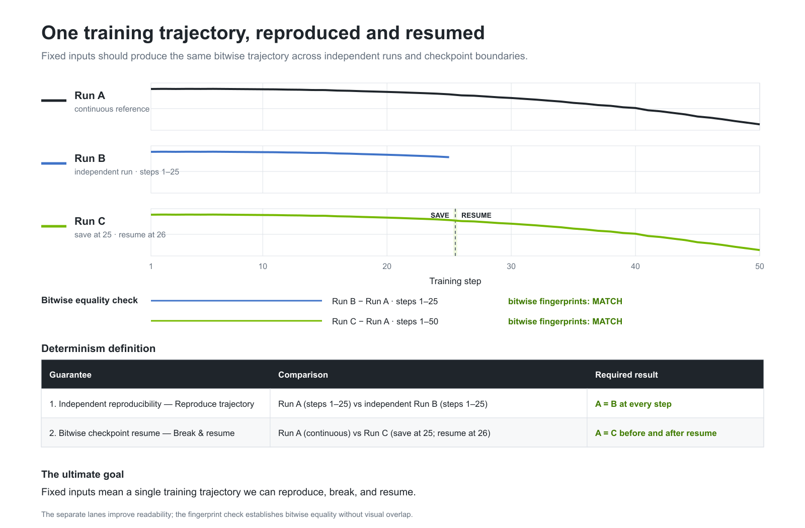
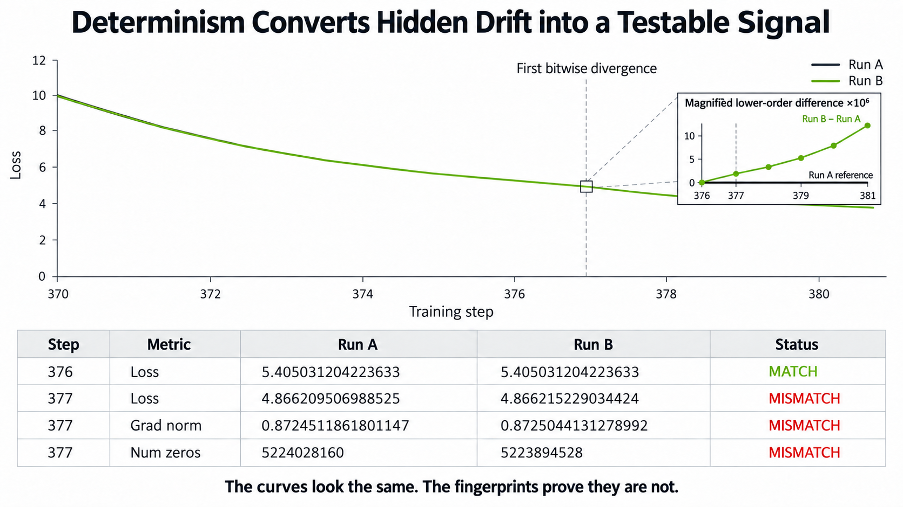
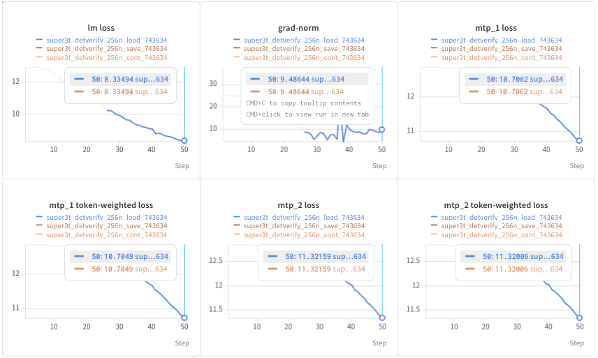
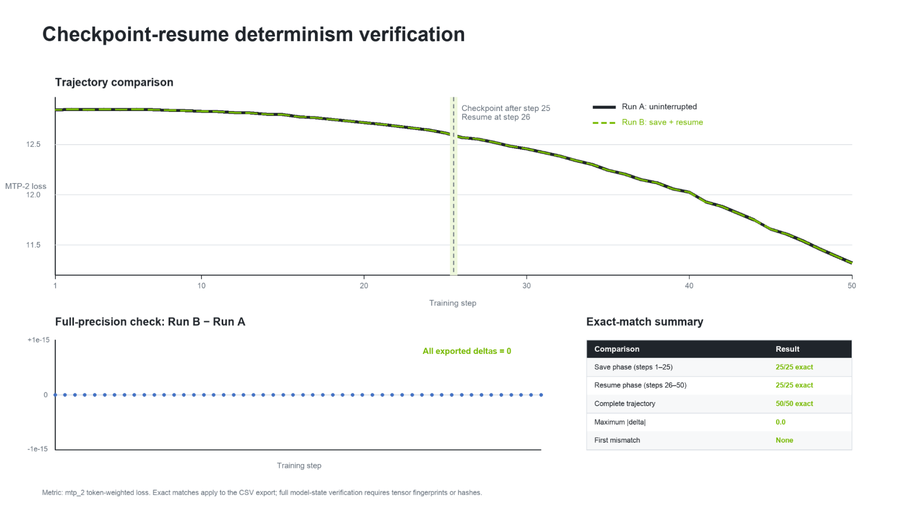
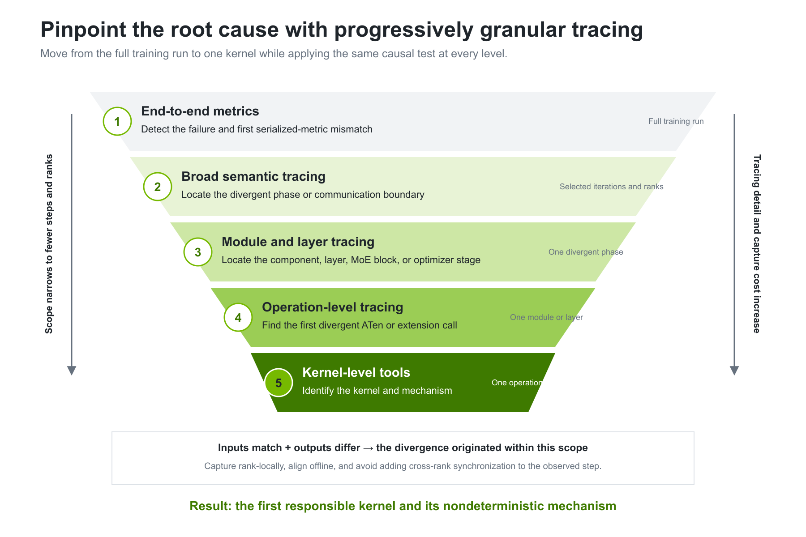
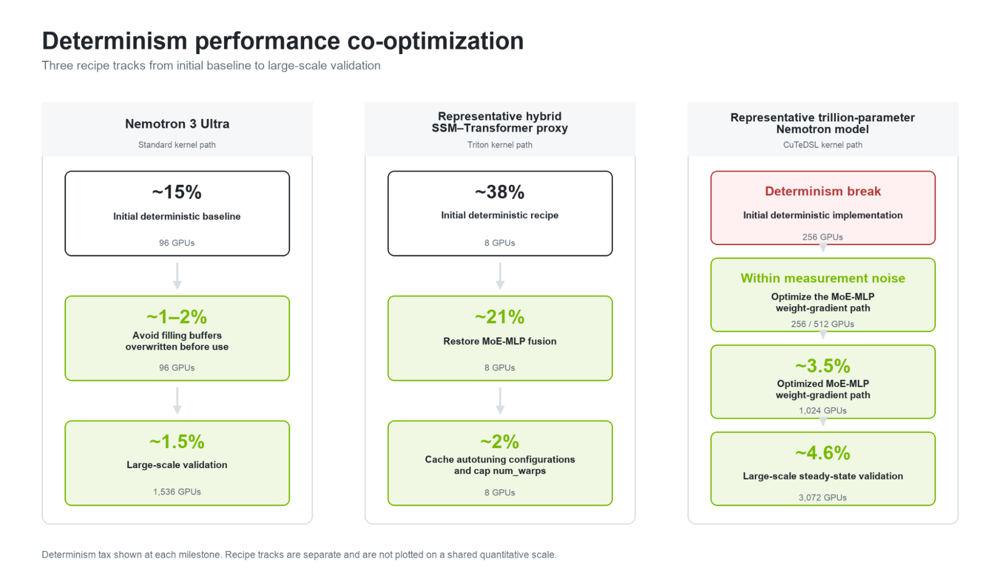
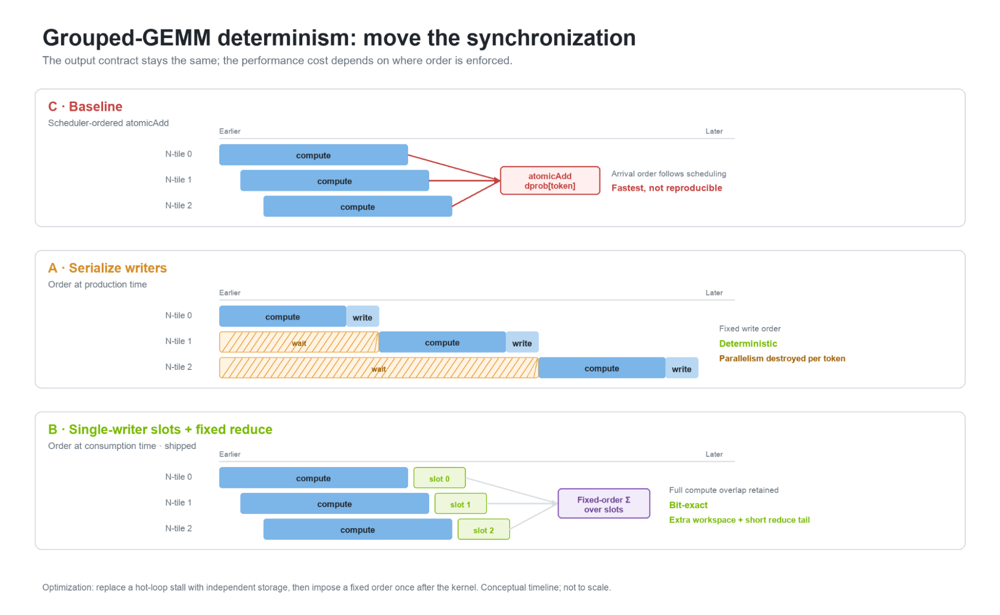

---
date:
  created: 2026-09-17
slug: megatron-determinism
authors:
  - ashwath_aithal
  - eric_harper
  - santosh_bhavani
  - yan_xu
  - zhiyu_li
categories:
  - Megatron-Core
tags:
  - Megatron-Core
  - Determinism
  - Pretraining
  - Nemotron
---

# Scaling Bitwise-Deterministic Pretraining for a Trillion-Parameter Nemotron Model with NVIDIA Megatron Core

<!--
nemo_discussion: {
  "repo": "https://github.com/NVIDIA/Megatron-LM",
  "authors": ["euronymous-aithal", "ericharper", "sbhavani", "Connor-XY", "ZhiyuLi-Nvidia"]
}
-->

Debugging large language model training becomes difficult and expensive at trillion-parameter scale across thousands of GPUs, especially when multiple forms of parallelism, low-precision computation, and distributed checkpointing interact. Reproducing issues is more difficult if the training is non-deterministic since the issue may or may not occur in repeated runs. Validating fixes to the issues also remains challenging since the improved numerics could come from variance rather than the bug fix when training with non-determinism.

Production and hero training runs are expensive and require a strong guarantee that they will be successful. Bitwise determinism is essential for reliably replaying failures, debugging loss spikes, validating system changes, and recovering interrupted training runs. Due to the cost, large-scale training runs must also be extremely efficient. At “megatron scale”, even a small slowdown can cost thousands of GPU-days, making performance optimization essential for enabling determinism while training.

Using a Trillion-Parameter Nemotron Model pretraining as a case study, this post explains how NVIDIA is developing bitwise determinism as an end-to-end capability in Megatron Core. We will cover:

<!-- more -->

- What we mean by bitwise determinism
- Why pretraining should be deterministic
- How to verify determinism
- How to fix determinism when it breaks
- How to verify independent runs and checkpoint resume
- How to optimize determinism performance at trillion-parameter scale
- Maintain a determinism framework as models, kernels, and recipes evolve
- Common sources of non-determinism

## What we mean by bitwise determinism

Given fixed inputs, independent runs must follow the same numerical trajectory, and saving and resuming from a checkpoint must not change that trajectory.

“Fixed inputs” encompass more than a random seed. They include:

- Input data and sample order
- Model architecture and training recipe
- Tensor, pipeline, data, expert, and virtual-pipeline parallelism
- Container and software versions
- CUDA, cuDNN, NCCL, PyTorch, Transformer Engine, and driver versions
- Runtime and communication settings
- Hardware type and, where relevant, cluster topology

Megatron Core determinism targets two guarantees:

### Independent reproducibility

Two runs launched from the same initial state must remain bitwise identical from beginning to end.

Here, “bitwise identical” means that two runs follow exactly the same training trajectory, step by step and bit for bit.

### Bitwise checkpoint resume

A run that saves and restores one or more checkpoints must remain identical to an uninterrupted run.



The objective is one training trajectory.

## Why pretraining should be deterministic

### Replaying critical training events

If a loss spike occurs during a nondeterministic run, restarting the job may produce a different trajectory and make the event disappear. Engineers are then left investigating an incident that they cannot reproduce.

With deterministic replay, the spike reappears at the same step. Components can then be changed one at a time until the spike moves or disappears, providing a controlled way to isolate the cause.

### Preventing checkpoint-induced trajectory changes

Large training jobs are routinely interrupted by planned maintenance, infrastructure failures, or scheduling requirements. Without bitwise checkpoint resume, restoring the job can alter its random-number stream, data position, low-precision weights, or optimizer state.

The resumed job may remain numerically healthy, but it is no longer the same experiment.

### Detecting silent corruption

Once the software stack is deterministic, a mismatch between two repeated runs becomes a strong diagnostic signal.

This can expose silent checkpoint corruption, unexpected software behavior, or potentially faulty hardware. A deterministic recipe is then both a regression test and a workload for testing fleet health.

### Making A/B comparisons more trustworthy

A deterministic reference improves controlled experiments. When two runs differ by exactly one intended change, any numerical divergence can be attributed to that change rather than background execution noise.



## How to verify determinism

Printed loss values are not sensitive enough to establish bitwise identical numerics. Two runs can print the same rounded loss while already differing in the lower-order bits of their gradients or parameters.

A stronger validation procedure fingerprints the numerical state at every step. Depending on the investigation, this can include:

- Loss
  - lm loss
  - load balancing loss
  - MTP
- Gradient norm

We run the same configuration twice and compare these fingerprints step by step. The first mismatching step helps to indicate the root cause of the underlying issue.

In order to validate bitwise checkpoint resume we compare a continuous reference run with one or more interrupted runs. After every restore, verify that the parameters, optimizer state, RNG state, data position, and subsequent outputs are bitwise identical to the reference.





## How to fix determinism when it breaks

Nondeterminism in large-scale training workloads may be intermittent, appear only at high GPU counts, or depend on a particular parallelism configuration. A recipe that is bitwise exact at small scale can diverge at production scale.

The point where two loss curves separate rarely identifies where nondeterminism began. It only shows where the difference became large enough to appear in the logged metric. The first differing bit may have occurred much earlier.

The agent skill proposed in [Megatron-LM PR #7262](https://github.com/NVIDIA/Megatron-LM/pull/7262) records ordered, per-rank streams of tensor fingerprints and compares two runs offline. The PR documents a diagnostic workflow and implementation guidance.

Use a repeatable workflow: locate the first divergent record, determine whether its inputs matched, identify the underlying mechanism, and validate the correction with paired runs.

Before tracing, confirm that both runs use the same seed, data order, global batch size, parallelism layout, container, and software stack. Compare full-precision serialized metrics rather than rounded console output.

### Progressively localize the divergence with granular tracing

A determinism break can originate anywhere in the training stack. Begin with an end-to-end comparison, then progressively narrow the capture scope from the training iteration to the phase, module, operation, and kernel.

At every level, apply the same test: if two runs enter a scope with bitwise-identical inputs but leave it with different outputs, the divergence originated within that scope.

1. **End-to-end metrics** detect the failure and identify the first iteration where a serialized metric differs.
2. **Broad semantic tracing** covers collectives, pipeline communication, recomputation, optimizer operations, and gradient reductions to identify the divergent training phase.
3. **Module and layer tracing** narrows the divergence to a particular model component, transformer layer, MoE block, or optimizer stage.
4. **Operation-level tracing** fingerprints ATen operations and targeted extension calls to identify the first operation with matching inputs and different outputs.
5. **Kernel-level tools** identify the responsible kernel, algorithm configuration, and nondeterministic mechanism.

The investigation begins with broad, low-overhead coverage and becomes more granular only as the search space contracts. Do not trace only the iteration where the loss visibly separates; the first differing bit may have appeared earlier. Use broad tracing to locate the earliest divergent iteration and ranks, then enable detailed operation and kernel tracing only within that narrowed scope.



### Compare traces offline

Each selected rank writes an append-only file stream without adding collectives or cross-rank ordering to the observed training step. This avoids changing execution timing or masking the race being investigated.

We align events by a run-independent identity, such as the operation name, occurrence count, and module scope.

For each aligned record, the main test is:

```text
hash(input_run_A) == hash(input_run_B)
hash(output_run_A) != hash(output_run_B)
```

Matching inputs with different outputs identify a candidate origin. If both inputs and outputs differ, the operation received an upstream difference, so continue walking backward.

The word “first” is exact only within one rank. Ranks do not share a global operation clock, so their sequence numbers cannot be compared directly. Classify each rank’s first mismatch causally:

| **First mismatch on a rank** | **Interpretation** | **Next action** |
| --- | --- | --- |
| Inputs match; outputs differ | Candidate origin | Investigate this operation or its hidden producer |
| Inputs and outputs differ | Downstream receiver | Continue tracing upstream |
| No origin on traced ranks | Origin lies outside the capture | Widen the iteration window or rank set |

If many ranks identify the same originating operation, the operation itself is likely nondeterministic. If only a subset does, we need to further investigate likely causes such as topology, rank placement, input distribution, or reduction ordering.

### Fingerprint tensors on the GPU

The proposed workflow recommends `torch.hash_tensor` for fast, GPU-resident fingerprints. Record each tensor’s shape, dtype, and element count alongside its digest. For MXFP8 or NVFP4 tensors, fingerprint both the encoded values and their scale buffers.

Whole-tensor XOR fingerprints cannot detect permutations, which is important for routing maps and MoE dispatch outputs. Fingerprint these tensors by row or chunk using the `dim` argument.

A fingerprint is an efficient check, but does not guarantee that the tensors are bitwise identical. Use stronger byte-level comparisons for confirming collisions.

### Rule out false alarms

Three cases can make a correct trace point to the wrong cause:

- **Dispatcher blind spots.** Operation tracing through `TorchDispatchMode` observes ATen operations routed through the PyTorch dispatcher. Custom kernels can bypass `TorchDispatchMode` and escape the tracing scope. If the first mismatch appears at a simple view, slice, or addition, probe the custom kernel that produced its input.
- **Probe artifacts.** Uninitialized tensors, incomplete asynchronous collectives, and nonblocking copies may be read before their contents are valid. Exclude these cases before declaring the producer nondeterministic.
- **Fingerprint limitations.** Tensor fingerprints quickly detect most differences but are not a formal proof of equality. Include tensor metadata and scaling data, and use finer-grained fingerprints when element order matters.

### Validate the fix

Validate a patch with paired runs:

- The original pair should reproduce the divergence.
- The patched pair should remain bitwise identical.
- Determine whether the fix corrects the nondeterministic implementation or routes execution around it
- Measure the new performance cost.

Note, bitwise determinism is validated within the same hardware and software environment. Comparisons across GPU generations, network configurations, or library versions are outside this guarantee and may produce different numerical results.

## Optimizing a deterministic training of a Trillion-Parameter Nemotron Model

Correctness alone is not enough for production determinism. A deterministic recipe with substantial overhead may support debugging, but it is not efficient enough to adopt for a hero run. Deterministic and nondeterministic execution should be co-optimized from the beginning.

### Model Architecture of Nemotron Model

This work uses a trillion-parameter Nemotron model as a representative production-scale workload. The model combines Mamba-style state-space model (SSM) layers with Transformer attention layers in a hybrid architecture.

The SSM path performs sequence mixing through recurrent state updates, scans, and convolutional operations. The Transformer path provides attention-based token interactions. The hybrid design combines these complementary layer types within one training recipe.

This architecture also broadens the determinism surface. Bitwise reproducibility must hold across SSM kernels, attention kernels, low-precision computation, distributed communication, and the transitions between different layer types.

### Establish a controlled baseline

Compare deterministic execution with the fastest supported nondeterministic recipe using the same model, hardware, batch sizes, parallelism strategy, precision format, software environment, and measurement window.

Record:

- Throughput and step time
- Peak memory and GPU utilization
- Exposed communication time
- Time spent in major kernel groups

Calculate the overhead as:

```text
Determinism tax = (deterministic step time / baseline step time - 1) × 100%
```

Note we should start collecting the data points when the training performance is stable, as data points taken before will skew the results.

### Optimization journey



Performance optimization began with Nemotron 3 Ultra. The initial MCore baseline had an approximately 15% determinism tax on 96 GPUs. Avoiding the fill of uninitialized memory reduced the tax to approximately 1–2%. At 1,536 GPUs, the large-scale proxy measured an approximately 1.5% determinism tax.

The early Nemotron Triton recipe had an approximately 38% determinism tax on eight GPUs. Restoring MoE-MLP fusion reduced the tax to approximately 21%. Caching the autotune configuration and capping `num_warps` further reduced it to approximately 2%.

The Nemotron CuteDSL baseline initially broke determinism at 256 GPUs. After work on the MoE-MLP weight-gradient path, the determinism tax was within measurement noise at 256 and 512 GPUs and approximately 3.5% at 1,024 GPUs. The large-scale Nemotron recipe measured an approximately 4.6% steady-state determinism tax at 3,072 GPUs.

These results show that determinism performance must be addressed at several levels. Memory handling, fusion, autotuning, kernel configuration, and the weight-gradient path each affected the final overhead.

**Determinism performance optimization milestones**

| **Workload** | **Kernel path** | **Optimization milestone** | **Observed result and improvement from previous milestone** | **Scale** |
| --- | --- | --- | --- | --- |
| Nemotron 3 Ultra | Standard kernel path | Initial deterministic baseline | ~15% determinism tax | 96 GPUs |
| Nemotron 3 Ultra | Standard kernel path | Avoid filling buffers that are overwritten before use | ~1–2% determinism tax (↓ ~13–14 percentage points) | 96 GPUs |
| Nemotron 3 Ultra | Standard kernel path | Large-scale validation | ~1.5% determinism tax | 1,536 GPUs |
| Representative hybrid SSM–Transformer proxy | Triton | Initial deterministic recipe | ~38% determinism tax | 8 GPUs |
| Representative hybrid SSM–Transformer proxy | Triton | Restore deterministic MoE-MLP fusion | ~21% determinism tax (↓ ~17 percentage points) | 8 GPUs |
| Representative hybrid SSM–Transformer proxy | Triton | Cache autotuning configurations and cap `num_warps` | ~2% determinism tax (↓ ~19 percentage points) | 8 GPUs |
| Representative trillion-parameter Nemotron model | CuTeDSL | Initial deterministic implementation | Not bitwise deterministic | 256 GPUs |
| Representative trillion-parameter Nemotron model | CuTeDSL | Optimize the MoE-MLP weight-gradient path | Within measurement noise at 256 and 512 GPUs; ~3.5% at 1,024 GPUs | 256 / 512 / 1,024 GPUs |
| Representative trillion-parameter Nemotron model | CuTeDSL | Large-scale steady-state validation | ~4.6% determinism tax | 3,072 GPUs |

### Example of Kernel Level Optimization

The following are three general concepts for writing an optimized deterministic kernel:

1. Find where determinism breaks. This is usually due to an unordered atomic reduce.
2. Enforce a fixed accumulation order for determinism. Replace unordered atomic reductions with fixed-order reductions.
3. Minimize syncs and try to sync only on the critical path right before atomic reduce.

The grouped-GEMM epilogue provides a concrete example of this approach. Multiple N-tiles originally accumulated into the same `dprob[token]` address, making the result depend on their arrival order. Serializing those writers restored determinism but reduced parallelism.

The optimized solution is to **separate writers in space, then order once**. Give each N-tile a private output slot, preserve parallel execution inside the kernel, and combine the slots in a fixed order after all writers finish.



### Validate optimization at scale

A low determinism tax on a few GPUs does not guarantee the same result at production scale. Communication, synchronization, pipeline bubbles, expert routing, and load balance can change the relative overhead.

The optimized recipe must therefore be validated at progressively larger GPU counts. Small-scale measurements provide a fast optimization loop, while large-scale measurements determine whether the result is suitable for the hero run.

### Impact of the determinism tax

For a hypothetical 100-day run using 10,000 GPUs:

| **Determinism overhead** | **Added time** | **Added capacity** |
| --- | --- | --- |
| 15% | 15 days | 150,000 GPU-days |
| 5% | 5 days | 50,000 GPU-days |
| Improving from 15% → 5% | 10 days saved | 100,000 GPU-days saved |

## Maintain determinism as models, kernels, and recipes evolve

Over time non-determinism can be introduced through: new kernels, fusions, precision formats, or parallelism configurations. Megatron-LM now protects against possible determinism breaks at several different levels:

1. **Recipe validation.** `--deterministic-mode` applies canonical environment settings, enables PyTorch deterministic algorithms, and rejects features without a deterministic path.
2. **Kernel testing.** Kernel tests run the same operation multiple times with identical inputs and RNG state, then compare outputs and gradients byte for byte. Optional side-stream contention helps expose ordering races that may remain hidden in a quiet test environment.
3. **Kernel coverage.** A manifest maps every kernel-bearing source file to its determinism tests or an explicit exemption. This makes untested kernels and temporary coverage gaps visible.
4. **Coverage enforcement.** The PR gate introduced in [Megatron-LM PR #7148](https://github.com/NVIDIA/Megatron-LM/pull/7148) rejects unregistered kernel files and requires determinism tests to be updated when registered kernel code changes.
5. **Module validation.** Module-level tests repeat models and transformer blocks under restored RNG state across tensor, pipeline, expert, virtual-pipeline, and fully sharded data parallelism, including FP8 and FP4 configurations. Independent end-to-end runs then verify that full-precision training metrics remain bitwise identical.

Together, these checks help maintain Megatron-LM as a deterministic framework. The current coverage and known gaps are kept up to date in: [determinism status](https://docs.nvidia.com/megatron-core/developer-guide/nightly/developer/determinism/status.html), [operation catalog](https://docs.nvidia.com/megatron-core/developer-guide/nightly/developer/determinism/op-catalog.html), and [kernel testing guide](https://docs.nvidia.com/megatron-core/developer-guide/nightly/developer/determinism/testing.html).

## Common sources of nondeterminism

| **Observed symptom** | **Likely cause** | **Diagnostic method** | **Resolution** |
| --- | --- | --- | --- |
| Runs diverge from the first step, but not consistently | Runtime autotuning selects different kernel configurations | Compare selected configurations and trace the earliest affected output | Pin or cache a validated configuration |
| MoE runs diverge only when a fused auxiliary loss is enabled | Reduction order is not fixed | Disable individual fusions and trace the loss computation | Use a deterministic reduction or disable the fusion |
| A resumed run gradually separates from the continuous run | Incomplete RNG state restoration | Compare RNG state immediately before and after resume | Save and restore every RNG stream bitwise |
| Divergence appears after a software or container update | A low-level library kernel changed | Bisect the stack and build a minimal kernel reproducer | Select a deterministic kernel path until corrected |
| Parameters differ immediately after loading a checkpoint | Low-precision weights or scales were reconstructed differently | Compare values and scaling metadata across save/load | Preserve a full-precision source of truth and exact reconstruction path |
| A recipe passes at small scale but fails at high scale | Scale-dependent communication or expert-parallel path | Increase scale systematically and trace selected ranks | Isolate and correct the first scale-dependent operation |

### Runtime autotuning selects different kernels

Autotuners often benchmark multiple kernel configurations at startup and retain the fastest result. Timing noise can cause different ranks or repeated runs to select different tile shapes.

Different shapes may change the order of floating-point accumulation, producing different bits from the first training step.

For deterministic execution, the selected configuration must be fixed or reliably cached.

### A fused reduction uses an unstable accumulation order

Floating-point addition is not associative. Changing the order of a reduction can change its final bits.

A fused loss or gradient kernel that uses atomics or an unordered reduction may produce different results even when its inputs match exactly. One safe interim solution is to disable that fusion in deterministic mode while developing a deterministic implementation with a fixed reduction strategy.

### Checkpoint resume restores an incomplete RNG state

If a checkpoint omits any RNG state, the resumed run begins consuming a different random stream. That can affect dropout masks, data shuffling, MoE routing behavior, or initialization performed after the restore.

A deterministic checkpoint must save and restore every relevant random-number state bit for bit.

### A low-level library kernel changes the result

The framework may be configured correctly while a single underlying library kernel remains nondeterministic.

Tracing can isolate the affected operation so deterministic mode can steer around it while a focused reproducer is supplied to the owning library team.

### Checkpoints must preserve low-precision state

Checkpoint correctness becomes more subtle when the live training representation uses low-precision weights plus scaling metadata.

Suppose a quantized weight is saved in a different precision while its original scale is discarded. Loading the checkpoint then requires requantization and scale reconstruction. Even if the difference is small enough to leave the visible loss curve unchanged, the resumed model is not bitwise identical.

The trillion-parameter Nemotron model checkpoint path addresses this by preserving a full-precision source of truth and reconstructing the runtime representation through the same conversion path used during training.

The governing rule is strict: saving and loading a checkpoint must not change a single tracked bit.

### Known operations without determinism support

Some operations do not yet have a deterministic implementation. These are known support limitations rather than newly introduced determinism regressions. A training recipe that uses one of these operations may require a deterministic alternative or a configuration that avoids the unsupported path.

Consult the Megatron Core catalog of [operations without determinism support](https://docs.nvidia.com/megatron-core/developer-guide/nightly/developer/determinism/op-catalog.html#operations-without-determinism-support) for current operator-level coverage gaps and constraints.
