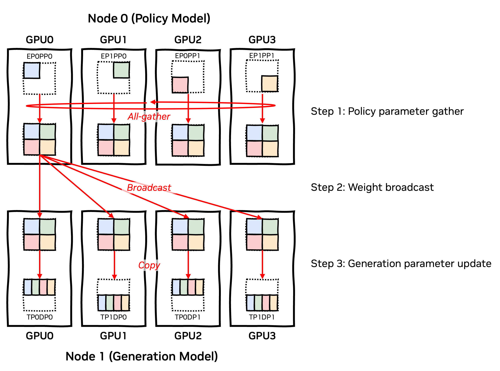
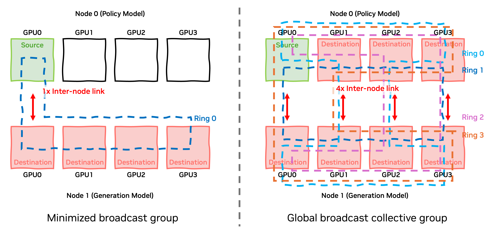
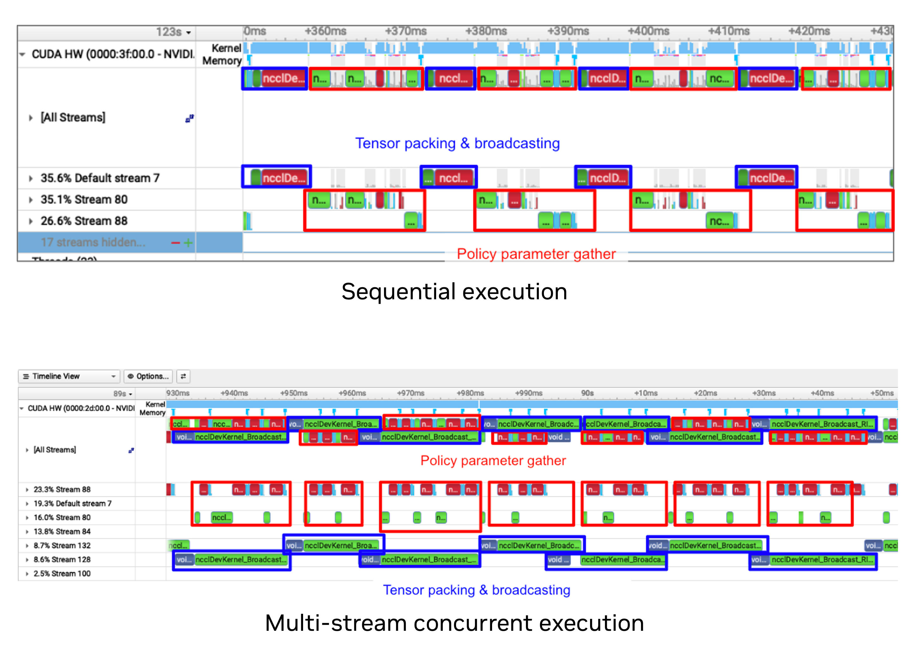

---
date:
    created: 2026-02-26
slug: nemo-rl-async-refit-performance
authors:
    - youngeun_kwon
    - guyue_huang
    - yuki_huang
    - terry_kong
    - wenwen_gao
categories:
    - NeMo-RL
    - Reinforcement Learning
    - GRPO
tags:
    - NeMo-RL
    - Reinforcement Learning
    - Megatron-Core
    - GRPO
    - Weight Transfer
---

# NeMo-RL: Optimizing Non-Colocated Refit for Asynchronous RL

<!--
nemo_discussion: {
  "repo": "https://github.com/NVIDIA-NeMo/RL",
  "authors": ["youngeunkwon0405", "guyueh1", "yuki-97", "terrykong", "snowmanwwg"]
}
-->

## Introduction

Employing async-RL with disaggregating training and inference GPU (non-colocated) now becomes standard for modern large-scale RL training. In the async-RL setup, the framework needs to perform weight transfer, which is also known as the “refit” process, to synchronize the weight parameters of inference GPUs with the latest parameters produced by the training GPUs. Optimizing the **refit** process is important to ensure maximum efficiency for the whole RL training loop.

This article details the non-colocated refit optimization for asynchronous RL in the NeMo-RL repository that can improve the refit latency by 4-10 times compared to the naive implementation.

## How Non-colocated Refit is done in NeMo-RL

Figure 1 illustrates how the non-colocated refit works in the nemo-rl repository. The process can be divided into three steps: 1) policy parameter gather, 2) weight broadcast, and 3) generation parameter update. In 1) policy parameter gather, all the sharded parameters (e.g., by TP, EP, and PP) in the policy worker are gathered to make each policy worker have full model parameters. This step is completely identical to that of colocated refit, which was well explained in the previous posting ([#1189](https://github.com/NVIDIA-NeMo/RL/discussions/1189)). However, after this step, the refit process becomes different. In colocated refit, the policy workers and the generation workers are “coloated” so the weight tensors are already there and what we need is just to pass the pointer of the new weight tensors. However, in the non-colocated case, we actually have to transfer the weight value between them. The step 2), weight broadcast, handles that part by performing a broadcast collective call to deliver gathered weight parameters to generation workers. We choose rank0 of the policy worker as the source rank and perform the broadcast collective. After this step, each generation worker also has the latest version of the full model weights. In 3) generation parameter update, utilizing the vLLM `load_weights` API, it finally updates the generation model weights with the broadcasted weight tensors.

Figure 1. NeMo-RL non-colocated refit overview

## Optimizing Refit Performance

Our optimization does not fundamentally change the methodology described above. Instead, it finetunes each step and better orchestrates the entire process to extract the performance to the limit.

### Optimization #1: Leveraging Topology-aware NCCL Broadcast ([PR#1264](https://github.com/NVIDIA-NeMo/RL/pull/1264))

It is a general rule of thumb to exclude unnecessary participants from the communication group because, intuitively, communication in a smaller group has better performance than in a larger group. In most cases, this is true. However, in the RL weight broadcast scenario, the story can be different. 
Figure 2 shows two different ways of forming a communication group for the weight broadcast. On the left side, following the rule of thumb, it includes as few participants as possible in the communication group. In this setup, [NCCL (NVIDIA Collective Communication Library)](https://github.com/NVIDIA/nccl) will form a ring as shown in the figure, which will have a minimum number of hops to travel. However, since the network topology in that communication group only contains a single inter-node link, it will quickly be bottlenecked by that link's bandwidth. On the other hand (right side of figure 2), if the communication group contains other policy worker GPUs as well, even if there is no point in sending the parameter weights to other policy worker GPUs, now the network topology contains four inter-node links. In this communication group setup, NCCL composes multiple different rings (ring0, ring1, ring2, and ring3 in the figure) to leverage all the available inter-node links to speed up the collective communication. By applying this optimization, in a typical multi-node DGX H100 setup with a CX7 NIC card (that has 50 GB/s internode communication bandwidth per link), the maximum achievable broadcast bandwidth becomes 400 GB/s (50 GB/s x 8) in theory.

 

Figure 2. Topology-aware NCCL broadcast

### Optimization #2: Coalesced Collective and Batched Weight Update ([PR#1313](https://github.com/NVIDIA-NeMo/RL/pull/1313))

This optimization focuses on improving the efficiency of each kernel launch, particularly for models like fine-grained Mixture-of-Experts (MoE) models that consist of a large number of relatively small tensors. Launching separate communication collectives (like broadcast) for numerous small tensors creates a substantial bottleneck. Even with high network bandwidth (as provided by Optimization #1), this overhead prevents it from being efficiently utilized. To address this, we implement Coalesced Collective communication. This involves packing all the model tensors into a single, contiguous memory buffer before initiating the weight broadcast. By executing a single collective call on this large packed tensor, we effectively amortize the collective launch overhead and allow the NCCL backend to better saturate the high communication bandwidth made available by the topology-aware approach. Following the efficient data transfer, the Batched Weight Update leverages the vLLM load_weights API to update the generation model parameters. Instead of incurring the fixed CPU and kernel launch overhead for every single tensor, the batched approach processes the weight updates in larger chunks, thereby significantly reducing the overall per-tensor update latency.

### Optimization #3: Overlap Policy Parameter Gather and Weight Broadcast phases ([PR#1379](https://github.com/NVIDIA-NeMo/RL/pull/1379))

The entire process is executed in chunks since we couldn’t all gather and broadcast the entire parameter at once due to the memory capacity limitation. All three steps described in Figure 1 are performed for every chunk one by one. The last optimization we made was overlapping different steps of different chunks using CUDA streams (Figure 3). This may have network resource contentions, but it usually helps improve performance because of the following reason. Each step (policy parameter gather and weight broadcast) not only contains the NCCL kernel, policy parameter gather has many other kernels involved, also in the broadcast part, there is also a tensor packing kernel from the previous optimization. Overlapping NCCL kernels with non-NCCL kernels will always help. Even for the overlap between NCCL kernels, since each kernel is not always fully utilizing both NVLink (NVL) and InfiniBand (IB) bandwidth, overlapping them might help reduce overall latency. Figure 3 uses two streams to overlap the policy parameter gather phase with the weight broadcast phase. In NeMo-RL, via the `NRL_REFIT_NUM_BUFFERS` environment variable, we allow the use of more streams for more aggressive overlapping. For example, using three different streams, we can overlap “policy parameter gather phase”, “tensor packing kernel”, and “broadcasting kernel”. This might further reduce refit latency in some cases, but it does not in every case due to excessive contention. Moreover, it will increase peak memory usage due to having “triple” buffers. Considering all those tradeoffs, we choose to use `NRL_REFIT_NUM_BUFFERS=2` as a default.

Figure 3. Multi-stream concurrent execution

## Conclusion

Our work in NeMo-RL significantly reduced this refit latency via three optimizations focused on better network utilization, improved kernel efficiency, and overlapping communication.
The cumulative impact of all three optimizations on a DGX H100 system resulted in significant performance gains, as demonstrated by the reduced refit times for various BF16 models:

| Model | Original Refit Time (s) | Optimized Refit Time (s) | Speedup |
| :--- | :--- | :--- | :--- |
| **QWEN3 30B A3B** | 15 | 1.5 | 10x |
| **QWEN3 235B A22B** | 23 | 5 | 4.6x |
| **DSV3** | 70 | 14 | 5x |

These improvements are crucial for maintaining the high throughput and GPU utilization required for large-scale asynchronous RL training, effectively eliminating the refit process as a performance bottleneck.

## Upcoming Updates on Refit

The optimizations described above were completed earlier and target NeMo-RL's default non-colocated refit path. Newer refit implementations now reduce or eliminate the need to transfer full model weights. For cross-data-center training, where network bandwidth is often severely constrained, [delta-weight updates](https://github.com/NVIDIA-NeMo/RL/pull/2444) reduce transfer volume by sending compressed parameter deltas instead of transferring the full model weights. We are also preparing [NCCL-based P2P resharding](https://github.com/NVIDIA-NeMo/RL/pull/2971), our latest refit implementation. It performs direct shard-to-shard transfers between training and inference workers using the highly optimized `nccl.m2n.reshard` operation, avoiding the need for full-tensor transfers. These implementations are expected to deliver up to an order-of-magnitude improvement in refit performance over the implementation described in this post.

## Acknowledgment

Great thanks to [Kaiming Ouyang](https://github.com/KaimingOuyang) for sharing the NCCL operation details.
