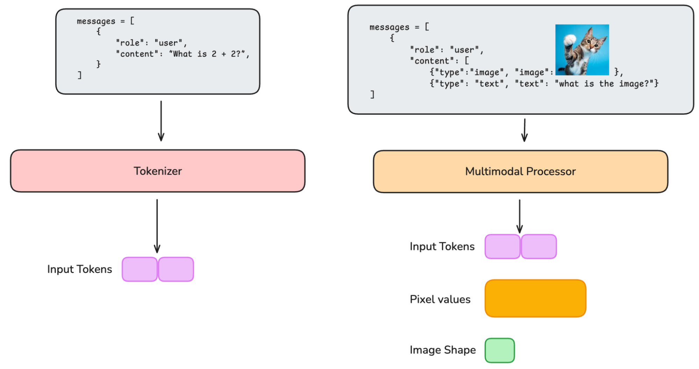
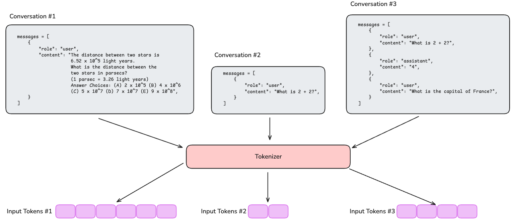
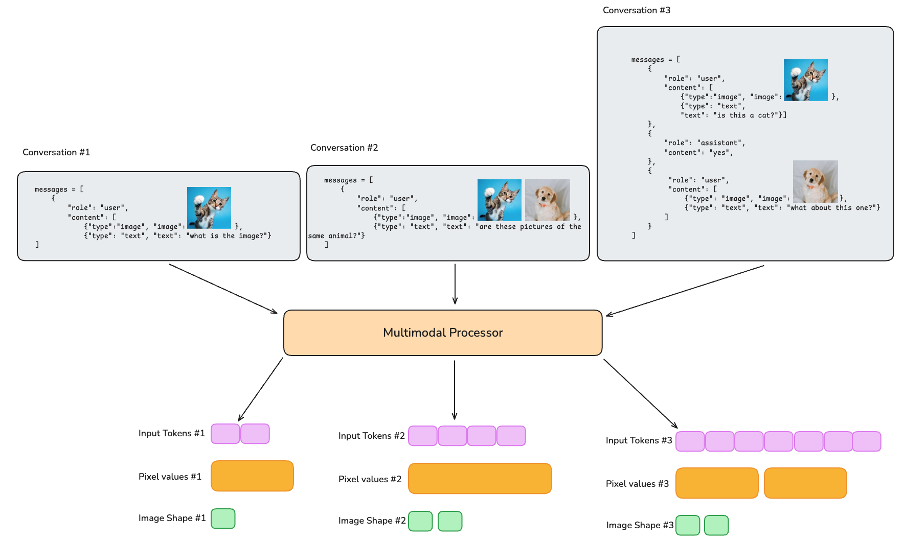
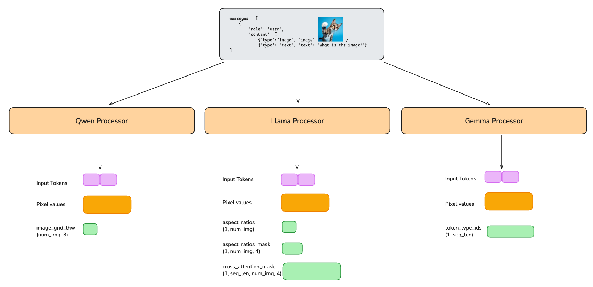
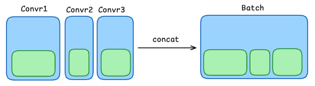
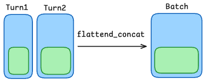
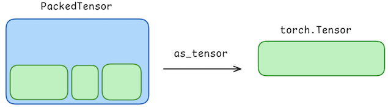
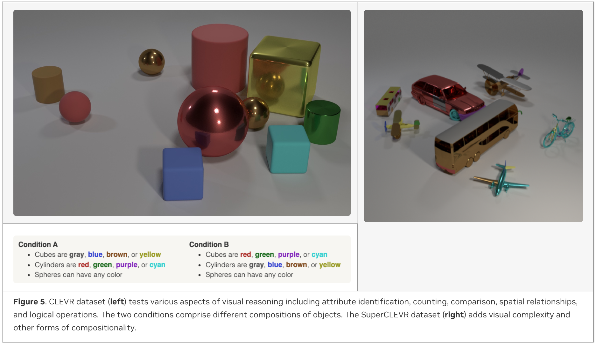
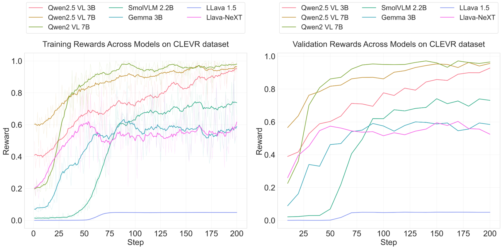

---
date:
  created: 2025-10-22
slug: nemo-rl-vlm
authors:
  - rohit_jena
  - yifu_wu
  - terry_kong
  - wenwen_gao
categories:
    - NeMo-RL
    - Reinforcement Learning
    - DeepScaleR
    - GRPO
    - Qwen
    - VLM
tags:
    - NeMo-RL
    - Reinforcement Learning
    - GRPO
    - Qwen
    - VLM
---

# Multimodal support for NeMo-RL

## Introduction

The world around us is inherently multimodal. We perceive and interact with it through a rich tapestry of senses: sight, sound, touch, and more. To truly understand and engage with this complexity, artificial intelligence systems must move beyond text-only processing and embrace the power of multimodal models. These models, which integrate information from data streams with diverse modalities like vision, text, and audio, are becoming increasingly vital for building AI that can truly comprehend and respond to the nuances of human experience.

Supervised finetuning methods have demonstrated promising performance in adapting large language models to specific tasks, and when coupled with RL-based finetuning, emergent reasoning capabilities lead to advanced problem-solving skills in language models. For multimodal data, reasoning becomes crucial in various scenarios, such as robotics, autonomous vehicles, mathematical geometries and gaming. In these cases, the ability to infer, deduce, and make logical connections across visual, textual, and even audio inputs is essential for accurate and effective task completion.

In this blog, we will demonstrate how NeMo-RL’s Supervised Finetuning (SFT) and Reinforcement Learning (RL) capabilities can be applied to multimodal models.

## What makes multimodal support challenging?




<p style="text-align: left; font-style: italic;"><b>Figure 1</b>. (left) The input messages for text-only LLMs are tokenized into a sequence of input tokens. (right) The input for multimodal LLMs is processed into text input tokens, pixel values, and additional metadata such as image shape - tokenizing the latter two requires additional, model-dependent engineering effort.</p>

Data pipeline is an important stage for efficient training, and this can be very different for data of varying modalities. For text data, NeMo RL currently features a number of data handling optimizations \- including dynamic micro-batching for maximizing GPU utilization across multiple GPUs, interleaved repeats (for generating multiple trajectories for GRPO), and sequence packing to reduce excessive padding waste in batches with highly variable sequence length.  Since nearly all LLMs use integer-valued token sequences, it’s fairly easy to apply these optimizations across different model families without any model-specific considerations.

However, for multimodal LLMs, the input messages may also include images, videos, or other modalities. These messages are passed through a multimodal processor, which handles the preprocessing steps for different modalities. Text inputs are tokenized in the same way as in text-only LLMs, while non-text inputs have modality-specific preprocessing (e.g., images or videos may be resized, cropped, or normalized), producing additional inputs for the multimodal LLM, such as pixel values and metadata like image dimensions. Unlike text-only LLMs, which only operate on a sequence of input tokens, these multimodal inputs introduce two additional sources of heterogeneity: across messages in a batch (*batch heterogeneity*) and across different model architectures (*representation heterogeneity*). These heterogeneities make it difficult to apply the same optimizations that are used for text-only LLMs without additional consideration.

### Batch Heterogeneity

As mentioned above, for text-only LLMs, all input conversations are flattened into a single sequence of input tokens regardless of how many messages are in the conversation or differences in the content of the messages. This makes it easy to "stack" the tokens into a batch of data.



<p style="text-align: left; font-style: italic;"><b>Figure 2</b>. For text-only LLMs, input samples can be flattened into a single sequence of input tokens, regardless of the number of tokens in each sample.</p>

Multimodal models, on the other hand, possess relatively little standardization of the input data. A single datum in a batch comprises a sequence of “turns” alternating between the user and the assistant, and the user may provide one, more or no auxiliary multimodal inputs (images, videos, or audio) at each turn. This variance makes “stacking” the auxiliary inputs across a batch dimension (like we do with token sequences) non-trivial. Moreover, the multimodal inputs are supplemented by metadata (e.g., image shape) which must be passed to the model too, requiring additional consideration.


<p style="text-align: left; font-style: italic;"><b>Figure 3</b>. Multimodal models need to handle additional data representing the multimodal inputs, such as pixel values and image shapes. This means additional care must be taken when creating a batch of data to ensure the multimodal data is stacked correctly in a batch.</p>

### Representation Heterogeneity



<p style="text-align: left; font-style: italic;"><b>Figure 4</b>. Different models may have different specifications for processing multimodal inputs. For example, for image inputs, models do not have a unified way of representing the metadata of the image.</p>

To throw another wrench in the multimodal integration, there are no standard key-value mappings for the multimodal inputs across models. Instead, model-specific designs elicit various specifications of the data and associated metadata. For example,

* Llava 1.5 resizes the image to a standard shape, and does not support multiple images.
* Llava-NeXT uses multiple patches of the image and a higher-resized resolution
* Qwen2-VL requires a flattened version of the patch embeddings and associated grid parameters.
* SmolVLM returns a stack of image patches and associated pixel attention masks.

The table below highlights the different formats used by multimodal models.


<p style="text-align: left; font-style: italic;"><b>Table 1</b>. Different multimodal models have different multimodal data preprocessing and semantics. A multimodal implementation must be agnostic to these heterogenous designs. <b>Glossary</b>: ps = patches, px = pixels, seqlen = image sequence length , n = number of images/videos, + represents support for multiple multimodal inputs</p>

| Model | Supported Modalities | Input sizes | Packing dimension(s) |
| :---- | :---- | :---- | :---- |
| Llava 1.5 | I | pixel\_values: (n,3,px,px) | n |
| Llava-NeXT | I+ | pixel\_values: (n, ps, 3, px, px)<br>image\_sizes: (n, 2\) | n |
| Qwen2VL / Qwen2.5VL   | I+, V+ | pixel\_values: (ps, d)<br>image\_grid\_thw: (n, 3\)<br>pixel\_values\_videos: (ps, d)<br>video\_grid\_thw: (n, 3) | ps |
| SmolVLM | I+ | pixel\_values: (1, ps, 3, px, px) | ps |
| Qwen2.5-Omni | I+, V+, A+ | pixel\_values: (ps, d)<br>image\_grid\_thw: (n, 3)<br>pixel\_values\_videos: (ps, d)<br>video\_grid\_thw: (n, 3) | ps, n |
| Gemma 3  | I+ | pixel\_values: (ps,3,px,px)<br>token\_type\_ids: (1,seq) | ps |
| Llama3.2 | I+ | pixel\_values: (1, n, ps, 3, px, px)<br>aspect\_ratios: (1, n)<br>aspect\_ratios\_mask: (1,n,4)<br>cross\_attention\_mask: (1, seqlen, n, 4\) | n, ps |
| Llama-4 | I+ | pixel\_values: (ps, 3, px, px) |  ps |

## Using `PackedTensor` to handle heterogeneous multimodal inputs

The highly heterogeneous nature of multimodal tensors for different models makes it incompatible with collating, sharding, and sequence packing logic used for tensors representing simple token sequences. In particular, performing these operations requires a way to stack and slice data in a general way that works across different models. To address this, we introduce a lightweight abstraction on top of `torch.Tensor` called the `PackedTensor`.

A `PackedTensor` is a wrapper around a list of `torch.Tensors` and an integer `dim_to_pack` representing the dimension along which to pack the tensors. It comes with the following functionality:

* `slice(indices)`: Slices the underlying list of `torch.Tensors` based on the given indices and is called for static / dynamic sharding and sequence packing.
* `concat(packed_tensors)`: Concatenates variable `PackedTensors` into a new `PackedTensor` object. This is used for creating a batch of data from multiple conversations.



* `flattened_concat(packed_tensors)`: First flattens the provided packed\_tensors along `dim_to_pack` and then creates a new `PackedTensor` with the flattened tensor. This is used for converting turn-level data into conversation-level data.



* `as_tensor()`: Concatenates the list of `torch.Tensors` along `dim_to_pack` and returns the resulting `torch.Tensor` which can then be used as input to the model.



Using `PackedTensors`, we can support the different multimodal inputs specified in Table 1 by simply specifying the corresponding `dim_to_pack`.

## Image reasoning on CLEVR and SuperCLEVR datasets

Our multimodal data structure abstracts the model specific multimodal formatting and naming conventions from the processor and the model. This allows zero-day support for new multimodal models that potentially adhere to different naming conventions, image preprocessing, and formatting. To demonstrate the convergence and flexibility of the feature, we test both GRPO and SFT pipelines for both in-distribution and out-of-distribution performance.

We show our experiments training on the CLEVR dataset, a diagnostic visual benchmark for compositional language and visual reasoning. Questions in the dataset require a range of reasoning skills, including - attribute identification, counting, comparison, spatial relationships and logical operations.


The [CLEVR dataset](https://cs.stanford.edu/people/jcjohns/clevr/) consists of a Compositional Generalization Test (CoGenT) version, which is used to test a system's ability to generalize to novel composable combinations of visual concepts. The dataset consists of Conditions A and B comprising different compositions of shapes and colors.



We use the CoGenT version with Condition A for training, and Conditions A (in-distribution) and B (out-of-distribution) for validation and testing respectively. Furthermore, we also evaluate our method on the [SuperCLEVR](https://arxiv.org/pdf/2212.00259) dataset, which adds visual complexity, question redundancy, concept distribution, and concept compositionality. The SuperCLEVR dataset represents an aggressive out-of-distribution scenario where the objects seen are completely different from those during training – testing the model’s capability to compose the representations seen during pretraining with reasoning capabilities learned during RL.

#### Models

We train GRPO and SFT on the CLEVR dataset with seven models across four families:

1. Qwen2-VL-7B-Instruct
2. Qwen2.5-VL-3B-Instruct
3. Qwen2.5-VL-7B-Instruct
4. Gemma3-4b-it
5. HuggingFaceTB/SmolVLM2-2.2B-Instruct
6. Llava 1.5
7. Llava NeXT (using Mistral 7B LLM)

Each model can be run using the `run_vlm_grpo.py` script ([permalink](https://github.com/NVIDIA-NeMo/RL/blob/e9bd6fd2978a9dea977ecabd116eb597b5cfecec/examples/run_vlm_grpo.py)).

```shell
uv run examples/run_vlm_grpo.py policy.model_name=Qwen2-VL-7B-Instruct
```

To run the benchmark with other models, we run the same script with different values of `policy.model_name` as follows:

* Qwen2.5 3B: `Qwen/Qwen2-VL-7B-Instruct`
* Qwen2.5 7B: `Qwen/Qwen2-VL-7B-Instruct`
* Llava 1.5: `llava-hf/llava-1.5-7b-hf`
* Llava NeXT: `llava-hf/llava-v1.6-mistral-7b-hf`
* SmolVLM: `HuggingFaceTB/SmolVLM2-2.2B-Instruct`
* Gemma 3B (gated model): `google/gemma-3-4b-it`

You can find the working implementation here: \[[Code](https://github.com/NVIDIA-NeMo/RL)\] \[[Training Script](https://github.com/NVIDIA-NeMo/RL/blob/main/examples/run_vlm_grpo.py)\] \[[Dockerfile](https://github.com/NVIDIA-NeMo/RL/blob/main/docker/Dockerfile)\].

#### Benchmarking
We run all models on a single node with 8 H100 GPUs for 200 steps using NeMo-RL's [AutoModel](https://github.com/NVIDIA-NeMo/Automodel) (i.e. PyTorch) backend, and vllm for generation, with a maximum sequence length of 3072. First, we verify convergence on Condition A for CLEVR dataset (Figure 6). We see that different models achieve different asymptotic validation performance depending on model class. Notably, Qwen2VL-7B achieves a higher performance than its 3B counterpart showing that the task is hard for smaller models even if the data set is synthetically generated with simple shapes.




<p style="text-align: left; font-style: italic;"><b>Figure 6</b>. Convergence on CLEVR Dataset, Condition A.</p>

Next, we test the out-of-distribution generalization performance on both Condition B and the SuperCLEVR datasets (Table 2). The Qwen and HF SmolVLM models benefit from GRPO on the out-of-distribution SuperCLEVR dataset. However, there is a trend reversal in Gemma3-4B and Llava-NeXT models indicating this does not hold across all models.

<p style="text-align: left; font-style: italic;"><b>Table 2</b>. Performance of different VLMs across 3 conditions. Condition A is in distribution while Condition B and SuperCLEVR are out of distribution.</p>

| Model | Algorithm | Condition A | Condition B | SuperCLEVR |
| ----- | :---- | :---- | :---- | :---- |
| Qwen2-VL-7B | GRPO | 97.5 | 97.9 | **43.4** |
|  | SFT | 97.9 | 98.2 | 34.6 |
| Qwen2.5-VL-3B | GRPO | 95.9 | 95.4 | **85.4** |
|  | SFT | 98.1 | 98.0 | 38.6 |
| Qwen2.5-VL-7B | GRPO | 96.0 | 95.8 | **88.3** |
|  | SFT | 98.9 | 99.2 | 35.1 |
| HF SmolVLM2-2.2B-Instruct  | GRPO | 76.7 | 77.6 | **51.3** |
|  | SFT | 36.1 | 37.9 | 16.4 |
| Gemma3-4B | GRPO | 46.8 | 47.5 | 44.7 |
|  | SFT | 63.7 | 62.9 | **53.1** |
| Llava NeXT | GRPO | 49.0 | 49.7 | 46.1 |
|  | SFT | 77.2 | 76.6 | **48.0** |
| Llava 1.5 | GRPO | 0.0 | 0.0 | 0.0 |
|  | SFT | 0.0 | 0.0 | 0.0 |


## Get started with multimodal post-training with NeMo RL

NeMo-RL is a scalable post-training library designed for models ranging from a single GPU to thousands. It includes seamless integration with Hugging Face, a modular design for flexibility, and efficient resource management with Ray.

To kick-start your own reinforcement learning experiments with NeMo-RL, explore the open source [NVIDIA NeMo-RL GitHub repo](https://github.com/NVIDIA-NeMo/RL), where you’ll find detailed documentation, example scripts, and configuration files.
