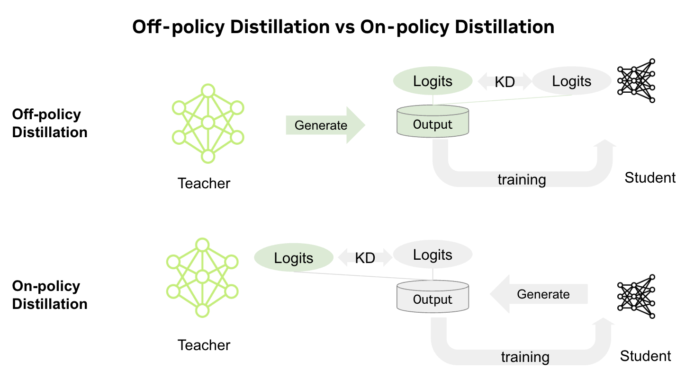
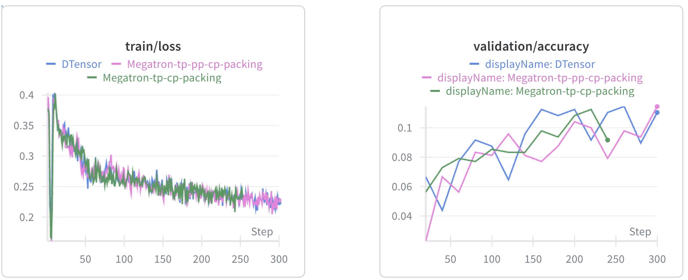

---
date:
  created: 2025-10-15
slug: on-policy-distillation
authors:
  - alex_qiu
  - shuo_yang
  - shuang_yu
  - sharath_turuvekere_sreenivas
  - wenwen_gao
categories:
    - NeMo-RL
    - Qwen3
    - On-Policy Distillation
tags:
    - NeMo-RL
    - Qwen3
    - On-Policy Distillation
---

# On‑Policy Distillation for LLMs in NVIDIA NeMo-RL

<!--
nemo_discussion: {
  "repo": "https://github.com/NVIDIA-NeMo/RL",
  "authors": ["zpqiu", "sharonyu-115", "shuo-nvidia", "sharathts", "snowmanwwg"]
}
-->

Knowledge distillation (KD) transfers knowledge from a large “teacher” model to a smaller “student” model, enabling the student to retain the teacher’s accuracy while being faster and more resource-efficient for deployment.

Traditional (off‑policy) distillation aligns the student with the teacher’s outputs on a fixed dataset, curated from external sources or generated by the teacher. While efficient for bootstrapping, it limits the student to data it may not encounter at inference time. In contrast, on‑policy distillation lets the student generate its own trajectories and align with the teacher’s outputs, ensuring learning from its own behavior distribution. This approach enables exploration beyond the fixed dataset and helps mitigate capacity gaps when distilling from larger teachers. Recent works such as [GKD](https://arxiv.org/abs/2306.13649) and [Qwen3](https://arxiv.org/abs/2505.09388) highlight the benefits of on‑policy distillation. See Figure 1 below for a comparison between the two methods.

<div align ="center">
  Figure 1. Comparison between off-policy distillation and on-policy distillation.
</div>
<p></p>
<!-- more -->

This post compares off‑policy and on‑policy distillation, outlines their workflows, and demonstrates how on‑policy distillation can improve accuracy of pretrained or SFT-trained models using [NVIDIA NeMo-RL](https://docs.nvidia.com/nemo/rl/latest/index.html). Notably, SFT itself can be performed via distillation.

## Understanding On‑Policy Distillation

### Off‑Policy vs. On‑Policy Distillation

- Off-policy distillation: A dataset of prompt–response pairs is curated from external sources and/or generated by a teacher model. The student is trained to align its logits with the teacher’s on this fixed dataset, typically by minimizing KL divergence.
- On-policy distillation: The student first generates responses to sampled prompts (its own trajectories). A teacher then provides logits for these sequences, and the student minimizes the KL divergence between its outputs and the teacher’s logits, learning directly from its own behavior distribution. Since the student is learning from its own trajectory generations, it resembles with reinforcement learning (RL) and hence is implemented by a RL framework such as NeMo RL.  Furthermore, on-policy knowledge distillation is typically more sample-efficient than regular RL, since the teacher logits provide a dense supervision signal, whereas RL feedback is often sparse" 

### Why On‑Policy Distillation Matters

- Bridging distribution shift: Off-policy distillation can underperform when the student’s behavior diverges from the fixed dataset. On-policy distillation reduces this shift by aligning the student with the teacher on the student's own trajectories.
- Diversity: Enables exploration of policies beyond the fixed dataset.
- Mitigating capacity gaps: Off-policy distillation from significantly larger teachers can lead to minimal gains or accuracy degradation. On-policy distillation addresses this by letting the student dictate the policy while refining it with the teacher’s guidance.
- Compute efficiency: On-policy knowledge distillation is typically more sample-efficient than reinforcement learning, since teacher logits provide a dense supervision signal, whereas RL feedback is often sparse"
- Accuracy gains: Empirical results show that on-policy distillation improves task performance, particularly when combined with off-policy distillation.


## How On‑Policy Distillation is Implemented in NeMo-RL

NeMo-RL’s newly introduced distillation algorithm implements [on-policy distillation](https://github.com/NVIDIA-NeMo/RL?tab=readme-ov-file#on-policy-distillation) end-to-end, and supports scaling via tensor parallelism (TP), context parallelism (CP), sequence parallelism, dynamic batching, and sequence packing.
 
High-level workflow:
- Setup: initialize student and teacher policies, data loaders, and the distillation loss.
- On-Policy generation: student policy generates sequences for sampled prompts via vLLM-backed generation.
- Teacher logits extraction: the teacher computes top‑k logits and indices for the student’s tokens.
- Distillation loss: The DistillationLossFn aligns the student’s logits with the teacher’s top‑k logits using a KL divergence loss restricted to the top‑k tokens.
- Training loop: student parameters are updated via backpropagation on the distillation loss, and the loop then continues with the next iteration.

Below is an illustrative code snippet showing the main on-policy distillation training loop: 

```python
while step < max_steps:
  for batch in dataloader:
      ...
      # 1) Prepare batch: repeat prompts for multiple generations per prompt
      ...
      repeated_batch = batch.repeat_interleave(
          master_config["distillation"]["num_generations_per_prompt"]
      )

      # 2) On-policy generation with student policy (vLLM-backed)
      ...
      if NEED_REFIT and POLICY_GENERATION_STALE:
          refit_policy_generation(student_policy, student_generation, colocated_inference)
      ...
      repeated_batch, rollout_metrics = run_multi_turn_rollout(
          policy_generation=student_generation,
          input_batch=repeated_batch,
          tokenizer=tokenizer,
          task_to_env=task_to_env,
          ...
      )
      ...

      # 3) Flatten messages and build training tensors
      ...
      flat_messages, input_lengths = batched_message_log_to_flat_message(
          repeated_batch["message_log"],
          pad_value_dict={"token_ids": tokenizer.pad_token_id},
          ...
      )

      train_data = BatchedDataDict[DistillationLossDataDict]({
          "input_ids": flat_messages["token_ids"],
          "input_lengths": input_lengths,
          ...
      })
      ...

      # 4) Get teacher's top-k logits/indices for student tokens
      ...
      teacher_topk = teacher_policy.get_topk_logits(
          train_data, k=master_config["distillation"]["topk_logits_k"]
      )
      train_data["teacher_topk_logits"] = teacher_topk["topk_logits"]
      train_data["teacher_topk_indices"] = teacher_topk["topk_indices"]

      # 5) Train student with distillation loss (KL on teacher's top-k)
      ...
      teacher_policy.offload_after_refit()
      student_policy.prepare_for_training()
      ...
      train_results = student_policy.train(train_data, loss_fn)

      ...
```

### Key Configuration Options

Below is a sample configuration file that sets up student and teacher policy definitions alongside distillation parameters. For a full example refer to [distillation_math.yaml](https://github.com/NVIDIA-NeMo/RL/blob/main/examples/configs/distillation_math.yaml). You can also refer to [distillation_math_megatron.yaml](https://github.com/NVIDIA-NeMo/RL/blob/main/examples/configs/distillation_math_megatron.yaml) to see how to use Megatron backend. The [quickstart section](https://github.com/NVIDIA-NeMo/RL?tab=readme-ov-file#on-policy-distillation) helps users to try them out.

```yaml
# Student Policy Configuration
policy:
    model_name: "Qwen/Qwen3-1.7B-Base"
    dtensor_cfg:
        enabled: true
        tensor_parallel_size: 1
        context_parallel_size: 1
    generation:
        backend: "vllm"
...

# Teacher Policy Configuration
teacher:
    model_name: "Qwen/Qwen3-4B"  # Larger teacher model
    dtensor_cfg:
        enabled: true
        tensor_parallel_size: 4
        context_parallel_size: 2

# Distillation Loss Configuration
loss_fn:
    kl_type: "mixed"  # Options: "forward", "reverse", "mixed"
    mixed_kl_weight: 0.5  # Weight for forward KL when kl_type="mixed"
    
# Distillation Training Configuration
distillation:
    num_prompts_per_step: 128
    num_generations_per_prompt: 1
    topk_logits_k: 64  # Top-k logits for teacher guidance
    max_num_steps: 1000
```

- `policy` (student) and `teacher` have the same config structure, but we can set different parallelization strategies for them. For example, a larger TP size can be set for a larger teacher model. The policy needs to configure generation to generate trajectories online.
- `kl_type` in `loss_fn` can set different KL loss calculation methods:
    - `forward`: $P_{teacher} * log(P_{teacher}/P_{student})$
    - `reverse`: $P_{student} * log(P_{student}/P_{teacher})$
    - `mixed`: $mixed_{kl_weights} * kl_{forward} + (1 - mixed_{kl_weights}) * kl_{reverse}$
- `topk_logits_k` in `distillation` means we support sparse KL loss calculation based on top-k logits, which can save GPU memory and improve training speed.

## Experiments

### Effectiveness of On‑Policy Distillation

We validated the effectiveness of on-policy distillation in the math domain. For the teacher model, we selected [Qwen3-32B](https://huggingface.co/Qwen/Qwen3-32B), and for the student models, we chose [Qwen3-1.7B-Base](https://huggingface.co/Qwen/Qwen3-1.7B-Base) and [Qwen3-4B-Base](https://huggingface.co/Qwen/Qwen3-4B-Base). As baselines, we evaluate standard SFT and off-policy KD on the fixed SFT dataset. For the off-policy methods, we selected the [nvidia/AceReason-1.1-SFT](https://huggingface.co/datasets/nvidia/AceReason-1.1-SFT) dataset, which includes prompts and responses with thinking processes. For the on-policy distillation method, we used prompts from the [DeepScaler](https://huggingface.co/datasets/agentica-org/DeepScaleR-Preview-Dataset) dataset. For evaluation, we selected the [AIME 2025](https://huggingface.co/datasets/yentinglin/aime_2025) dataset and generated 16 responses for each question, using Avg@16 as the metric.

The results are shown in the following table:

| Student Model | Original | SFT | SFT + Off-policy distillation | On‑policy distillation | SFT + On‑policy distillation |
|---|---|---|---|---|---|
| Qwen3‑1.7B‑Base | 1.67 | 5.42 |  - | **11.25** | 9.79 |
| Qwen3‑4B‑Base | 2.71 | 24.58 | 30.42 | 28.96 | **47.71** |
<div align="center">
  Table 1. Evaluation results on different models with different methods
</div>
<p></p>

Firstly, we observe that off-policy SFT distillation outperforms vanilla SFT. For Qwen3-1.7B-Base, on-policy distillation yields the highest accuracy (11.25), surpassing SFT (5.42). For Qwen3-4B-Base, although SFT off-policy distillation slightly outperforms on-policy distillation (30.42 vs. 28.96), the best overall performance is achieved with the combination of SFT followed by on-policy distillation (47.71). In summary, the best results are consistently obtained when on-policy distillation is incorporated into the training process.

### Alignment between PyTorch DTensor (i.e. DTensor) and Megatron Backend

To assess backend consistency, we ran three experiments with identical settings except for the training backend (DTensor vs. Megatron). As shown below in Figure 2, the loss and validation curves closely overlap, confirming alignment between the two backends.


<div align="center">
  Figure 2. Loss and validation curves across different backends for the Qwen3‑1.7B‑Base model on the DeepScaler dataset.
</div>
<p></p>

## Future Work

- **Expansion to Agentic Scenarios**: With the rapid advancement of large language models in agentic capabilities—such as tool usage and multi-turn reasoning—we recognize their importance for tackling complex tasks. We plan to explore how to transfer these advanced behaviors to smaller, efficient student models via on‑policy distillation. This approach aims to reduce deployment costs while enabling more applications to benefit from the reasoning power of large models. Our goal is to design distillation strategies and loss functions that allow students to accurately learn and replicate the teacher’s agentic behaviors, achieving high‑performance intelligent agents even in resource‑constrained environments.

## Conclusion

In this post, we showed how on‑policy distillation aligns supervision with the student’s own behavior and delivers robust quality gains. We walked through the core algorithm flow in NeMo‑RL and shared experimental results: in math‑focused evaluations, on‑policy distillation improves over both SFT and off‑policy distillation, while combining off‑policy with on‑policy distillation yields the strongest results.

Try out on-policy distillation with NeMo RL today by following the [Quickstart](https://github.com/NVIDIA-NeMo/RL?tab=readme-ov-file#on-policy-distillation), and refer to the sample configurations with [Dtensor](https://github.com/NVIDIA-NeMo/RL/blob/main/examples/configs/distillation_math.yaml) and [Megatron](https://github.com/NVIDIA-NeMo/RL/blob/main/examples/configs/distillation_math_megatron.yaml) backends for your own experiments.
