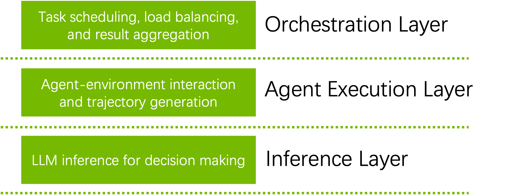
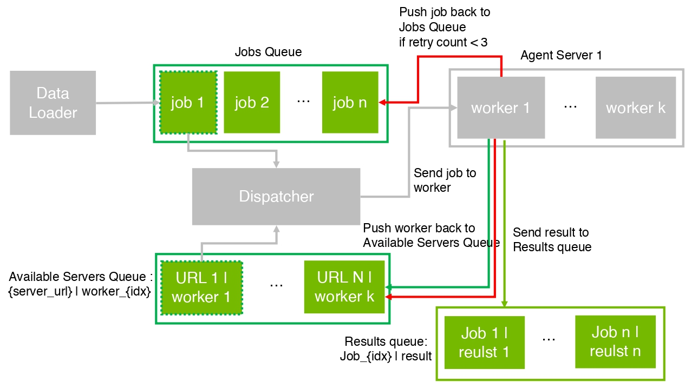
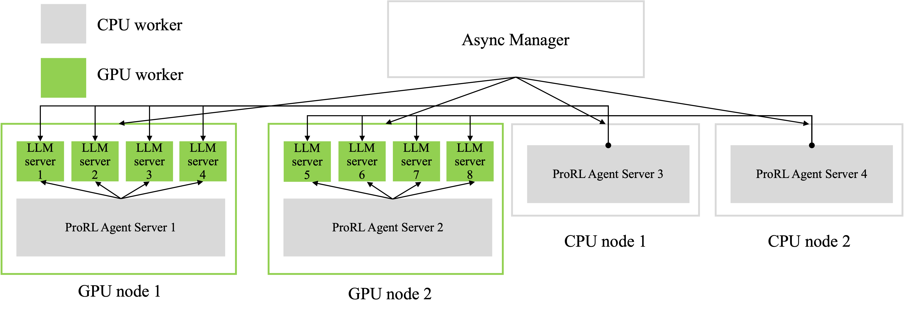
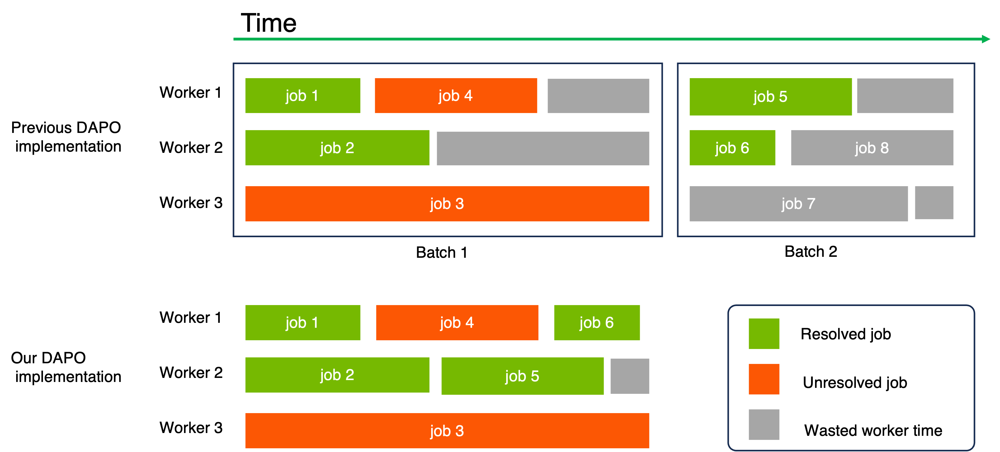
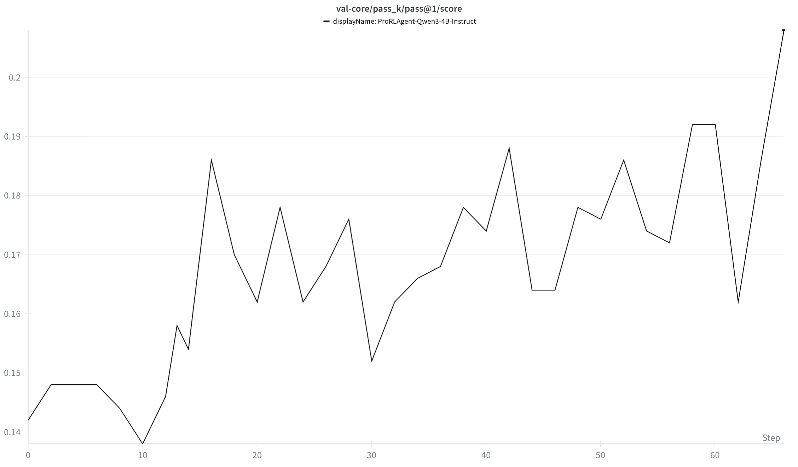
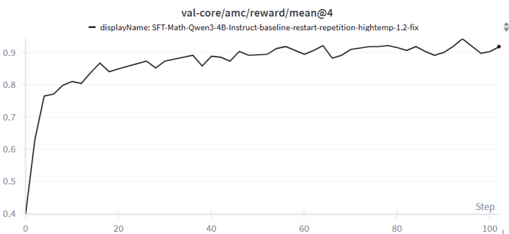
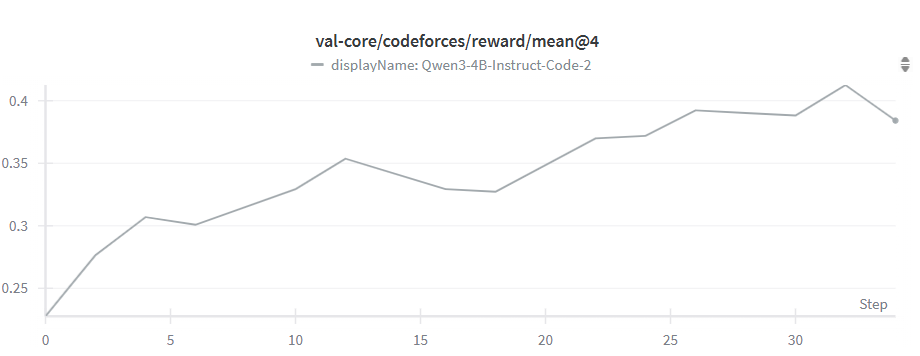

---
date:
  created: 2025-07-21
slug: nemo-rl-v0.3
authors:
  - hao_zhang
  - mingjie_liu
  - shaokun_zhang
  - jian_hu
  - yuki_huang
  - jan_kautz
  - yi_dong
categories:
  - NeMo-RL
  - Reinforcement Learning
tags:
  - NeMo-RL
  - Reinforcement Learning
  - DAPO
  - Qwen3
---

# End-to-End RL Agent Training with ProRL Agent Server

<!--
nemo_discussion: {
  "repo": "https://github.com/NVIDIA-NeMo/ProRL-Agent-Server",
  "authors": ["haozhang", "mingjieliu", "shaokunzhang", "jianhu", "yidong"]
}
-->
This article introduces an efficient end-to-end reinforcement learning (RL) agent training system built on the ProRL Agent Server architecture. In large-scale RL training scenarios, agents need to interact extensively with environments to generate training data (rollouts), which poses significant challenges for system throughput, scalability, and resource utilization.

Our ProRL Agent training system, coupled with an existing RL framework, addresses three critical problems: Load Balancing Bottleneck, CPU Computation Bottleneck, Data Efficiency Challenge. We do RL training on Qwen3-4B-Instruct-2507 model with training data from [a subset ofSWE-GYM](https://huggingface.co/datasets/NovaSky-AI/SkyRL-v0-293-data). Our training allow the Pass@1 on SWE-Bench-Verified to be improved from 14.2% to 20.8%. This blog is for research purpose and the ProRL Agent Server is an environment belongs to Nemo-GYM.

  

Figure 1. The overview of ProRL Agent training system

Here is an overview of our training system which is fully decoupled into three layers: Orchestration Layer, Agent Execution Layer, and Inference Layer
Responsibilities of core components:

- **Orchestration Layer**: Task scheduling, load balancing, data management, and result aggregation
- **Agent Execution Layer**: Actual agent-environment interaction and trajectory generation
- **Inference Layer**: LLM inference to provide computational support for agent decision-making

<!-- more -->

## System Design

### Feature 1: Efficient Asynchronous Task Scheduling with Three Queues

Figure 2. the efficient asynchronous task scheduling technique with three queues. Green and red arrows denotes the process when succeed or fail in processing a job. 

This scheduling technique is built around a three-queue asynchronous architecture designed to maximize resource utilization, balance workloads dynamically, and ensure robustness in large-scale distributed systems. The three queues — a task queue, a server availability queue, and a result queue — operate together to form a continuous processing pipeline.

The task queue holds all pending jobs waiting to be executed. Whenever a server becomes available, it retrieves the next job in line without delay. This decoupling of task preparation and server availability ensures that no server remains idle while tasks are pending. The server availability queue functions as a dynamic pool of active workers: as soon as a server completes its work, it immediately re-enters the availability queue, ready to take on the next task. Meanwhile, completed or failed job outcomes are placed into the result queue, where the system can asynchronously collect, validate, and aggregate results. If a job fails — due to network instability, timeout, or server failure — it is automatically returned to the task queue for reprocessing by another server, keeping the workflow fault-tolerant and self-correcting.

This fully asynchronous and non-blocking design offers several advantages.

- **Zero Idle Waiting**:  Servers never wait for other tasks or nodes; they continuously pick up new work as soon as they are free, which significantly improves throughput and resource efficiency.

- **Adaptive Scheduling**: The system naturally adapts to real-time load and server performance differences. Faster servers handle more tasks, while slower or temporarily busy servers contribute as capacity allows, creating a self-balancing effect.

- **Fault Tolerance**: Any failure — whether from transient network errors or hardware faults — is gracefully handled by reinserting affected tasks back into the queue. This ensures that the overall progress of the system continues uninterrupted, without bottlenecks or manual recovery steps.

Overall, this three-queue scheduling method transforms traditional synchronous dispatching into a resilient, elastic, and highly parallel workflow, ideal for distributed AI inference, large-scale data processing, and other high-performance computing scenarios where stability and efficiency are equally critical.
<!-- **Key Advantages**

- **Zero Idle Waiting**: Servers immediately return to available queue after task completion, no need to wait for other servers
- **Adaptive Scheduling**: Dynamically balances load based on task completion speed
- **Fault Tolerance**: Failed tasks automatically re-enter queue without affecting overall progress -->

### Feature 2: Decoupled Architecture Overcoming CPU Bottleneck
When generating trajectories for agent tasks such as SWE-Bench, a key challenge is the imbalance between CPU and GPU resource demands. Agent execution for software engineering requires substantial CPU resources for environment simulation, code execution, tool invocation, etc., while LLM inference requires GPU acceleration.

To address this, our decoupled architecture separates the Agent Execution Layer (CPU-intensive) from the Inference Layer (GPU-intensive). Specifically, the ProRL Agent Servers leverage CPUs to manage environment simulation, task orchestration, and data preprocessing, while the asynchronous LLM Servers perform model inference on GPUs. Communication between the two layers is facilitated by a lightweight HTTP protocol and a message queue system that exchanges only compact representations (e.g., prompts, responses, and rewards), thereby minimizing inter-node communication overhead.

**How resource allocation works:**
The Orchestration Layer is responsible for allocating resources to ProRL Agent Servers and Async LLM Servers. It first launches one ProRL Agent Server on each CPU or GPU node, since GPU nodes also contain CPUs. Next, it starts $N=\frac{num\_gpus}{tp\_size}$ Async LLM Servers on each GPU node. These Async LLM Servers are then registered with the corresponding ProRL Agent Servers. To minimize communication overhead, ProRL Agent Servers on GPU nodes are paired with Async LLM Servers located on the same node. Finally, Async LLM Servers on CPU nodes are evenly distributed among the ProRL Agent Servers on CPU nodes. This resource allocation strategy ensures that all Async LLM Servers are evenly utilized, leading to balanced workloads and consistent access for ProRL Agent Servers during action prediction.

**Core Advantages of Decoupled Design** 
1. Independent Deployment: ProRL Agent Servers can be deployed on both GPU nodes and CPU nodes while Async LLM servers can be deployed on GPU nodes.
2. Scale up the number of CPU nodes: CPU nodes can scale independent of GPU resources

Figure 3. An example deployment of ProRL Agent Servers and Async LLM servers on GPU and CPU nodes. 

Figure 3 illustrates an example deployment of our training system, demonstrating how scaling CPU nodes can effectively mitigate CPU bottlenecks. To validate this approach, we conducted an experiment using the Qwen3-4B-Instruct-2507 model to generate trajectories based on the SWE-GYM dataset. We compared two configurations: (1) four GPU nodes, and (2) four GPU nodes plus fifteen CPU nodes with dynamic sampling enabled. Each GPU node is equipped with eight NVIDIA A100 GPUs and 128 CPUs, while each CPU node contains 64 CPUs. The experiments were run with a batch size of 32 and a maximum of eight trajectories. We observed that GPU utilization was approximately 50% when using two GPU nodes, and increased to 70% when two GPU nodes were paired with eight CPU nodes. In terms of runtime, the configuration with four GPU nodes required 28 minutes, whereas adding fifteen CPU nodes reduced the time to just 11 minutes.

### Feature 3: Efficient DAPO implementation
DAPO (Dynamic sAmpling Policy Optimization) is an effective algorithm in RL training. It can stablize training and improve data efficiency through filtering out sampling that are too easy or too hard. [Previous DAPO implementation in verl](https://github.com/volcengine/verl/blob/main/recipe/dapo/dapo_ray_trainer.py) is time costing especially for agent task where rollout takes much time.

Our implementation has three features:
1. Dynamic data replenishment. We refill the Job Queue with one job once the Job Queue is empty.
2. Early Termination. We do not do rollout batch by batch. Instead, we keep doing rollout until we collected the required number of effective results which are the responses that resolve the problem for SWE-Bench. Then, we will terminate all the unfinished jobs.
3. We push the unfinished jobs back to the Job Queue to use in the next iteration.

Figure 4. A comparison between our implementation and the previous one is presented. ‘Resolved jobs’ refer to cases where the corresponding response successfully addresses the problem, while ‘unresolved jobs’ indicate the opposite.

Here we present a comparison between our implementation and the previous one. Our approach significantly reduces worker time waste. To evaluate the efficiency, we conducted an experiment using a batch size of 32, eight rollouts per prompt, and a maximum of 30 turns, employing the Qwen3-4B-Instruct-2507 model on 32 NVIDIA A100 GPUs. With the original implementation, the process took approximately 80 minutes, whereas our optimized version completed it in just 28 minutes.

## Experimental Results

We performed experiments on Software Engineering, math and code tasks respectively and got improvements on all the tasks with our agent training system. The following table shows the performance compared with our baseline model Qwen3-4B-Instruct-2507.

| Model | SWE-Bench-Verified (%) | AMC (%)| Codeforeces (%)| 
|-------|-----------|-----|-------------|
| Qwen3-4B-Instruct-2507 | 14.2 | 40.0 | 22.8 |
| Ours | 20.8 | 90.0 | 41.6 |

Note that "Ours" in the table denote different models for different tasks. For all the tasks, our model is trained with DAPO based on Qwen3-4B-Instruct-2507. For SWE-Bench task, our model is trained for 66 steps with generation batch size 32, number of trajectories for each prompt 8 and max number of turns 30. For math and code tasks, our model is trained for 100 steps.

### Software Engineering:
We did some initial RL training on Qwen3-4B-Instruct-2507 model. We used 32 A100 GPUs to train the model. Our training data is [a subset of SWE-GYM](https://huggingface.co/datasets/NovaSky-AI/SkyRL-v0-293-data) with 293 training examples. Training for around 66 steps have allowed the Pass@1 on SWE-Bench-Verified to be improved from 14.2% to 20.8%，the following charts shows the test results on SWE-Bench-Verified. It increases during training.

Figure 5. The validation results on SWE-Bench-Verified. 

### Math Competition Benchmarks and Code Benchmarks
Training on agentic math tasks for ~100 steps has allowed improvements on AMC validation scores to improve from 40% to 90%; on code tasks for ~30 steps improved Codeforces validation scores from 22.8% to 41.6%. Qualitative analysis has shown models to have emergent capabilities of correctly using tools to both implement, verify, and fix errors of problem solutions.

Figure 6. The validation results on AMC. 

Figure 7. The validation results on codeforces. 

## Use ProRL Agent Server in NeMo-RL

### Launch ProRL Agent Server
The ProRL Agent Server needs to be launched using [this script](https://github.com/NVIDIA-NeMo/ProRL-Agent-Server/tree/stable/scripts#start_serverpy). The script is invoked within the `ray.sub` file as shown [here](https://github.com/yuki-97/NeMo-RL-ProRL/blob/37e5157c950292a05285081ad5ba1bec7ce76cee/ray.sub#L219-L246) in NeMo-RL, and the resulting `prorl_server_urls` are recorded for subsequent use.

Once the server has been launched, the URLs are passed to NeMo-RL through the `PRORL_SERVER_URLS` environment variable to enable communication between NeMo-RL and the ProRL Agent Server. An implementation example is available [here](https://github.com/yuki-97/NeMo-RL-ProRL/blob/37e5157c950292a05285081ad5ba1bec7ce76cee/ray.sub#L248-L252).

### Efficient DAPO Implementation
We have an efficient DAPO implementation integrated into NeMo-RL. This implementation leverages the dynamic data replenishment, early termination, and job reuse features described in [Feature 3](#feature3-efficient-dapo-implementation) above, significantly reducing rollout time and worker idle time. The implementation example is available [here](https://github.com/yuki-97/NeMo-RL-ProRL/blob/37e5157c950292a05285081ad5ba1bec7ce76cee/nemo_rl/environments/prorl_environment_dapo.py#L17).

### Usage in Training Loop
To utilize the efficient DAPO implementation, users need to [pass the dataloader](https://github.com/yuki-97/NeMo-RL-ProRL/blob/37e5157c950292a05285081ad5ba1bec7ce76cee/examples/run_prorl.py#L135) to the ProRL Agent Server rather than passing the dataset at each training step.

When integrating ProRL Agent Server within a training framework, users only need to provide the `requested_batch_size` parameter to obtain generation results along with other required training data. An implementation example is available [here](https://github.com/yuki-97/NeMo-RL-ProRL/blob/37e5157c950292a05285081ad5ba1bec7ce76cee/nemo_rl/algorithms/grpo.py#L753-L755).

## Future Work

Looking ahead, we plan to extend the ProRL Agent training system along several key directions:

### Generalized Environment Interface
Current environments are mainly software engineering, math and coding. We plan to integrate a unified environment abstraction layer that can seamlessly support broader RL tasks such as GUI, Computer using and embodied agents. This will allow the system to serve as a general-purpose RL training platform.

### Enhanced Data Efficiency and Curriculum Learning
We will explore curriculum-based sampling strategies to further improve data efficiency — dynamically adjusting task difficulty during training and automatically identifying under-trained skill areas for targeted improvement.

### Benchmark Expansion and Real-World Evaluation
Finally, we will expand benchmark coverage beyond SWE-Bench, AMC and Codeforeces to include real-world reasoning and decision-making datasets, enabling a more comprehensive evaluation of the generalization and robustness of RL-trained LLMs.

## Core Contributors

Here are the core contributors for ProRL Agent training system:

- [Hao Zhang*](https://github.com/HaoZhang534)
- [Mingjie Liu*](https://github.com/jayl940712)
- [Shaokun Zhang*](https://github.com/skzhang1)
- [Jian Hu](https://github.com/hijkzzz)
- [Yuki Huang](https://github.com/yuki-97)
- [Jan Kautz](https://jankautz.com/)
- [Yi Dong](https://github.com/yidong72)
Also +1 to @snowmanwwg for helping out with the blog. 
