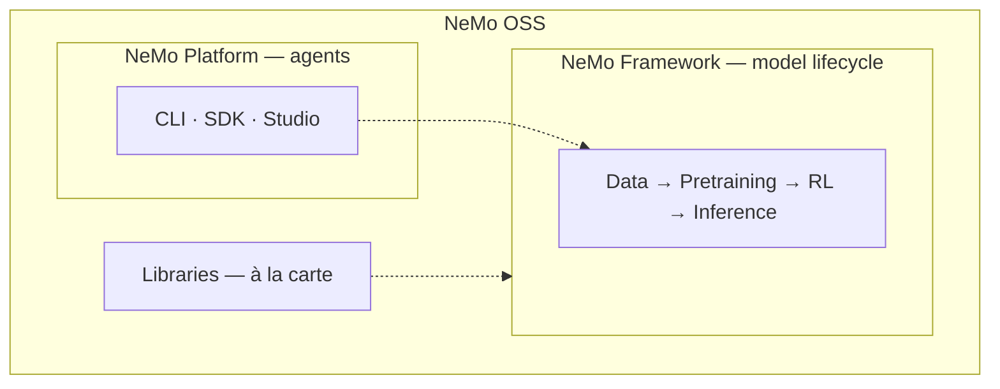
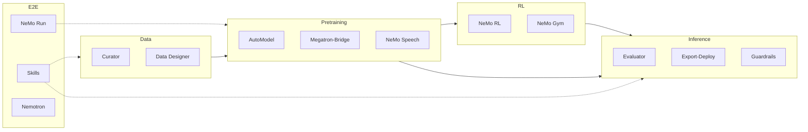
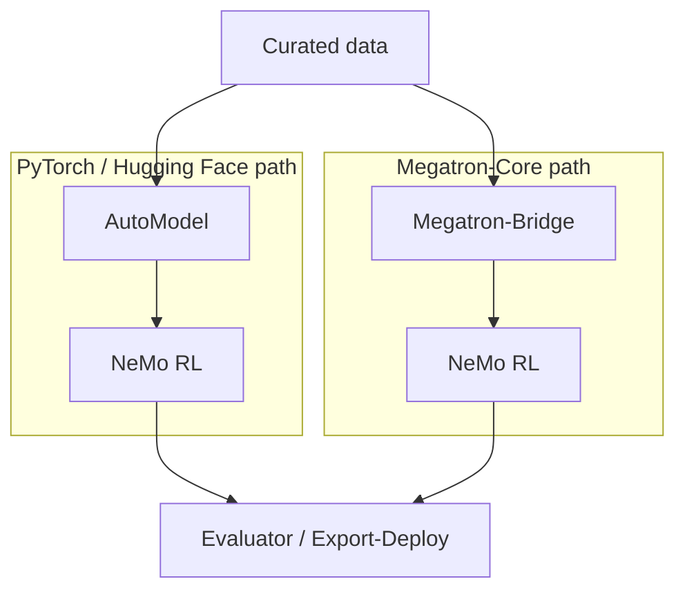

**NeMo OSS** is not one monolithic codebase. It is an organization of focused repos you can use individually or together. Two named stacks sit on top of those repos:

- **NeMo Framework** — the **model lifecycle** (data → train → align → evaluate → deploy).
- **NeMo Platform** — **agent integration** (evaluate, secure, tune, and deploy agents using selected libraries).

<Callout intent="info">
For positioning within NVIDIA NeMo, refer to [Ecosystem](/about/ecosystem). For term definitions, refer to [Concepts](/about/concepts).
</Callout>

## Three layers

| Layer | What it is | How you use it |
| --- | --- | --- |
| **Libraries** | 22 repos in [NVIDIA-NeMo](https://github.com/NVIDIA-NeMo) — one product per repo | `pip install`, per-library docs, or standalone NGC images |
| **NeMo Framework** | Model-lifecycle stack — the pipeline below | Pick libraries by stage, or pull the multi-library Framework container |
| **NeMo Platform** | Agent product — CLI, SDK, Studio | Clone [nemo-platform](https://github.com/NVIDIA-NeMo/nemo-platform), run `nemo setup` |

Platform **composes** libraries (Guardrails, Evaluator, Data Designer, and others). It is **not** a box in the Framework pipeline — it is a cross-cutting integration layer for agent workflows. Training still starts with Framework libraries such as AutoModel or Megatron-Bridge.

## NeMo Framework pipeline

The diagram shows representative libraries. The live list is [Libraries](/about/libraries) filtered by stage.

Solid arrows are the typical **model lifecycle**. Dotted lines are **orchestration and reference assets** (Run, Skills, Nemotron) that span stages.

## Functional layers

| Layer | Purpose |
| --- | --- |
| **Data** | Ingest, filter, deduplicate, synthesize, and govern datasets |
| **Pretraining** | Train, fine-tune, and convert checkpoints |
| **RL** | Post-training alignment and agent improvement |
| **Inference** | Benchmark, export, serve, and apply guardrails |
| **E2E** | Launch experiments, ship recipes, share reference assets |

Which repos sit in each layer changes over time — use [Libraries](/about/libraries) (filtered by stage) as the live catalog.

## Training backends

Two primary training paths coexist:

- **HF path** — `pip install nemo-automodel`, Hugging Face models and trainers, scales to roughly 1,000 GPUs.
- **Megatron path** — Megatron-Bridge on Megatron-Core, HF checkpoint conversion, scales to thousand-node clusters.

Both paths can feed the same **RL**, **Evaluator**, and **Export-Deploy** libraries downstream.

## NeMo Platform overlay

[NeMo Platform](https://github.com/NVIDIA-NeMo/nemo-platform) integrates NeMo libraries for **agent** workflows — not for large-scale pretraining today.

| Platform capability | Libraries and services involved |
| --- | --- |
| Secure agents | Guardrails, Anonymizer, Auditor |
| Evaluate agents | Evaluator, Harbor-backed suites |
| Tune agents | Skill optimization, Switchyard routing |
| Build agents | NeMo Agent Toolkit (NAT), Inference Gateway |
| Synthetic data | Data Designer |

Platform is **not** the Framework NGC container. Refer to [Framework and Platform](/about/concepts#framework-and-platform) for naming and [Ecosystem](/about/ecosystem#choose-framework-or-platform) for when to start here.

<Cards>

<Card title="NeMo Platform docs" href="https://nvidia-nemo.github.io/nemo-platform/main/">
Setup, CLI reference, and API for agent hardening and evaluation.
</Card>

<Card title="Inference get started" href="/get-started/inference">
Model evaluation, export, guardrails, and Platform entry points.
</Card>

</Cards>

## NGC containers

NGC images bundle tested dependency sets. They are **delivery mechanisms** for Framework libraries — not separate products.

| Image | Scope |
| --- | --- |
| `nvcr.io/nvidia/nemo` | Multi-library **Framework** stack (Megatron-Bridge, Evaluator, Export-Deploy, Run, Speech) |
| `nvcr.io/nvidia/nemo-automodel` | Standalone AutoModel |
| `nvcr.io/nvidia/nemo-rl` | Standalone NeMo RL |
| `nvcr.io/nvidia/nemo-curator` | Standalone Curator |

Refer to the [container catalog](/about/release-notes/containers) for pull commands and recent Framework tags.

## Where to go next

<Cards>

<Card title="Concepts" href="/about/concepts">
Glossary — Framework, Platform, stages, and homonyms.
</Card>

<Card title="Get Started" href="/get-started">
Install paths and stage-specific entry points.
</Card>

<Card title="Libraries" href="/about/libraries">
Full repo catalog with docs and GitHub links.
</Card>

</Cards>
