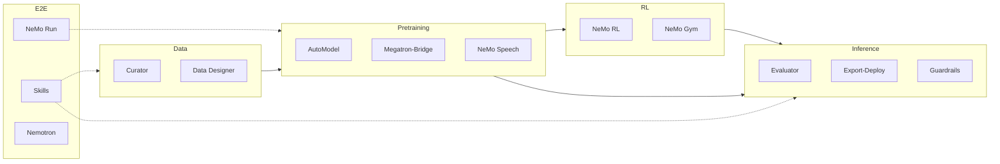
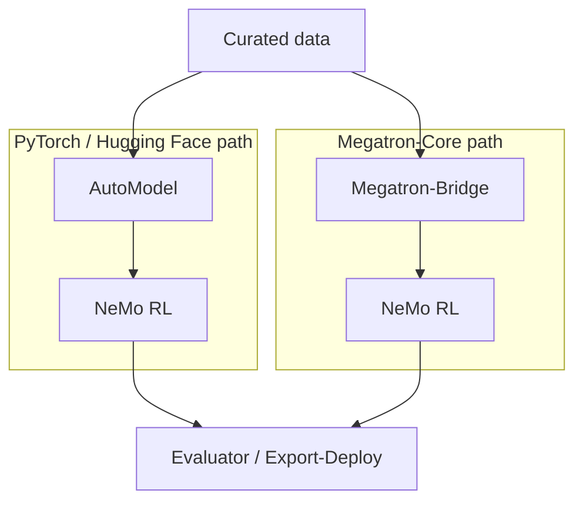

NeMo OSS is a **composable pipeline** of libraries — not a single monolithic framework. Data flows from curation through training and alignment to evaluation and deployment, with optional orchestration across stages.

<Callout intent="info">
For positioning within NVIDIA NeMo, refer to [Ecosystem](/about/ecosystem). For definitions of terms below, refer to [Concepts](/about/concepts).
</Callout>

## High-level pipeline

Solid arrows are the typical **model lifecycle** (data → train → align → evaluate/deploy). Dotted lines show **orchestration and reference pipelines** (Run, Skills, Nemotron) that span stages.

## Functional layers

| Layer | Purpose |
| --- | --- |
| **Data** | Ingest, filter, deduplicate, synthesize, and govern datasets |
| **Pretraining** | Train, fine-tune, and convert checkpoints |
| **RL** | Post-training alignment and agent improvement |
| **Inference** | Benchmark, export, serve, and apply guardrails |
| **E2E** | Launch experiments, ship recipes, share reference assets |

Which repos sit in each layer changes over time — use [Libraries](/about/libraries) (filtered by stage) as the live catalog, not this table.

## Training backends

Two primary training paths coexist:

- **HF path** — `pip install nemo-automodel`, Hugging Face models and trainers, scales to roughly 1,000 GPUs.
- **Megatron path** — Megatron-Bridge on Megatron-Core, HF checkpoint conversion, scales to thousand-node clusters.

Both paths can feed the same **RL**, **Evaluator**, and **Export-Deploy** libraries downstream.

## Agent platform

[NeMo Platform](https://github.com/NVIDIA-NeMo/nemo-platform) sits alongside individual inference libraries: it wires Guardrails, Evaluator, Data Designer, and related services into one CLI and SDK for **agent** evaluate / optimize / deploy loops. It is not the Framework NGC container — refer to [Framework and Platform](/about/concepts#framework-and-platform).

<Cards>

<Card title="NeMo Platform docs" href="https://nvidia-nemo.github.io/nemo-platform/main/">
Setup, CLI reference, and API for agent hardening and evaluation.
</Card>

<Card title="Inference get started" href="/get-started/inference">
Model evaluation, export, guardrails, and when to use Platform or standalone libraries.
</Card>

</Cards>

## NGC containers

For production-style stacks, NGC images bundle tested dependency sets:

| Image | Scope |
| --- | --- |
| `nvcr.io/nvidia/nemo` | Multi-library **Framework** stack (Megatron-Bridge, Evaluator, Export-Deploy, Run, Speech) |
| `nvcr.io/nvidia/nemo-automodel` | Standalone AutoModel |
| `nvcr.io/nvidia/nemo-rl` | Standalone NeMo RL |
| `nvcr.io/nvidia/nemo-curator` | Standalone Curator |

Refer to the [container catalog](/about/release-notes/containers) for pull commands and recent Framework tags.

## Where to go next

<Cards>

<Card title="Concepts" href="/about/concepts">
Lifecycle stages, backends, and hub and product docs.
</Card>

<Card title="Get Started" href="/get-started">
Install paths and stage-specific entry points.
</Card>

<Card title="Libraries" href="/about/libraries">
Full repo catalog with docs and GitHub links.
</Card>

</Cards>
