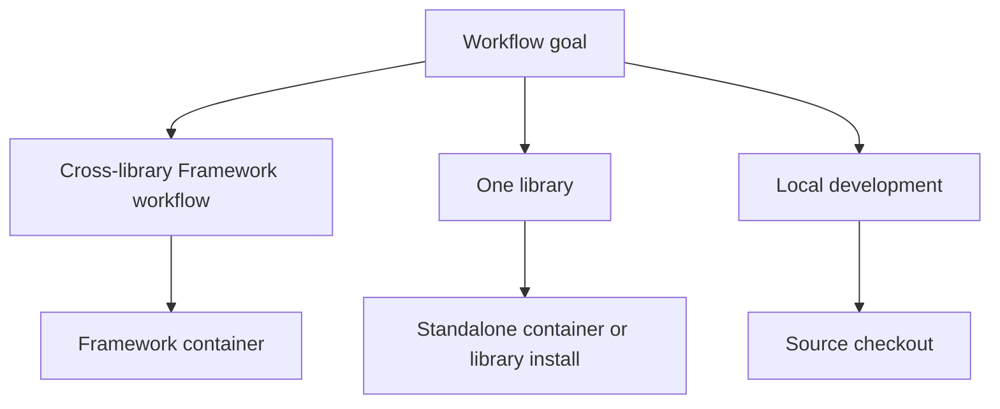

NeMo Open Source Software supports several runtime paths. Choose the path based on the workflow you want to run, then follow the linked library docs for current commands.

## Runtime Choices

Choose the runtime path that matches your workflow scope and development mode.

| Runtime path | Use it for |
| --- | --- |
| **Framework container** | Multi-library workflows with `nvcr.io/nvidia/nemo:<tag>`. |
| **Standalone containers** | Single-library workflows such as AutoModel, RL, or Curator. |
| **Per-library installs** | Lightweight local development when a library recommends pip or source install. |
| **Source checkout** | Contributing, debugging, or running examples that require repository files. |

## Why Containers Cause Confusion

The name **NeMo Framework** can mean the model-lifecycle stack or the `nvcr.io/nvidia/nemo` container. The container packages a tested set of components for selected Framework workflows. Standalone images and per-library installs remain the better fit for many single-library workflows.

Standalone images exist for focused library workflows. Library docs cover extras, optional dependencies, local development, and release-specific compatibility.

## Where to Check Versions

Use the release or library page for details that change by version.

| Need | Go to |
| --- | --- |
| Recent Framework container tags | [Container releases](/about/release-notes/containers) |
| Cross-component Framework container known issues | [Known issues](/about/release-notes/known-issues) |
| Library-specific install commands | The library docs linked from [Libraries](/about/libraries) |
| GitHub source and issues | The repo linked from [Libraries](/about/libraries) |

## Continue

Use these pages when you are ready to turn runtime choice into setup steps.

<Cards>

<Card title="Installation" href="/get-started/installation">
Compare the main setup paths.
</Card>

<Card title="Container Releases" href="/about/release-notes/containers">
See Framework tags and component versions.
</Card>

</Cards>
