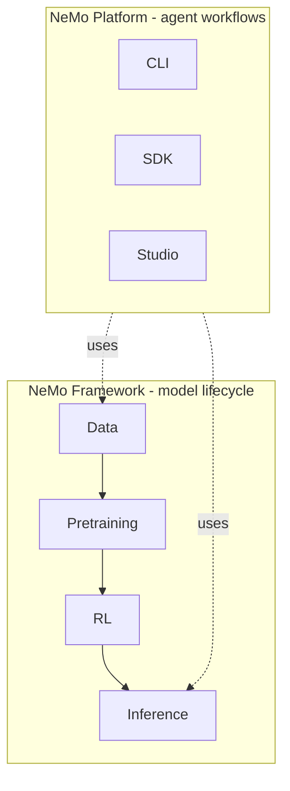

Most NeMo OSS users start from one of two paths: **NeMo Framework** for model lifecycle work, or **NeMo Platform** for integrated agent workflows. They share libraries, but they answer different developer questions.

## The Main Distinction

Choose the path based on whether your work centers on models or integrated agents.

| Your goal | Start with | Why |
| --- | --- | --- |
| Train, fine-tune, align, evaluate, export, or deploy **models** | **NeMo Framework** | It organizes libraries around the model lifecycle from data through deployment. |
| Evaluate, secure, tune, or deploy **agents** | **NeMo Platform** | It composes selected libraries behind a CLI, SDK, and Studio UI for agent workflows. |
| Explore before choosing | [Libraries](/about/libraries) | The catalog lets you filter by stage, kind, and tags. |

**NeMo Framework** is the model-lifecycle stack: data, training, RL, evaluation, export, and guardrails. It is also the name of the multi-library NGC image (`nvcr.io/nvidia/nemo:<tag>`). When the distinction matters, these docs use **Framework libraries** for the stack and **Framework container** for the image.

**NeMo Platform** is the agent integration product in the [nemo-platform](https://github.com/NVIDIA-NeMo/nemo-platform) repo. It brings together libraries such as Guardrails, Evaluator, and Data Designer for agent use cases.

## When the Paths Meet

The two paths often meet downstream. A team might curate data with Curator, train with AutoModel or Megatron-Bridge, align with NeMo RL, benchmark with Evaluator, and then use Platform when the output becomes part of an agent workflow.

Framework describes the model pipeline. Platform describes an integrated agent experience built from selected pieces of that pipeline.

## Common Naming Traps

These names are close enough that readers often need a quick disambiguation.

| Name | Meaning |
| --- | --- |
| **NeMo OSS** | The GitHub organization, documentation, and related OSS containers. |
| **NeMo Framework** | Model lifecycle libraries and, in container contexts, the `nvcr.io/nvidia/nemo` image. |
| **NeMo Platform** | Agent integration product with CLI, SDK, and Studio. |
| **NeMo Speech** | Speech AI docs and source in the `NVIDIA-NeMo/NeMo` repo. |

## Continue

Use these pages when you need broader positioning or structural context.

<Cards>

<Card title="Lifecycle Stages" href="/about/concepts/lifecycle-stages">
Follow the model pipeline from data through inference.
</Card>

<Card title="Ecosystem" href="/about/ecosystem">
See how OSS, Platform, and the broader NVIDIA NeMo suite relate.
</Card>

<Card title="Architecture" href="/about/architecture">
See the structural diagram and library layers.
</Card>

</Cards>
