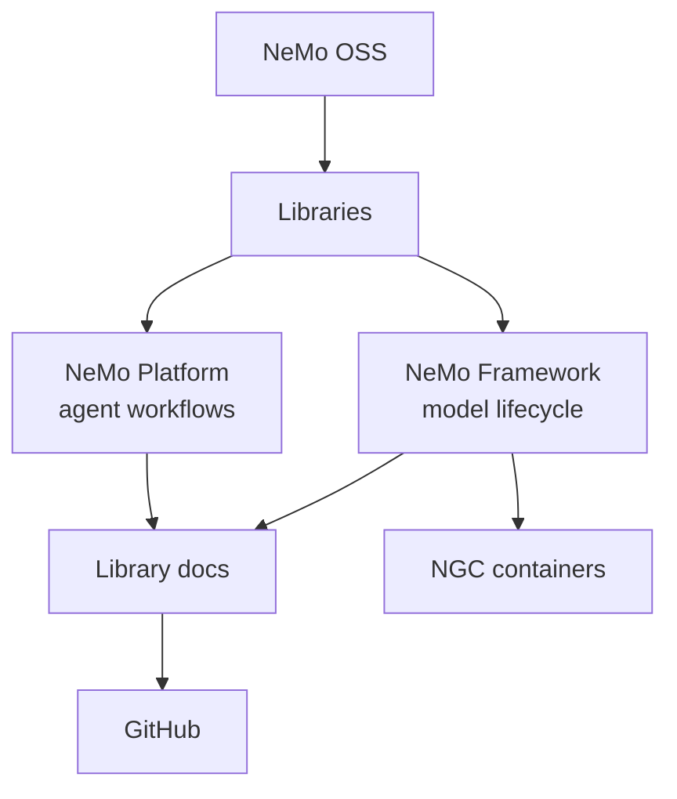

Use these pages to understand how **NeMo OSS** is organized: how repos are grouped, how workflows move across libraries, and how containers relate to install paths.

For short term definitions and acronyms, use the [Glossary](/resources/glossary).

## Concept Map

NeMo OSS is the public open source side of NVIDIA NeMo: repositories in [NVIDIA-NeMo](https://github.com/NVIDIA-NeMo), documentation on **docs.nvidia.com/nemo**, and the NGC containers that package common runtime paths.

Use this site to choose a stack, stage, library, or container, then follow the linked library docs for usage details.

NeMo OSS is one part of the broader [NVIDIA NeMo](https://www.nvidia.com/en-us/ai-data-science/products/nemo/) software suite, alongside commercial products such as Customizer, NIM, and NeMo microservices.

## Pages

These concept pages split the main mental model into focused explanations.

<Cards>

<Card title="Framework and Platform" href="/about/concepts/framework-and-platform">
Choose between the model-lifecycle stack and the agent integration product.
</Card>

<Card title="Lifecycle Stages" href="/about/concepts/lifecycle-stages">
Understand Data, Pretraining, RL, Inference, and E2E as workflow stages.
</Card>

<Card title="Repository Catalog Model" href="/about/concepts/repository-catalog">
Read stage, kind, and tags without treating repo placement as a rigid boundary.
</Card>

<Card title="Training Backends and Checkpoints" href="/about/concepts/training-backends-and-checkpoints">
Compare the PyTorch / Hugging Face and Megatron-Core paths, including checkpoint flow.
</Card>

<Card title="Containers and Installs" href="/about/concepts/containers-and-installs">
Choose between Framework containers, standalone images, and per-library installs.
</Card>

<Card title="Where to Find Information" href="/about/concepts/documentation-surfaces">
Choose the right page for setup, releases, examples, terminology, and support.
</Card>

</Cards>

## What These Pages Clarify

Use the Concepts section when you need durable context before following a library-specific guide:

| Question | Concept response |
| --- | --- |
| Which name, stack, repo, or container should I start with? | [Framework and Platform](/about/concepts/framework-and-platform), [Containers and installs](/about/concepts/containers-and-installs) |
| How do workflows move across libraries and stages? | [Lifecycle stages](/about/concepts/lifecycle-stages), [Repository catalog model](/about/concepts/repository-catalog) |
| How do training backend and checkpoint choices affect downstream work? | [Training backends and checkpoints](/about/concepts/training-backends-and-checkpoints) |
| Where should I go for setup, releases, examples, or support? | [Where to find information](/about/concepts/documentation-surfaces) |

## Related Pages

These pages provide the surrounding orientation, structure, catalog, and terminology.

<Cards>

<Card title="Ecosystem" href="/about/ecosystem">
Choose Framework, Platform, or broader NVIDIA NeMo entry points.
</Card>

<Card title="Architecture" href="/about/architecture">
See the layers, pipeline diagram, backends, and containers.
</Card>

<Card title="Libraries" href="/about/libraries">
Search and filter all open source repos.
</Card>

<Card title="Glossary" href="/resources/glossary">
Look up terms, acronyms, and product names.
</Card>

</Cards>
