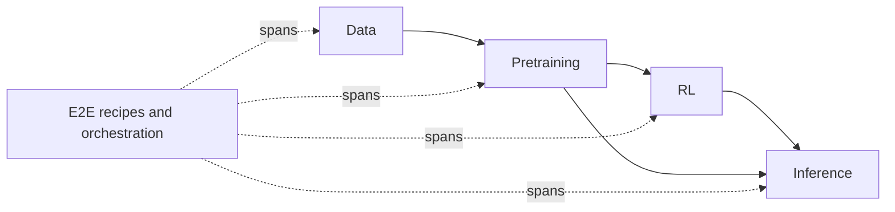

NeMo Framework groups libraries by the stage of model development they usually support. Stages help you find the right entry point, especially when a workflow spans several repos.

## Stage Model

Stages describe the usual position of each library in the model lifecycle.

| Stage | You typically... | Examples |
| --- | --- | --- |
| **Data** | Curate, filter, synthesize, anonymize, or govern datasets | Curator, Data Designer, Anonymizer |
| **Pretraining** | Pretrain, fine-tune, adapt models, or convert training formats | AutoModel, Megatron-Bridge, NeMo Speech |
| **RL** | Align models with SFT, DPO, GRPO, distillation, or reinforcement learning | NeMo RL, Gym, ProRL Agent Server |
| **Inference** | Evaluate quality, export checkpoints, deploy, or add guardrails | Evaluator, Export-Deploy, Guardrails |
| **E2E** | Run multi-step recipes, orchestrate experiments, or share reference pipelines | Run, Skills, Nemotron |

The arrows show a common model lifecycle, not a required sequence. You can use Evaluator without training a model in NeMo, or use Curator for data that feeds a non-NeMo training stack.

## Stage Guides and Cross-Stage Work

Use stage guides when you know the part of the lifecycle you are working on:

- [Data](/get-started/data)
- [Pretraining](/get-started/pretraining)
- [RL](/get-started/rl)
- [Inference](/get-started/inference)
- [E2E](/get-started/e2e)

Use [Libraries](/about/libraries) when your work crosses stages. Agent evaluation, deployment, speech, and checkpoint conversion often involve several repos even when one repo is the main starting point.

## What Stays Stable

Stage pages help you choose an entry point. For supported models, commands, and detailed recipes, follow the linked library docs.

## Continue

Use these pages when you need to connect stage selection to repo selection or training flow.

<Cards>

<Card title="Repository Catalog Model" href="/about/concepts/repository-catalog">
Learn how stage, kind, and tags work together.
</Card>

<Card title="Training Backends and Checkpoints" href="/about/concepts/training-backends-and-checkpoints">
Choose a training path and understand checkpoint flow.
</Card>

</Cards>
