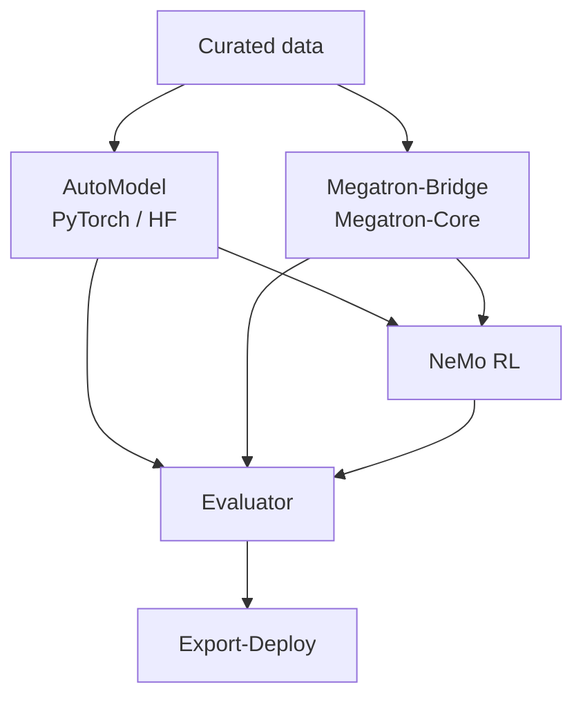

NeMo Framework supports two primary training paths. The right path depends on your scale, source model format, and checkpoint flow.

## Two Training Paths

Choose the training path based on scale, source model format, and downstream checkpoint needs.

| Path | Start with | Typical fit |
| --- | --- | --- |
| **PyTorch / Hugging Face** | [AutoModel](https://docs.nvidia.com/nemo/automodel/latest/) | Fine-tuning, research iteration, and training up to roughly 1,000 GPUs. |
| **Megatron-Core** | [Megatron-Bridge](https://docs.nvidia.com/nemo/megatron-bridge/latest/) | Large-scale pretraining, SFT, and Hugging Face to Megatron checkpoint conversion. |

Both paths can feed downstream RL, evaluation, and export workflows.

## Checkpoint Flow

Checkpoint format affects the rest of the workflow. Check whether downstream RL, evaluation, or deployment expects Hugging Face, Megatron, NeMo, or another serving format before choosing a training path.

| Question | Good next page |
| --- | --- |
| Which training library should I start with? | [Pretraining guide](/get-started/pretraining) |
| How do I convert between Hugging Face and Megatron checkpoints? | [Megatron-Bridge docs](https://docs.nvidia.com/nemo/megatron-bridge/latest/) |
| Can my trained model run through RL or evaluation? | [RL guide](/get-started/rl), [Inference guide](/get-started/inference) |
| How do I export or serve a model? | [Export-Deploy docs](https://docs.nvidia.com/nemo/export-deploy/latest/) |

## Next Step

After choosing a path, use the linked library docs for model support, conversion scripts, commands, and compatibility notes.

## Continue

Use these pages when you are ready to choose a training entry point or runtime.

<Cards>

<Card title="Pretraining" href="/get-started/pretraining">
Choose AutoModel, Megatron-Bridge, NeMo Speech, or optimizer libraries.
</Card>

<Card title="Containers and Installs" href="/about/concepts/containers-and-installs">
Choose a runtime path before running examples.
</Card>

</Cards>
