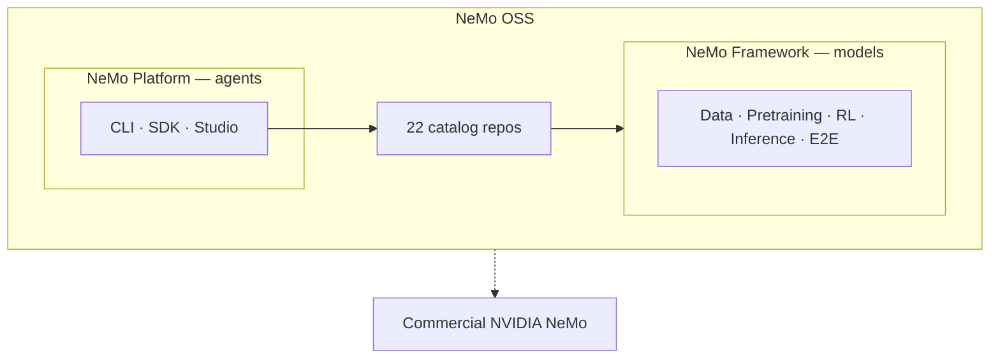

**NeMo OSS** is the open source side of [NVIDIA NeMo](https://www.nvidia.com/en-us/ai-data-science/products/nemo/) — the public GitHub organization [NVIDIA-NeMo](https://github.com/NVIDIA-NeMo) and the documentation hub you are reading now. Commercial NeMo products, enterprise services, and NIM microservices live outside this catalog.

<Callout intent="info">
This page explains **where NeMo OSS fits** and **what to choose**. For definitions, refer to [Concepts](/about/concepts). For structure, refer to [Architecture](/about/architecture).
</Callout>

## What NeMo OSS includes

NeMo OSS is not a single product. It is an **organization of repos** plus two named ways to adopt them:

| You are building… | Start with… |
| --- | --- |
| **Models** (train, align, evaluate, deploy checkpoints) | **NeMo Framework** — libraries by stage or Framework NGC container |
| **Agents** (evaluate, secure, tune, deploy in production) | **NeMo Platform** — or individual inference libraries à la carte |
| **Not sure yet** | [Libraries](/about/libraries) catalog or [decision guide](/get-started#decision-guide) |

## Framework lifecycle stages

**NeMo Framework** delivers the model pipeline as composable open source libraries:

| Stage | Role in the pipeline |
| --- | --- |
| **[Data](/get-started/data)** | Prepare and govern training data |
| **[Pretraining](/get-started/pretraining)** | Train and fine-tune models |
| **[RL](/get-started/rl)** | Align and improve models with feedback |
| **[Inference](/get-started/inference)** | Evaluate, export, and safeguard models |
| **[E2E](/get-started/e2e)** | Recipes, orchestration, reference assets |

Repo names and counts change — [Libraries](/about/libraries) is the searchable catalog. Each library's docs site has install steps and tutorials.

## Choose Framework or Platform

These names sound similar but address different jobs:

| | **NeMo Framework** | **NeMo Platform** |
| --- | --- | --- |
| **What it is** | Model-lifecycle **libraries** — data, training, RL, evaluation, export, guardrails | Agent **integration product** — CLI, Python SDK, and web UI |
| **You adopt it when…** | You are training, aligning, evaluating, or deploying **models** | You are shipping **agents** and want evaluate / secure / tune / deploy in one setup |
| **Typical entry** | Stage guide → library docs, or Framework NGC container | Clone [nemo-platform](https://github.com/NVIDIA-NeMo/nemo-platform), run `nemo setup` |
| **Docs** | This hub + per-library Fern sites | [NeMo Platform docs](https://nvidia-nemo.github.io/nemo-platform/main/) |
| **Relationship** | Libraries are the building blocks | Composes Guardrails, Evaluator, Data Designer, and others — does not replace AutoModel or Megatron-Bridge for training |

**NeMo Framework** also names the multi-library NGC container (`nvcr.io/nvidia/nemo`). Refer to [Concepts](/about/concepts#framework-and-platform) for all uses of “Framework.”

Many teams train with **AutoModel or Megatron-Bridge**, align with **NeMo RL**, benchmark with **Evaluator**, and serve with **Export-Deploy**. Agent builders can start from **NeMo Platform** instead of wiring those pieces manually.

## Commercial NeMo boundary

| In NeMo OSS hub | Outside this catalog |
| --- | --- |
| 22 public GitHub repos in NVIDIA-NeMo | Customizer, NIM, enterprise services |
| Framework container release notes | Per-tenant managed offerings |
| Open source docs on docs.nvidia.com/nemo | Microservice docs under `docs.nvidia.com/nemo/microservices` |

For the full suite, refer to [NVIDIA NeMo (commercial)](https://www.nvidia.com/en-us/ai-data-science/products/nemo/).

## What this hub covers and product docs

| | **NeMo OSS hub** (this site) | **Per-library docs** |
| --- | --- | --- |
| **Audience** | Choosing Framework vs Platform, stage, or library | Using one product deeply |
| **Content** | Catalog, get-started by stage, release notes | APIs, tutorials, recipes |
| **Scope** | Orientation across NeMo OSS | One library or Platform at a time |

## Choosing AutoModel or Megatron-Bridge

Both train large language models (LLMs) and vision language models (VLMs) on NVIDIA GPUs; they target different scale and stack preferences:

| | **AutoModel** | **Megatron-Bridge** |
| --- | --- | --- |
| **Stack** | PyTorch / Hugging Face native | Megatron-Core |
| **Typical scale** | 1–1,000 GPUs | 1,000+ GPUs |
| **Checkpoint flow** | HF models day-0 | HF ↔ Megatron conversion |
| **Best for** | Fine-tuning, research, rapid iteration | Large-scale pretraining and SFT |

Speech workloads often start with [NeMo Speech](https://docs.nvidia.com/nemo/speech/nightly/) directly — the [NeMo](https://github.com/NVIDIA-NeMo/NeMo) repo is speech-only today.

## Related entry points

<Cards>

<Card title="Concepts" href="/about/concepts">
Glossary — OSS, Framework, Platform, homonyms.
</Card>

<Card title="Architecture" href="/about/architecture">
Three layers, pipeline, backends, containers.
</Card>

<Card title="Libraries" href="/about/libraries">
Search and filter all 22 NVIDIA-NeMo repositories.
</Card>

<Card title="Get Started" href="/get-started">
Quickstart, installation, and guides by stage.
</Card>

<Card title="NeMo Platform" href="https://nvidia-nemo.github.io/nemo-platform/main/">
Agent evaluate, harden, tune, and deploy — CLI, SDK, and Studio.
</Card>

</Cards>
