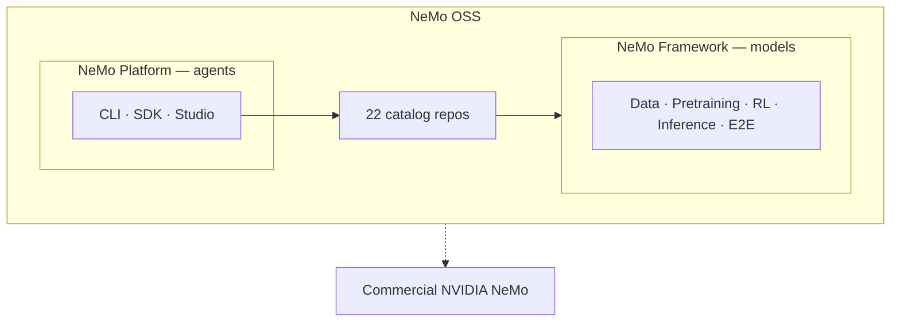

**NeMo OSS** is the public, open source entry point for [NVIDIA NeMo](https://www.nvidia.com/en-us/ai-data-science/products/nemo/): the [NVIDIA-NeMo](https://github.com/NVIDIA-NeMo) GitHub organization, and the libraries and containers that support model and agent development.

<Callout intent="info">
This page explains **where NeMo OSS fits** and **what to choose**. For the organizing model, refer to [Concepts](/about/concepts). For structure, refer to [Architecture](/about/architecture).
</Callout>

## What You Can Build

NeMo OSS is organized around two adoption paths:

| You are building… | Start with… |
| --- | --- |
| **Models** (train, align, evaluate, deploy checkpoints) | **NeMo Framework** — libraries by stage or Framework NGC container |
| **Agents** (evaluate, secure, tune, deploy in production) | **NeMo Platform** — or individual inference libraries à la carte |
| **Not sure yet** | [Libraries](/about/libraries) catalog or [decision guide](/get-started#decision-guide) |

## Framework Lifecycle Stages

NeMo Framework delivers the model pipeline as composable open source libraries:

| Stage | Role in the pipeline |
| --- | --- |
| **[Data](/get-started/data)** | Prepare and govern training data |
| **[Pretraining](/get-started/pretraining)** | Train and fine-tune models |
| **[RL](/get-started/rl)** | Align and improve models with feedback |
| **[Inference](/get-started/inference)** | Evaluate, export, and safeguard models |
| **[E2E](/get-started/e2e)** | Recipes, orchestration, reference assets |

Repo names and counts change — [Libraries](/about/libraries) is the searchable catalog. Each library's docs site has install steps and tutorials.

## Choose Framework or Platform

These names sound similar because they share libraries, but they serve different developer jobs:

| | **NeMo Framework** | **NeMo Platform** |
| --- | --- | --- |
| **What it is** | Model-lifecycle **libraries** — data, training, RL, evaluation, export, guardrails | Agent **integration product** — CLI, Python SDK, and web UI |
| **You adopt it when…** | You are training, aligning, evaluating, or deploying **models** | You are shipping **agents** and want evaluate / secure / tune / deploy in one setup |
| **Typical entry** | Stage guide → library docs, or Framework NGC container | Follow [NeMo Platform setup](https://nvidia-nemo.github.io/nemo-platform/main/get-started/setup/) |
| **Docs** | NeMo OSS pages and library docs | [NeMo Platform setup](https://nvidia-nemo.github.io/nemo-platform/main/get-started/setup/) |
| **Relationship** | Libraries are the building blocks | Composes Guardrails, Evaluator, Data Designer, and others for agent workflows |

**NeMo Framework** also names the multi-library NGC container (`nvcr.io/nvidia/nemo`). Refer to [Framework and Platform](/about/concepts/framework-and-platform) for naming details.

Many teams train with **AutoModel or Megatron-Bridge**, align with **NeMo RL**, benchmark with **Evaluator**, and serve with **Export-Deploy**. Agent builders can start from **NeMo Platform** instead of wiring those pieces manually.

## Open Source and Commercial Entry Points

NeMo OSS focuses on open source repositories, OSS documentation, and Framework container releases. The broader NVIDIA NeMo suite also includes commercial products, enterprise services, and NIM microservices with their own product documentation.

| NeMo OSS | Broader NVIDIA NeMo Docs |
| --- | --- |
| 22 public GitHub repos in NVIDIA-NeMo | Customizer, NIM, enterprise services |
| Framework container release notes | Per-tenant managed offerings |
| Open source hub and library documentation | Product documentation for commercial offerings |

For the full suite, refer to [NVIDIA NeMo (commercial)](https://www.nvidia.com/en-us/ai-data-science/products/nemo/).

## OSS and Product Docs

Use this comparison to choose between open source entry points and product documentation.

| | **NeMo OSS** | **Library docs** |
| --- | --- | --- |
| **Audience** | Choose a stack, stage, or library | Use one library or product deeply |
| **Content** | Catalog, get-started paths, release notes | APIs, tutorials, recipes |
| **Scope** | Orientation across NeMo OSS | One library or Platform at a time |

## Choosing AutoModel or Megatron-Bridge

Both train large language models (LLMs) and vision language models (VLMs) on NVIDIA GPUs; they target different scale and stack preferences:

| | **AutoModel** | **Megatron-Bridge** |
| --- | --- | --- |
| **Stack** | PyTorch / Hugging Face native | Megatron-Core |
| **Typical scale** | 1–1,000 GPUs | 1,000+ GPUs |
| **Checkpoint flow** | Hugging Face checkpoints | HF ↔ Megatron conversion |
| **Best for** | Fine-tuning, research, rapid iteration | Large-scale pretraining and SFT |

Speech workloads often start with [NeMo Speech](https://docs.nvidia.com/nemo/speech/nightly/) directly — the [NeMo](https://github.com/NVIDIA-NeMo/NeMo) repo is speech-only today.

## Related Entry Points

Use these links to move from ecosystem positioning to concepts, structure, catalog, and setup.

<Cards>

<Card title="Concepts" href="/about/concepts">
How NeMo OSS organizes stacks, stages, libraries, and docs.
</Card>

<Card title="Architecture" href="/about/architecture">
Three layers, pipeline, backends, containers.
</Card>

<Card title="Libraries" href="/about/libraries">
Search and filter all 22 NVIDIA-NeMo repositories.
</Card>

<Card title="Get Started" href="/get-started">
Quickstart, installation, and guides by stage.
</Card>

<Card title="NeMo Platform" href="https://nvidia-nemo.github.io/nemo-platform/main/get-started/setup/">
Agent evaluate, harden, tune, and deploy — CLI, SDK, and Studio.
</Card>

</Cards>
