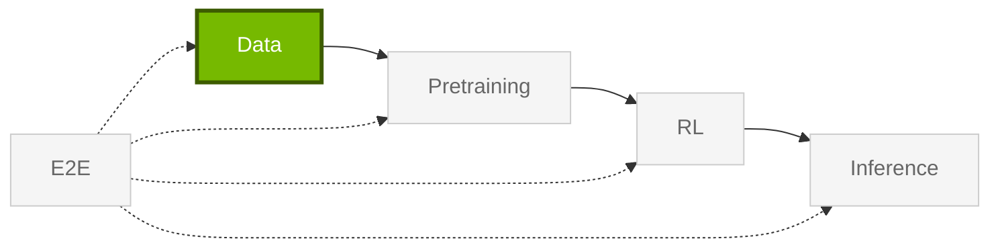

import StageGuide from "@/components/StageGuide";

Libraries for **Data** — curation, synthetic generation, PII handling, and SDG pipelines. Install and tutorial steps live on each library's docs site; this page lists every active repo in this stage.

<StageGuide stage="data" />

## Typical Workflow

Most data workflows move from raw inputs to curated, protected, or synthetic datasets that downstream training and RL libraries can consume.

1. **Curate** raw corpora with [Curator](https://docs.nvidia.com/nemo/curator/latest/) (dedup, filtering, multimodal pipelines).
2. **Generate** synthetic data with [Data Designer](https://nvidia-nemo.github.io/DataDesigner/latest/) or domain SDG tools.
3. **Protect** sensitive fields with [Anonymizer](https://github.com/NVIDIA-NeMo/Anonymizer) before sharing or training.

Hand off curated datasets to [Pretraining](/get-started/pretraining) or [RL](/get-started/rl) libraries.

<Card title="NeMo Curator on NGC" href="https://catalog.ngc.nvidia.com/orgs/nvidia/containers/nemo-curator">
Pre-built container for large-scale curation jobs.
</Card>
