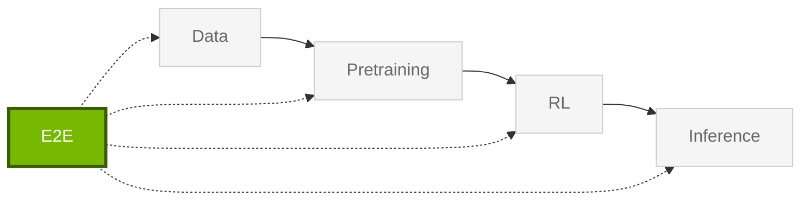

import StageGuide from "@/components/StageGuide";

Libraries for **E2E** — reference pipelines, Nemotron recipes, synthetic-data workflows, and experiment launchers that tie the stack together.

<StageGuide stage="e2e" />

## Orchestration

Use orchestration libraries when you need repeatable launches across local machines, SLURM, or Kubernetes.

<Card title="NeMo Run" href="https://docs.nvidia.com/nemo-oss/run/latest/">
Configure, launch, and manage experiments on local machines, SLURM, and Kubernetes.
</Card>

## Reference Assets

Use reference assets when you want complete recipes, cookbooks, datasets, or example pipelines instead of starting from a single library API.

<Card title="NeMo Skills" href="https://nvidia-nemo.github.io/Skills/">
Pipelines for synthetic data generation and evaluation (math, code, science).
</Card>

<Card title="Nemotron Hub" href="https://github.com/NVIDIA-NeMo/Nemotron#readme">
Cookbooks, datasets, and reference examples for Nemotron models.
</Card>

Connect upstream stages: [Data](/get-started/data) → [Pretraining](/get-started/pretraining) → [RL](/get-started/rl) → [Inference](/get-started/inference).
