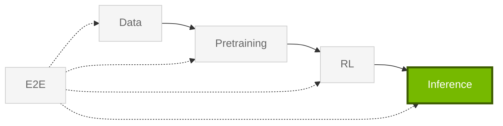

import StageGuide from "@/components/StageGuide";

Libraries for **Inference** — benchmarking, export to serving stacks, guardrails, and agent platforms.

<StageGuide stage="inference" />

## Typical workflow (models)

1. **Evaluate** with [Evaluator](https://docs.nvidia.com/nemo/evaluator/latest/) across 100+ harnesses.
2. **Export** to vLLM, TensorRT-LLM, or ONNX with [Export-Deploy](https://docs.nvidia.com/nemo/export-deploy/latest/).
3. **Guard** production apps with [Guardrails](https://docs.nvidia.com/nemo/guardrails/latest/).

Models usually come from [Pretraining](/get-started/pretraining) or [RL](/get-started/rl). For bundled Framework container versions, refer to [Container releases](/about/release-notes/containers).

## Shipping agents

If you are building **agents** (not just serving a fine-tuned checkpoint), [NeMo Platform](https://github.com/NVIDIA-NeMo/nemo-platform) integrates evaluation, guardrails, tuning, and deployment in one setup — CLI, SDK, and Studio UI. You can adopt Evaluator or Guardrails standalone; Platform is the umbrella when you want those loops wired together.

<Card title="NeMo Platform" href="https://nvidia-nemo.github.io/nemo-platform/main/">
Setup, CLI, and docs — evaluate, secure, and optimize agents with NeMo libraries.
</Card>

For related guidance, refer to [Framework and Platform](/about/concepts#framework-and-platform) and [Ecosystem](/about/ecosystem#nemo-framework-and-nemo-platform).
