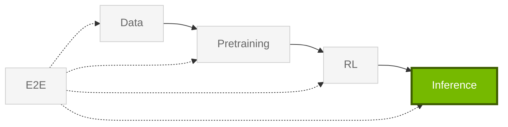

import StageGuide from "@/components/StageGuide";

Libraries for **Inference** in the **NeMo Framework** model lifecycle — benchmarking, export, serving, and guardrails. For **agents**, see [NeMo Platform](#shipping-agents) below or start at [Platform setup](https://nvidia-nemo.github.io/nemo-platform/main/get-started/setup/).

<StageGuide stage="inference" />

## Typical Workflow (Models)

Most model inference workflows move from evaluation to export or deployment, with guardrails added where application behavior needs control.

1. **Evaluate** with [Evaluator](https://docs.nvidia.com/nemo/evaluator/latest/) across benchmark suites and harnesses.
2. **Export** to vLLM, TensorRT-LLM, or ONNX with [Export-Deploy](https://docs.nvidia.com/nemo/export-deploy/latest/).
3. **Guard** production apps with [Guardrails](https://docs.nvidia.com/nemo/guardrails/latest/).

Models usually come from [Pretraining](/get-started/pretraining) or [RL](/get-started/rl). For bundled Framework container versions, refer to [Container releases](/about/release-notes/containers).

## Shipping Agents

Agent workflows usually start with Platform when you want an integrated CLI, SDK, and Studio experience.

If you are building **agents**, [NeMo Platform](https://github.com/NVIDIA-NeMo/nemo-platform) brings evaluation, guardrails, tuning, and deployment into one workflow with a CLI, SDK, and Studio UI. Use Evaluator or Guardrails directly when you want one library; start with Platform when you want those loops wired together.

<Card title="NeMo Platform" href="https://nvidia-nemo.github.io/nemo-platform/main/get-started/setup/">
Setup, CLI, and docs — evaluate, secure, and optimize agents with NeMo libraries.
</Card>

For related guidance, refer to [Framework and Platform](/about/concepts/framework-and-platform) and [Ecosystem](/about/ecosystem#choose-framework-or-platform).
