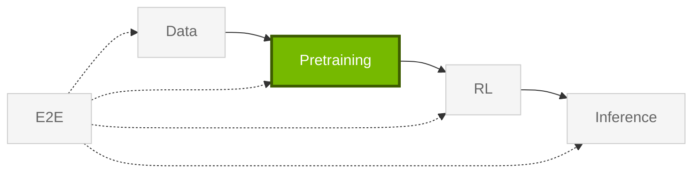

import StageGuide from "@/components/StageGuide";

Libraries for **Pretraining** — from Hugging Face fine-tuning on a single node to thousand-GPU Megatron pretraining and Speech AI. Use AutoModel for large language models (LLMs) and vision language models (VLMs) at modest scale; use Megatron-Bridge for cluster-scale jobs.

<StageGuide stage="pretraining" />

## Choose a Path

Choose the pretraining path based on model format, target scale, and whether your workflow is Hugging Face-native or Megatron-based.

| Goal | GPUs | Library |
| --- | --- | --- |
| Fine-tune Hugging Face LLMs and VLMs | 1–1,000 | [AutoModel](https://docs.nvidia.com/nemo-oss/automodel/latest/) |
| Large-scale pretrain / SFT | 1,000+ | [Megatron-Bridge](https://docs.nvidia.com/nemo-oss/megatron-bridge/latest/) |
| Speech ASR, TTS, speech-LM | Any | [NeMo Speech](https://docs.nvidia.com/nemo-oss/speech/nightly/) |

Fastest first run: [Quickstart](/get-started/quickstart). Install details: [Installation](/get-started/installation).

Model recipes, example configs, and supported architectures live on each library's docs site — for example [AutoModel examples](https://github.com/NVIDIA-NeMo/Automodel/tree/main/examples) and [Megatron-Bridge recipes](https://docs.nvidia.com/nemo-oss/megatron-bridge/latest/).

Post-training alignment: [RL](/get-started/rl).
