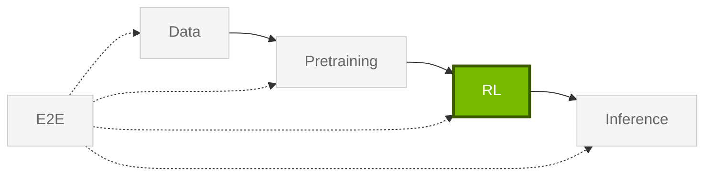

import StageGuide from "@/components/StageGuide";

Libraries for **RL** — SFT, DPO, GRPO, on-policy distillation, RL environments, and agent rollout infrastructure.

<StageGuide stage="rl" />

## Common entry points

| Technique | Start in docs | Library |
| --- | --- | --- |
| GRPO, DPO, SFT | [NeMo RL examples](https://docs.nvidia.com/nemo/rl/latest/) | NeMo RL |
| RL environments | [NeMo Gym](https://docs.nvidia.com/nemo/gym/latest/index.html) | Gym |

Train base models first through [Pretraining](/get-started/pretraining), then align here. Evaluate with [Inference](/get-started/inference) libraries.

<Card title="NeMo RL on NGC" href="https://catalog.ngc.nvidia.com/orgs/nvidia/containers/nemo-rl">
Pre-built alignment and RL container.
</Card>
