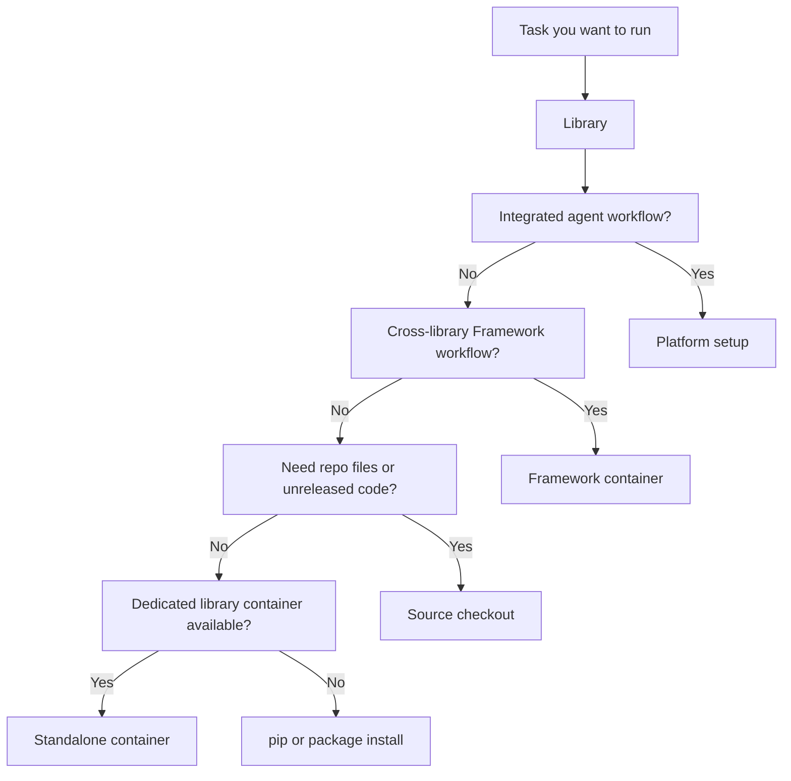

Choose a runtime after you know the library or task. Use this page to choose the setup family, then follow the linked library docs for commands.

| Runtime path | Best for | Check first |
| --- | --- | --- |
| **Framework container** (`nvcr.io/nvidia/nemo:<tag>`) | Cross-library Framework workflows, Megatron-Bridge, Evaluator, Export-Deploy, Run, and Speech workflows packaged together | [Container releases](/about/release-notes/containers) |
| **Standalone container** | Focused workflows for libraries with dedicated images, such as AutoModel, RL, or Curator | [Container catalog](/about/release-notes/containers) and the library docs |
| **pip or package install** | Local development, notebooks, small experiments, and integrations with existing Python environments | The linked library install page |
| **Source checkout** | Contributing, debugging, running repo-local examples, or using unreleased code | The GitHub repo and `CONTRIBUTING.md` |
| **Platform setup** | Integrated agent workflows with CLI, SDK, and Studio | [NeMo Platform docs](https://nvidia-nemo.github.io/nemo-platform/main/) |

## Runtime Flow

Start with the task you want to run. If you already know the library, start there instead. The next question is whether the workflow is cross-library, single-library, source-based, or an integrated Platform workflow.

## Practical Checks

Run through these checks before following commands from a guide or example.

| Before you run | Why it matters |
| --- | --- |
| Check the linked library docs | Install extras, optional dependencies, and support matrices can vary by library and release. |
| Check container release notes | Framework container component versions and cross-component known issues are listed by release. |
| Check whether the example needs repo files | Some examples assume a source checkout, even when the package can be installed from pip. |
| Check checkpoint format | AutoModel, Megatron-Bridge, RL, Evaluator, and Export-Deploy workflows can depend on Hugging Face, Megatron, or serving-specific formats. |
| Check data and model credentials | Hugging Face tokens, NGC access, S3 credentials, and cluster credentials are often required outside the Python package install. |

## Related Concepts

Use these pages when you need deeper context on installs, task routing, or setup commands.

<Cards>

<Card title="Containers and Installs" href="/about/concepts/containers-and-installs">
Understand how runtime paths fit into the NeMo OSS model.
</Card>

<Card title="Task Map" href="/get-started/task-map">
Start from the work you want to do.
</Card>

<Card title="Installation" href="/get-started/installation">
See the main install families and backend scale guidance.
</Card>

</Cards>
