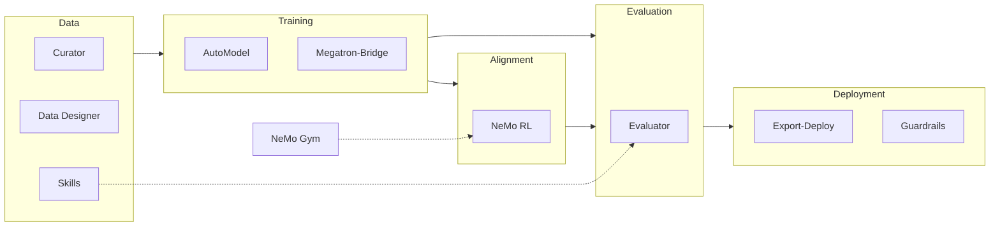

NeMo Framework is NVIDIA's open-source suite for large language models, multimodal models, diffusion, and speech. Scale pretraining, post-training, and reinforcement learning from a single GPU to thousand-node clusters with Hugging Face/PyTorch and Megatron backends.

The [NVIDIA-NeMo](https://github.com/NVIDIA-NeMo) GitHub organization hosts modular libraries and recipes so you can compose only what you need. NeMo Framework is also part of the broader [NVIDIA NeMo](https://www.nvidia.com/en-us/ai-data-science/products/nemo/) software suite for the AI agent lifecycle.

<Callout intent="info">
The framework is restructuring from the monolithic NeMo 2.0 repo into focused libraries (AutoModel, RL, Gym, Curator, and more). Speech AI remains in the legacy [NeMo](https://github.com/NVIDIA-NeMo/NeMo) repository.
</Callout>

## Choose your path

<Cards>

<Card title="Getting Started" href="/getting-started">
Decision guide, installation paths, and training recipes by scale.
</Card>

<Card title="All repositories" href="/repositories">
Search and filter all 23 NVIDIA-NeMo repos by category.
</Card>

<Card title="Community" href="/community">
Discussions, announcements, and how to contribute.
</Card>

</Cards>

## Start here

<Cards>

<Card title="NeMo AutoModel" href="https://docs.nvidia.com/nemo/automodel/latest/">
Fine-tune Hugging Face models on NVIDIA GPUs — the simplest on-ramp for most users.
</Card>

<Card title="Megatron-Bridge" href="https://docs.nvidia.com/nemo/megatron-bridge/latest/">
Large-scale pretraining and SFT at 1,000+ GPUs with Megatron-Core.
</Card>

<Card title="NeMo RL" href="https://docs.nvidia.com/nemo/rl/latest/">
SFT, DPO, GRPO, and on-policy distillation for LLMs and VLMs.
</Card>

</Cards>

## Pipeline overview

## Popular libraries

<Cards>

<Card title="Curator" href="https://docs.nvidia.com/nemo/curator/latest/">
Scalable data preprocessing and curation for LLMs and multimodal data.
</Card>

<Card title="Evaluator" href="https://docs.nvidia.com/nemo/evaluator/latest/">
Model benchmarking across 100+ evaluation harnesses.
</Card>

<Card title="Export-Deploy" href="https://docs.nvidia.com/nemo/export-deploy/latest/">
Export to vLLM, TensorRT-LLM, ONNX, and production serving.
</Card>

<Card title="Guardrails" href="https://docs.nvidia.com/nemo/guardrails/latest/">
Programmable safety rails for LLM applications.
</Card>

<Card title="Run" href="https://docs.nvidia.com/nemo/run/latest/">
Launch experiments on local machines, SLURM, or Kubernetes.
</Card>

<Card title="Gym" href="https://docs.nvidia.com/nemo/gym/latest/index.html">
RL environments for model and agent improvement.
</Card>

</Cards>
