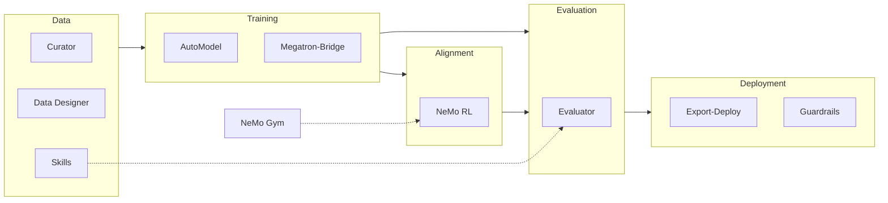
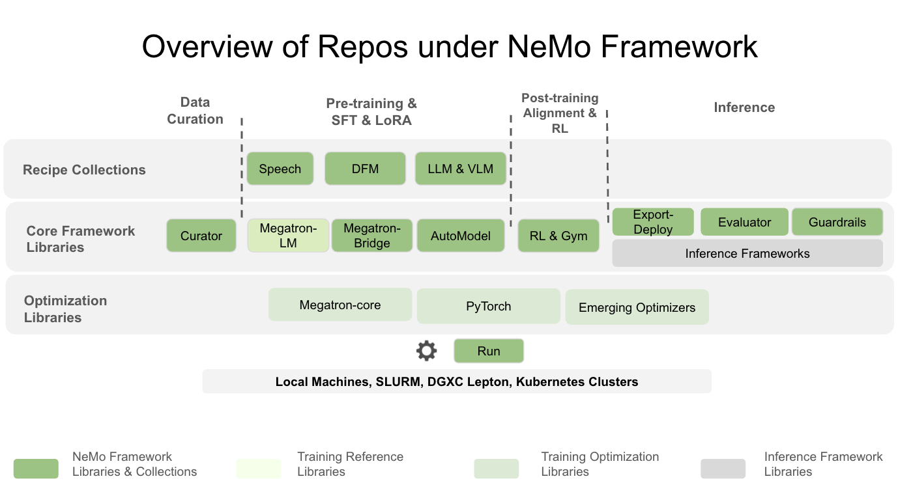

<!--
SPDX-FileCopyrightText: Copyright (c) 2024-2025 NVIDIA CORPORATION & AFFILIATES. All rights reserved.
SPDX-License-Identifier: Apache-2.0
-->

# NVIDIA NeMo Framework

**Train Llama 3.3 · Qwen 2.5 · Mistral · DeepSeek · Gemma · Nemotron on NVIDIA GPUs**

This GitHub org contains libraries for training, data curation, evaluation, alignment, and deployment. Scale from a single GPU to 10,000+ nodes with day-0 Hugging Face support or Megatron backends for maximum throughput.

---

## Choose Your Path

<table width="100%">
<tr>
<td width="33%" valign="top">

### Get Started

**Start with [NeMo AutoModel](https://github.com/NVIDIA-NeMo/Automodel)** – the simplest path to fine-tuning Hugging Face models on NVIDIA GPUs.

```bash
pip install nemo-automodel
```

```python
from nemo_automodel import AutoModelForCausalLM, Trainer

model = AutoModelForCausalLM.from_pretrained(
    "meta-llama/Llama-3.3-70B-Instruct"
)
trainer = Trainer(model=model, train_dataset=dataset)
trainer.train()
```

[→ AutoModel Quick Start](https://docs.nvidia.com/nemo/automodel/latest/launcher/local-workstation.html#quick-start-choose-your-job-launch-option)

</td>
<td width="33%" valign="top">

### Scale Training

- **< 1,000 GPUs**: [AutoModel](https://github.com/NVIDIA-NeMo/Automodel)
- **1,000+ GPUs**: [Megatron-Bridge](https://github.com/NVIDIA-NeMo/Megatron-Bridge)
- **RLHF/DPO**: [NeMo RL](https://github.com/NVIDIA-NeMo/RL)

[→ Training Recipes](#training-recipes)

### Experiment

[NeMo Run](https://github.com/NVIDIA-NeMo/Run) for launching and tracking experiments across:

- Local machines
- SLURM clusters
- Kubernetes

[→ Run Documentation](https://docs.nvidia.com/nemo/run/latest/)

</td>
<td width="33%" valign="top">

### Explore Libraries

- [Curator](https://github.com/NVIDIA-NeMo/Curator) – Data curation at scale
- [Evaluator](https://github.com/NVIDIA-NeMo/Evaluator) – Model benchmarking
- [Export-Deploy](https://github.com/NVIDIA-NeMo/Export-Deploy) – Production deployment

[→ All Libraries](#all-libraries)

### Use Containers

Pull optimized containers to get started fast.

- [NeMo Framework](https://catalog.ngc.nvidia.com/orgs/nvidia/containers/nemo)
- [NeMo AutoModel](https://catalog.ngc.nvidia.com/orgs/nvidia/containers/nemo-automodel)
- [NeMo RL](https://catalog.ngc.nvidia.com/orgs/nvidia/containers/nemo-rl)
- [NeMo Curator](https://catalog.ngc.nvidia.com/orgs/nvidia/containers/nemo-curator)

[→ Explore NGC Catalog](https://catalog.ngc.nvidia.com/orgs/nvidia/teams/nemo/containers)
</td>
</tr>
</table>

<details>
<summary>📋 Decision Guide — Which library should I use?</summary>

| I want to... | Models | Scale | Library | Docs |
|--------------|--------|-------|---------|------|
| **Train/fine-tune** | LLM, VLM | ≤1K GPUs | [AutoModel](https://github.com/NVIDIA-NeMo/Automodel) | [docs](https://docs.nvidia.com/nemo/automodel/latest/) |
| **Train at scale** | LLM, VLM | 1K+ GPUs | [Megatron-Bridge](https://github.com/NVIDIA-NeMo/Megatron-Bridge) | [docs](https://docs.nvidia.com/nemo/megatron-bridge/latest/) |
| **Align** (DPO/GRPO) | LLM, VLM | Any | [NeMo RL](https://github.com/NVIDIA-NeMo/RL) | [docs](https://docs.nvidia.com/nemo/rl/latest/) |
| **Curate data** | — | Any | [Curator](https://github.com/NVIDIA-NeMo/Curator) | [docs](https://docs.nvidia.com/nemo/curator/latest/) |
| **Evaluate** | Any | — | [Evaluator](https://github.com/NVIDIA-NeMo/Evaluator) | [docs](https://docs.nvidia.com/nemo/evaluator/latest/) |
| **Deploy** | Any | — | [Export-Deploy](https://github.com/NVIDIA-NeMo/Export-Deploy) | [docs](https://docs.nvidia.com/nemo/export-deploy/latest/) |
| **Speech AI** | ASR, TTS | Any | [NeMo Speech](https://github.com/NVIDIA-NeMo/NeMo) | [docs](https://docs.nvidia.com/nemo/speech/latest/) |

</details>

---

## Training Recipes

| Library | LLM Recipes | VLM Recipes |
|---------|-------------|-------------|
| [AutoModel](https://github.com/NVIDIA-NeMo/Automodel) | [Llama](https://github.com/NVIDIA-NeMo/Automodel/tree/main/examples/llm_finetune/llama3_2), [Qwen](https://github.com/NVIDIA-NeMo/Automodel/tree/main/examples/llm_finetune/qwen), [Gemma](https://github.com/NVIDIA-NeMo/Automodel/tree/main/examples/llm_finetune/gemma), [DeepSeek V3](https://github.com/NVIDIA-NeMo/Automodel/blob/main/examples/llm_pretrain/deepseekv3_pretrain.yaml), [Mistral](https://github.com/NVIDIA-NeMo/Automodel/tree/main/examples/llm_finetune/mistral), [Phi](https://github.com/NVIDIA-NeMo/Automodel/tree/main/examples/llm_finetune/phi) | [Gemma 3 VL](https://github.com/NVIDIA-NeMo/Automodel/tree/main/examples/vlm_finetune/gemma3), [Qwen2.5 VL](https://github.com/NVIDIA-NeMo/Automodel/tree/main/examples/vlm_finetune/qwen2_5), [Gemma 3n VL](https://github.com/NVIDIA-NeMo/Automodel/tree/main/examples/vlm_finetune/gemma3n) |
| [Megatron-Bridge](https://github.com/NVIDIA-NeMo/Megatron-Bridge) | [Llama](https://github.com/NVIDIA-NeMo/Megatron-Bridge/blob/main/src/megatron/bridge/recipes/llama/llama3.py), [Qwen](https://github.com/NVIDIA-NeMo/Megatron-Bridge/blob/main/src/megatron/bridge/recipes/qwen/qwen2.py), [DeepSeek V3](https://github.com/NVIDIA-NeMo/Megatron-Bridge/blob/main/src/megatron/bridge/recipes/deepseek/deepseek_v3.py), [Gemma 3](https://github.com/NVIDIA-NeMo/Megatron-Bridge/blob/main/src/megatron/bridge/recipes/gemma/gemma3.py), [Nemotron](https://github.com/NVIDIA-NeMo/Megatron-Bridge/blob/main/src/megatron/bridge/recipes/nemotronh/nemotronh.py) | [Gemma 3 VL](https://github.com/NVIDIA-NeMo/Megatron-Bridge/blob/main/src/megatron/bridge/recipes/gemma3_vl/gemma3_vl.py), [Qwen2.5 VL](https://github.com/NVIDIA-NeMo/Megatron-Bridge/blob/main/src/megatron/bridge/recipes/qwen_vl/qwen25_vl.py), [Qwen3 VL](https://github.com/NVIDIA-NeMo/Megatron-Bridge/blob/main/src/megatron/bridge/recipes/qwen_vl/qwen3vl.py) |
| [NeMo RL](https://github.com/NVIDIA-NeMo/RL) | [GRPO](https://github.com/NVIDIA-NeMo/RL/blob/main/examples/run_grpo_math.py), [DPO](https://github.com/NVIDIA-NeMo/RL/blob/main/examples/run_dpo.py), [SFT](https://github.com/NVIDIA-NeMo/RL/blob/main/examples/run_sft.py) | [GRPO](https://github.com/NVIDIA-NeMo/RL/blob/main/examples/run_vlm_grpo.py), [SFT](https://github.com/NVIDIA-NeMo/RL/blob/main/examples/run_vlm_sft.py) |


---

## All Libraries

### Pipeline Overview



### Data

| Repo | Description | Docs | Container |
|------|-------------|------|-----------|
| [Curator](https://github.com/NVIDIA-NeMo/Curator) | Data curation at scale | [docs](https://docs.nvidia.com/nemo/curator/latest/) | [NeMo Curator](https://catalog.ngc.nvidia.com/orgs/nvidia/containers/nemo-curator) |
| [Data Designer](https://github.com/NVIDIA-NeMo/DataDesigner) | Synthetic data generation | [docs](https://nvidia-nemo.github.io/DataDesigner/latest/) | — |
| [Skills](https://github.com/NVIDIA-NeMo/Skills) | SDG pipelines (math, code, science datasets) | [docs](https://nvidia-nemo.github.io/Skills/) | — |

### Training

| Repo | Description | Backend | Models | Docs | Container |
|------|-------------|---------|--------|------|-----------|
| [AutoModel](https://github.com/NVIDIA-NeMo/Automodel) | Pretraining, SFT, LoRA | PyTorch | LLM, VLM, Omni | [docs](https://docs.nvidia.com/nemo/automodel/latest/) | [NeMo AutoModel](https://catalog.ngc.nvidia.com/orgs/nvidia/containers/nemo-automodel) |
| [Megatron-Bridge](https://github.com/NVIDIA-NeMo/Megatron-Bridge) | Pretraining, SFT, LoRA | Megatron-core | LLM, VLM | [docs](https://docs.nvidia.com/nemo/megatron-bridge/latest/) | [NeMo Framework](https://catalog.ngc.nvidia.com/orgs/nvidia/containers/nemo) |
| [NeMo Speech](https://github.com/NVIDIA-NeMo/NeMo) | Pretraining, SFT | Megatron-core | Speech | [docs](https://docs.nvidia.com/nemo-framework/user-guide/latest/speech_ai/index.html) | — |
| [DFM](https://github.com/NVIDIA-NeMo/DFM) | Diffusion training | Megatron-core | Diffusion | [docs](https://github.com/NVIDIA-NeMo/DFM/tree/main/docs) | — |

### Alignment

| Repo | Description | Backend | Models | Docs | Container |
|------|-------------|---------|--------|------|-----------|
| [NeMo RL](https://github.com/NVIDIA-NeMo/RL) | SFT, DPO, GRPO | Megatron-core, vLLM | LLM, VLM | [docs](https://docs.nvidia.com/nemo/rl/latest/) | [NeMo RL](https://catalog.ngc.nvidia.com/orgs/nvidia/containers/nemo-rl) |
| [Gym](https://github.com/NVIDIA-NeMo/Gym) | RL environments | — | LLM, VLM | [docs](https://docs.nvidia.com/nemo/gym/latest/index.html) | — |

### Evaluation

| Repo | Description | Docs | Container |
|------|-------------|------|-----------|
| [Evaluator](https://github.com/NVIDIA-NeMo/Evaluator) | Model benchmarking | [docs](https://docs.nvidia.com/nemo/evaluator/latest/) | [NeMo Framework](https://catalog.ngc.nvidia.com/orgs/nvidia/containers/nemo) |
| [Skills](https://github.com/NVIDIA-NeMo/Skills) | Evaluation pipelines (math, code, science, etc.) | [docs](https://nvidia-nemo.github.io/Skills/) | — |

### Deployment

| Repo | Description | Backends | Docs | Container |
|------|-------------|----------|------|-----------|
| [Export-Deploy](https://github.com/NVIDIA-NeMo/Export-Deploy) | Export to production | vLLM, TRT-LLM, ONNX | [docs](https://docs.nvidia.com/nemo/export-deploy/latest/) | [NeMo Framework](https://catalog.ngc.nvidia.com/orgs/nvidia/containers/nemo) |
| [Guardrails](https://github.com/NVIDIA-NeMo/Guardrails) | Safety rails | — | [docs](https://docs.nvidia.com/nemo/guardrails/latest/) | — |

### Infrastructure

| Repo | Description | Docs | Container |
|------|-------------|------|-----------|
| [Run](https://github.com/NVIDIA-NeMo/Run) | Experiment launcher | [docs](https://docs.nvidia.com/nemo/run/latest/) | [NeMo Framework](https://catalog.ngc.nvidia.com/orgs/nvidia/containers/nemo) |
| [Emerging-Optimizers](https://github.com/NVIDIA-NeMo/Emerging-Optimizers) | Collection of optimizers | [docs](https://docs.nvidia.com/nemo/emerging-optimizers/latest/index.html) | — |
| [Nemotron](https://github.com/NVIDIA-NeMo/Nemotron) | Recipes for Nemotron models | [docs](https://github.com/NVIDIA-NeMo/Nemotron#readme) | — |

### Architecture Reference



*Architectural layers and dependencies across the NeMo Framework.*

---

## Community

<table width="100%">
<tr>
<td width="33%" valign="top">

### 💬 Get Involved

**[GitHub Discussions](https://github.com/orgs/NVIDIA-NeMo/discussions)** — Questions, ideas, and announcements

- [All Repositories](https://github.com/orgs/NVIDIA-NeMo/repositories)
- Follow each repos CONTRIBUTING guide to get started
- [Release Notes](https://docs.nvidia.com/nemo-framework/user-guide/latest/changelog.html)

</td>
<td width="66%" valign="top">

### 📣 Latest

**🐳 AutoModel**
- [PyTorch Native Pipeline Parallelism for HF Models](https://github.com/orgs/NVIDIA-NeMo/discussions) *(Oct 2025)*
- [Day-0 Hugging Face Support](https://github.com/orgs/NVIDIA-NeMo/discussions) *(Sep 2025)*
- [Gemma 3n Multimodal Fine-tuning](https://github.com/orgs/NVIDIA-NeMo/discussions) *(Sep 2025)*

**🔬 NeMo RL** — [On-policy Distillation](https://github.com/orgs/NVIDIA-NeMo/discussions), [FP8 Quantization](https://github.com/orgs/NVIDIA-NeMo/discussions), [10× MoE Weight Transfer](https://github.com/orgs/NVIDIA-NeMo/discussions)

</td>
</tr>
</table>

## License

Apache 2.0. Third-party attributions in each repository.
